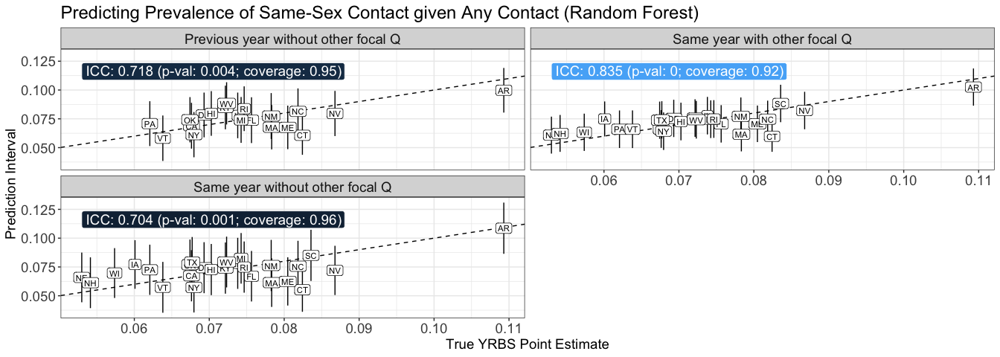

    library(data.table)
    library(ggplot2)
    library(rpart)
    library(irr)
    library(Hmisc)
    library(printr)

#### Load LOO State predictions from train\_and\_predict notebooks

    q66_prevalence_preds = rbindlist(lapply(
      grep("q66", list.files("~/YRBS_predictions/data/yrbs_20210904", full.names=T), value=T), 
      fread))

    q67_prevalence_preds = rbindlist(lapply(
      grep("q67", list.files("~/YRBS_predictions/data/yrbs_20210904", full.names=T), value=T), 
      fread))

    q66_male_prevalence_preds = rbindlist(lapply(
      grep("q66", list.files("~/YRBS_predictions/data/yrbs_males_q66_20210904", full.names=T), value=T), 
      fread))

    print(nrow(q67_prevalence_preds[year == 2017 & predset == "Using Contact Responses"]))

    ## [1] 208

    # Encode true state-level proportions (2017 YRBS estimates)
    q66_true_prevalences = q66_prevalence_preds[year == 2017, .(real_prev = mean(real_prop)),  by=c('pred_state')]
    q67_true_prevalences = q67_prevalence_preds[year == 2017, .(real_prev = mean(real_prop)),  by=c('pred_state')]
    q66_male_true_prevalences = q66_male_prevalence_preds[year == 2017, .(real_prev = mean(real_prop)),  by=c('pred_state')]

#### For each model, prediction dataset, calculate ICC and prediction interval coverage

    get_eval_stats = function(true_prevalences, prevalence_preds, pred_method, pred_model, pred_predset, pred_year, pred_col) {
      
      subset_dt = prevalence_preds[
        model == pred_model &
        predset == pred_predset &
        year == pred_year
      ]

      pred_prev_by_state = subset_dt[,.(
        pred_state,
        pred_prev = get(pred_col),
        n
      )]

      # add real prevs
      pred_prev_by_state = merge(pred_prev_by_state, true_prevalences, by = 'pred_state')

      # prediction intervals using empirical out-of-bag T distribtion
      pred_prev_by_state = rbindlist(lapply(pred_prev_by_state[, unique(pred_state)], function(s) {

        oob_mean_bias = pred_prev_by_state[pred_state != s, mean(real_prev - pred_prev)]
        #message(paste("oob_mean_bias:", oob_mean_bias))
        oob_sd = pred_prev_by_state[pred_state != s, sd(real_prev - pred_prev)]
        oob_df = pred_prev_by_state[pred_state != s, .N] - 1
        
        real_prev_interval = binconf(pred_prev_by_state[pred_state == s, real_prev*n], 
                                     pred_prev_by_state[pred_state == s, n])

        return(data.table(
          pred_state = s,
          real_prev = pred_prev_by_state[pred_state == s, real_prev],
          real_prev_lb = real_prev_interval[,"Lower"],
          real_prev_ub = real_prev_interval[,"Upper"],
          # T out-of-bag method
          norm_oob_pe = pred_prev_by_state[pred_state == s, pred_prev + oob_mean_bias],
          norm_oob_lb = pred_prev_by_state[pred_state == s, pred_prev + oob_mean_bias - qt(0.975, oob_df)*oob_sd],
          norm_oob_ub = pred_prev_by_state[pred_state == s, pred_prev + oob_mean_bias + qt(0.975, oob_df)*oob_sd]
        ))

      }))

      # add columns to state predictions dt
      pred_prev_by_state[,`:=`(
        pred_method = pred_method,
        pred_model = pred_model
      )]

      # summary result dt
      oob_icc_res = icc(pred_prev_by_state[, .(norm_oob_pe, real_prev)], model = "oneway", type = "agreement", unit = "average")
      summary_dt = data.table(
        pred_method,
        pred_model,
        oob_icc = round(oob_icc_res$value,3),
        oob_icc_pval = round(oob_icc_res$p.value,3),
        oob_coverage = mean(pred_prev_by_state[, norm_oob_lb < real_prev & norm_oob_ub > real_prev])
      )

      return(list(
        state_predictions = pred_prev_by_state,
        summary_stats = summary_dt
      ))
    }

    # TEST

    get_eval_stats(
      true_prevalences = q66_male_true_prevalences,
      prevalence_preds = q66_male_prevalence_preds, 
      pred_method = "Same year with other focal Q",
      pred_model = "rf", 
      pred_predset = "Using Identity Responses",
      pred_year = 2017, 
      pred_col = "pred_prop")$summary_stats

<table>
<thead>
<tr class="header">
<th style="text-align: left;">pred_method</th>
<th style="text-align: left;">pred_model</th>
<th style="text-align: right;">oob_icc</th>
<th style="text-align: right;">oob_icc_pval</th>
<th style="text-align: right;">oob_coverage</th>
</tr>
</thead>
<tbody>
<tr class="odd">
<td style="text-align: left;">Same year with other focal Q</td>
<td style="text-align: left;">rf</td>
<td style="text-align: right;">0.697</td>
<td style="text-align: right;">0.002</td>
<td style="text-align: right;">0.9230769</td>
</tr>
</tbody>
</table>

#### Inspect LOO RF predictions for each state and prediction dataset

    MODEL = "rf"

    q66_state_preds = rbind(
      get_eval_stats(
        true_prevalences = q66_true_prevalences,
        prevalence_preds = q66_prevalence_preds, 
        pred_method = "Same year with other focal Q",
        pred_model = MODEL, 
        pred_predset = "Using Identity Responses",
        pred_year = 2017, 
        pred_col = "pred_prop")$state_predictions,
      get_eval_stats(
        true_prevalences = q66_true_prevalences,
        prevalence_preds = q66_prevalence_preds, 
        pred_method = "Same year without other focal Q",
        pred_model = MODEL, 
        pred_predset = "Not Using Identity Responses",
        pred_year = 2017, 
        pred_col = "pred_prop")$state_predictions,
      get_eval_stats(
        true_prevalences = q66_true_prevalences,
        prevalence_preds = q66_prevalence_preds, 
        pred_method = "Previous year without other focal Q",
        pred_model = MODEL, 
        pred_predset = "Not Using Identity Responses",
        pred_year = 2015, 
        pred_col = "pred_prop_2017")$state_predictions
    )

    q66_real_prevs_states = unique(q66_state_preds[pred_method == "Same year without other focal Q", .(pred_state, real_prev, real_prev_lb, real_prev_ub)])
    q66_real_prevs_states[, real_txt := paste0(
      format(real_prev*100,digits=0,nsmall=1), " (", 
      format(real_prev_lb*100,digits=0,nsmall=1), ", ", 
      format(real_prev_ub*100,digits=0,nsmall=1), ")")]

<table>
<thead>
<tr class="header">
<th style="text-align: left;">pred_state</th>
<th style="text-align: right;">real_prev</th>
<th style="text-align: right;">real_prev_lb</th>
<th style="text-align: right;">real_prev_ub</th>
<th style="text-align: left;">real_txt</th>
</tr>
</thead>
<tbody>
<tr class="odd">
<td style="text-align: left;">AR</td>
<td style="text-align: right;">0.1093056</td>
<td style="text-align: right;">0.0952748</td>
<td style="text-align: right;">0.1251169</td>
<td style="text-align: left;">10.9 (9.5, 12.5)</td>
</tr>
<tr class="even">
<td style="text-align: left;">CA</td>
<td style="text-align: right;">0.0676291</td>
<td style="text-align: right;">0.0568647</td>
<td style="text-align: right;">0.0802578</td>
<td style="text-align: left;">6.8 (5.7, 8.0)</td>
</tr>
<tr class="odd">
<td style="text-align: left;">CT</td>
<td style="text-align: right;">0.0824294</td>
<td style="text-align: right;">0.0721326</td>
<td style="text-align: right;">0.0940470</td>
<td style="text-align: left;">8.2 (7.2, 9.4)</td>
</tr>
<tr class="even">
<td style="text-align: left;">DE</td>
<td style="text-align: right;">0.0693097</td>
<td style="text-align: right;">0.0606326</td>
<td style="text-align: right;">0.0791239</td>
<td style="text-align: left;">6.9 (6.1, 7.9)</td>
</tr>
<tr class="odd">
<td style="text-align: left;">FL</td>
<td style="text-align: right;">0.0756364</td>
<td style="text-align: right;">0.0693000</td>
<td style="text-align: right;">0.0825008</td>
<td style="text-align: left;">7.6 (6.9, 8.3)</td>
</tr>
<tr class="even">
<td style="text-align: left;">HI</td>
<td style="text-align: right;">0.0702699</td>
<td style="text-align: right;">0.0640888</td>
<td style="text-align: right;">0.0769980</td>
<td style="text-align: left;">7.0 (6.4, 7.7)</td>
</tr>
<tr class="odd">
<td style="text-align: left;">IA</td>
<td style="text-align: right;">0.0600913</td>
<td style="text-align: right;">0.0497301</td>
<td style="text-align: right;">0.0724466</td>
<td style="text-align: left;">6.0 (5.0, 7.2)</td>
</tr>
<tr class="even">
<td style="text-align: left;">IL</td>
<td style="text-align: right;">0.0737981</td>
<td style="text-align: right;">0.0668806</td>
<td style="text-align: right;">0.0813687</td>
<td style="text-align: left;">7.4 (6.7, 8.1)</td>
</tr>
<tr class="odd">
<td style="text-align: left;">KY</td>
<td style="text-align: right;">0.0721530</td>
<td style="text-align: right;">0.0616075</td>
<td style="text-align: right;">0.0843414</td>
<td style="text-align: left;">7.2 (6.2, 8.4)</td>
</tr>
<tr class="even">
<td style="text-align: left;">MA</td>
<td style="text-align: right;">0.0783309</td>
<td style="text-align: right;">0.0696286</td>
<td style="text-align: right;">0.0880180</td>
<td style="text-align: left;">7.8 (7.0, 8.8)</td>
</tr>
<tr class="odd">
<td style="text-align: left;">ME</td>
<td style="text-align: right;">0.0804765</td>
<td style="text-align: right;">0.0751746</td>
<td style="text-align: right;">0.0861175</td>
<td style="text-align: left;">8.0 (7.5, 8.6)</td>
</tr>
<tr class="even">
<td style="text-align: left;">MI</td>
<td style="text-align: right;">0.0742504</td>
<td style="text-align: right;">0.0624860</td>
<td style="text-align: right;">0.0880217</td>
<td style="text-align: left;">7.4 (6.2, 8.8)</td>
</tr>
<tr class="odd">
<td style="text-align: left;">NC</td>
<td style="text-align: right;">0.0818405</td>
<td style="text-align: right;">0.0727708</td>
<td style="text-align: right;">0.0919286</td>
<td style="text-align: left;">8.2 (7.3, 9.2)</td>
</tr>
<tr class="even">
<td style="text-align: left;">NE</td>
<td style="text-align: right;">0.0529865</td>
<td style="text-align: right;">0.0425179</td>
<td style="text-align: right;">0.0658553</td>
<td style="text-align: left;">5.3 (4.3, 6.6)</td>
</tr>
<tr class="odd">
<td style="text-align: left;">NH</td>
<td style="text-align: right;">0.0541400</td>
<td style="text-align: right;">0.0502398</td>
<td style="text-align: right;">0.0583243</td>
<td style="text-align: left;">5.4 (5.0, 5.8)</td>
</tr>
<tr class="even">
<td style="text-align: left;">NM</td>
<td style="text-align: right;">0.0782656</td>
<td style="text-align: right;">0.0716187</td>
<td style="text-align: right;">0.0854727</td>
<td style="text-align: left;">7.8 (7.2, 8.5)</td>
</tr>
<tr class="odd">
<td style="text-align: left;">NV</td>
<td style="text-align: right;">0.0867771</td>
<td style="text-align: right;">0.0741957</td>
<td style="text-align: right;">0.1012586</td>
<td style="text-align: left;">8.7 (7.4, 10.1)</td>
</tr>
<tr class="even">
<td style="text-align: left;">NY</td>
<td style="text-align: right;">0.0679559</td>
<td style="text-align: right;">0.0634821</td>
<td style="text-align: right;">0.0727204</td>
<td style="text-align: left;">6.8 (6.3, 7.3)</td>
</tr>
<tr class="odd">
<td style="text-align: left;">OK</td>
<td style="text-align: right;">0.0674286</td>
<td style="text-align: right;">0.0563030</td>
<td style="text-align: right;">0.0805648</td>
<td style="text-align: left;">6.7 (5.6, 8.1)</td>
</tr>
<tr class="even">
<td style="text-align: left;">PA</td>
<td style="text-align: right;">0.0620686</td>
<td style="text-align: right;">0.0547954</td>
<td style="text-align: right;">0.0702356</td>
<td style="text-align: left;">6.2 (5.5, 7.0)</td>
</tr>
<tr class="odd">
<td style="text-align: left;">RI</td>
<td style="text-align: right;">0.0746578</td>
<td style="text-align: right;">0.0644459</td>
<td style="text-align: right;">0.0863385</td>
<td style="text-align: left;">7.5 (6.4, 8.6)</td>
</tr>
<tr class="even">
<td style="text-align: left;">SC</td>
<td style="text-align: right;">0.0835750</td>
<td style="text-align: right;">0.0706150</td>
<td style="text-align: right;">0.0986610</td>
<td style="text-align: left;">8.4 (7.1, 9.9)</td>
</tr>
<tr class="odd">
<td style="text-align: left;">TX</td>
<td style="text-align: right;">0.0677193</td>
<td style="text-align: right;">0.0577714</td>
<td style="text-align: right;">0.0792362</td>
<td style="text-align: left;">6.8 (5.8, 7.9)</td>
</tr>
<tr class="even">
<td style="text-align: left;">VT</td>
<td style="text-align: right;">0.0638054</td>
<td style="text-align: right;">0.0605526</td>
<td style="text-align: right;">0.0672205</td>
<td style="text-align: left;">6.4 (6.1, 6.7)</td>
</tr>
<tr class="odd">
<td style="text-align: left;">WI</td>
<td style="text-align: right;">0.0573642</td>
<td style="text-align: right;">0.0481363</td>
<td style="text-align: right;">0.0682343</td>
<td style="text-align: left;">5.7 (4.8, 6.8)</td>
</tr>
<tr class="even">
<td style="text-align: left;">WV</td>
<td style="text-align: right;">0.0723146</td>
<td style="text-align: right;">0.0604956</td>
<td style="text-align: right;">0.0862307</td>
<td style="text-align: left;">7.2 (6.0, 8.6)</td>
</tr>
</tbody>
</table>

    q66_real_prevs_states = q66_real_prevs_states[, .(pred_state, real_txt)]
    #display(q66_real_prevs_states)

    q66_pred_prevs_states = q66_state_preds[, .(pred_state, norm_oob_pe, norm_oob_lb, norm_oob_ub, pred_method)]
    q66_pred_prevs_states[, pred_txt := paste0(
      format(norm_oob_pe*100,digits=0,nsmall=1), " (", 
      format(norm_oob_lb*100,digits=0,nsmall=1), ", ", 
      format(norm_oob_ub*100,digits=0,nsmall=1), ")")]

<table>
<colgroup>
<col style="width: 11%" />
<col style="width: 12%" />
<col style="width: 12%" />
<col style="width: 12%" />
<col style="width: 36%" />
<col style="width: 17%" />
</colgroup>
<thead>
<tr class="header">
<th style="text-align: left;">pred_state</th>
<th style="text-align: right;">norm_oob_pe</th>
<th style="text-align: right;">norm_oob_lb</th>
<th style="text-align: right;">norm_oob_ub</th>
<th style="text-align: left;">pred_method</th>
<th style="text-align: left;">pred_txt</th>
</tr>
</thead>
<tbody>
<tr class="odd">
<td style="text-align: left;">AR</td>
<td style="text-align: right;">0.1025620</td>
<td style="text-align: right;">0.0864395</td>
<td style="text-align: right;">0.1186844</td>
<td style="text-align: left;">Same year with other focal Q</td>
<td style="text-align: left;">10.3 (8.6, 11.9)</td>
</tr>
<tr class="even">
<td style="text-align: left;">CA</td>
<td style="text-align: right;">0.0661456</td>
<td style="text-align: right;">0.0497958</td>
<td style="text-align: right;">0.0824955</td>
<td style="text-align: left;">Same year with other focal Q</td>
<td style="text-align: left;">6.6 (5.0, 8.2)</td>
</tr>
<tr class="odd">
<td style="text-align: left;">CT</td>
<td style="text-align: right;">0.0598100</td>
<td style="text-align: right;">0.0463795</td>
<td style="text-align: right;">0.0732405</td>
<td style="text-align: left;">Same year with other focal Q</td>
<td style="text-align: left;">6.0 (4.6, 7.3)</td>
</tr>
<tr class="even">
<td style="text-align: left;">DE</td>
<td style="text-align: right;">0.0753708</td>
<td style="text-align: right;">0.0592021</td>
<td style="text-align: right;">0.0915394</td>
<td style="text-align: left;">Same year with other focal Q</td>
<td style="text-align: left;">7.5 (5.9, 9.2)</td>
</tr>
<tr class="odd">
<td style="text-align: left;">FL</td>
<td style="text-align: right;">0.0706422</td>
<td style="text-align: right;">0.0544114</td>
<td style="text-align: right;">0.0868730</td>
<td style="text-align: left;">Same year with other focal Q</td>
<td style="text-align: left;">7.1 (5.4, 8.7)</td>
</tr>
<tr class="even">
<td style="text-align: left;">HI</td>
<td style="text-align: right;">0.0726798</td>
<td style="text-align: right;">0.0563488</td>
<td style="text-align: right;">0.0890109</td>
<td style="text-align: left;">Same year with other focal Q</td>
<td style="text-align: left;">7.3 (5.6, 8.9)</td>
</tr>
<tr class="odd">
<td style="text-align: left;">IA</td>
<td style="text-align: right;">0.0748977</td>
<td style="text-align: right;">0.0597227</td>
<td style="text-align: right;">0.0900727</td>
<td style="text-align: left;">Same year with other focal Q</td>
<td style="text-align: left;">7.5 (6.0, 9.0)</td>
</tr>
<tr class="even">
<td style="text-align: left;">IL</td>
<td style="text-align: right;">0.0777436</td>
<td style="text-align: right;">0.0614636</td>
<td style="text-align: right;">0.0940235</td>
<td style="text-align: left;">Same year with other focal Q</td>
<td style="text-align: left;">7.8 (6.1, 9.4)</td>
</tr>
<tr class="odd">
<td style="text-align: left;">KY</td>
<td style="text-align: right;">0.0756586</td>
<td style="text-align: right;">0.0593614</td>
<td style="text-align: right;">0.0919557</td>
<td style="text-align: left;">Same year with other focal Q</td>
<td style="text-align: left;">7.6 (5.9, 9.2)</td>
</tr>
<tr class="even">
<td style="text-align: left;">MA</td>
<td style="text-align: right;">0.0615681</td>
<td style="text-align: right;">0.0467445</td>
<td style="text-align: right;">0.0763917</td>
<td style="text-align: left;">Same year with other focal Q</td>
<td style="text-align: left;">6.2 (4.7, 7.6)</td>
</tr>
<tr class="odd">
<td style="text-align: left;">ME</td>
<td style="text-align: right;">0.0706863</td>
<td style="text-align: right;">0.0548327</td>
<td style="text-align: right;">0.0865399</td>
<td style="text-align: left;">Same year with other focal Q</td>
<td style="text-align: left;">7.1 (5.5, 8.7)</td>
</tr>
<tr class="even">
<td style="text-align: left;">MI</td>
<td style="text-align: right;">0.0746823</td>
<td style="text-align: right;">0.0583219</td>
<td style="text-align: right;">0.0910427</td>
<td style="text-align: left;">Same year with other focal Q</td>
<td style="text-align: left;">7.5 (5.8, 9.1)</td>
</tr>
<tr class="odd">
<td style="text-align: left;">NC</td>
<td style="text-align: right;">0.0746731</td>
<td style="text-align: right;">0.0585819</td>
<td style="text-align: right;">0.0907643</td>
<td style="text-align: left;">Same year with other focal Q</td>
<td style="text-align: left;">7.5 (5.9, 9.1)</td>
</tr>
<tr class="even">
<td style="text-align: left;">NE</td>
<td style="text-align: right;">0.0608723</td>
<td style="text-align: right;">0.0448386</td>
<td style="text-align: right;">0.0769061</td>
<td style="text-align: left;">Same year with other focal Q</td>
<td style="text-align: left;">6.1 (4.5, 7.7)</td>
</tr>
<tr class="odd">
<td style="text-align: left;">NH</td>
<td style="text-align: right;">0.0623562</td>
<td style="text-align: right;">0.0463507</td>
<td style="text-align: right;">0.0783616</td>
<td style="text-align: left;">Same year with other focal Q</td>
<td style="text-align: left;">6.2 (4.6, 7.8)</td>
</tr>
<tr class="even">
<td style="text-align: left;">NM</td>
<td style="text-align: right;">0.0771710</td>
<td style="text-align: right;">0.0608159</td>
<td style="text-align: right;">0.0935261</td>
<td style="text-align: left;">Same year with other focal Q</td>
<td style="text-align: left;">7.7 (6.1, 9.4)</td>
</tr>
<tr class="odd">
<td style="text-align: left;">NV</td>
<td style="text-align: right;">0.0821994</td>
<td style="text-align: right;">0.0659477</td>
<td style="text-align: right;">0.0984511</td>
<td style="text-align: left;">Same year with other focal Q</td>
<td style="text-align: left;">8.2 (6.6, 9.8)</td>
</tr>
<tr class="even">
<td style="text-align: left;">NY</td>
<td style="text-align: right;">0.0642642</td>
<td style="text-align: right;">0.0479741</td>
<td style="text-align: right;">0.0805543</td>
<td style="text-align: left;">Same year with other focal Q</td>
<td style="text-align: left;">6.4 (4.8, 8.1)</td>
</tr>
<tr class="odd">
<td style="text-align: left;">OK</td>
<td style="text-align: right;">0.0738161</td>
<td style="text-align: right;">0.0576689</td>
<td style="text-align: right;">0.0899633</td>
<td style="text-align: left;">Same year with other focal Q</td>
<td style="text-align: left;">7.4 (5.8, 9.0)</td>
</tr>
<tr class="even">
<td style="text-align: left;">PA</td>
<td style="text-align: right;">0.0659867</td>
<td style="text-align: right;">0.0497056</td>
<td style="text-align: right;">0.0822678</td>
<td style="text-align: left;">Same year with other focal Q</td>
<td style="text-align: left;">6.6 (5.0, 8.2)</td>
</tr>
<tr class="odd">
<td style="text-align: left;">RI</td>
<td style="text-align: right;">0.0748462</td>
<td style="text-align: right;">0.0584850</td>
<td style="text-align: right;">0.0912074</td>
<td style="text-align: left;">Same year with other focal Q</td>
<td style="text-align: left;">7.5 (5.8, 9.1)</td>
</tr>
<tr class="even">
<td style="text-align: left;">SC</td>
<td style="text-align: right;">0.0883255</td>
<td style="text-align: right;">0.0720822</td>
<td style="text-align: right;">0.1045687</td>
<td style="text-align: left;">Same year with other focal Q</td>
<td style="text-align: left;">8.8 (7.2, 10.5)</td>
</tr>
<tr class="odd">
<td style="text-align: left;">TX</td>
<td style="text-align: right;">0.0741243</td>
<td style="text-align: right;">0.0579783</td>
<td style="text-align: right;">0.0902703</td>
<td style="text-align: left;">Same year with other focal Q</td>
<td style="text-align: left;">7.4 (5.8, 9.0)</td>
</tr>
<tr class="even">
<td style="text-align: left;">VT</td>
<td style="text-align: right;">0.0659659</td>
<td style="text-align: right;">0.0496289</td>
<td style="text-align: right;">0.0823029</td>
<td style="text-align: left;">Same year with other focal Q</td>
<td style="text-align: left;">6.6 (5.0, 8.2)</td>
</tr>
<tr class="odd">
<td style="text-align: left;">WI</td>
<td style="text-align: right;">0.0633263</td>
<td style="text-align: right;">0.0471514</td>
<td style="text-align: right;">0.0795012</td>
<td style="text-align: left;">Same year with other focal Q</td>
<td style="text-align: left;">6.3 (4.7, 8.0)</td>
</tr>
<tr class="even">
<td style="text-align: left;">WV</td>
<td style="text-align: right;">0.0742050</td>
<td style="text-align: right;">0.0578623</td>
<td style="text-align: right;">0.0905477</td>
<td style="text-align: left;">Same year with other focal Q</td>
<td style="text-align: left;">7.4 (5.8, 9.1)</td>
</tr>
<tr class="odd">
<td style="text-align: left;">AR</td>
<td style="text-align: right;">0.1086321</td>
<td style="text-align: right;">0.0864134</td>
<td style="text-align: right;">0.1308508</td>
<td style="text-align: left;">Same year without other focal Q</td>
<td style="text-align: left;">10.9 (8.6, 13.1)</td>
</tr>
<tr class="even">
<td style="text-align: left;">CA</td>
<td style="text-align: right;">0.0673663</td>
<td style="text-align: right;">0.0451462</td>
<td style="text-align: right;">0.0895865</td>
<td style="text-align: left;">Same year without other focal Q</td>
<td style="text-align: left;">6.7 (4.5, 9.0)</td>
</tr>
<tr class="odd">
<td style="text-align: left;">CT</td>
<td style="text-align: right;">0.0552803</td>
<td style="text-align: right;">0.0360981</td>
<td style="text-align: right;">0.0744625</td>
<td style="text-align: left;">Same year without other focal Q</td>
<td style="text-align: left;">5.5 (3.6, 7.4)</td>
</tr>
<tr class="even">
<td style="text-align: left;">DE</td>
<td style="text-align: right;">0.0743673</td>
<td style="text-align: right;">0.0522454</td>
<td style="text-align: right;">0.0964893</td>
<td style="text-align: left;">Same year without other focal Q</td>
<td style="text-align: left;">7.4 (5.2, 9.6)</td>
</tr>
<tr class="odd">
<td style="text-align: left;">FL</td>
<td style="text-align: right;">0.0669720</td>
<td style="text-align: right;">0.0450418</td>
<td style="text-align: right;">0.0889022</td>
<td style="text-align: left;">Same year without other focal Q</td>
<td style="text-align: left;">6.7 (4.5, 8.9)</td>
</tr>
<tr class="even">
<td style="text-align: left;">HI</td>
<td style="text-align: right;">0.0727546</td>
<td style="text-align: right;">0.0505579</td>
<td style="text-align: right;">0.0949513</td>
<td style="text-align: left;">Same year without other focal Q</td>
<td style="text-align: left;">7.3 (5.1, 9.5)</td>
</tr>
<tr class="odd">
<td style="text-align: left;">IA</td>
<td style="text-align: right;">0.0771568</td>
<td style="text-align: right;">0.0560844</td>
<td style="text-align: right;">0.0982292</td>
<td style="text-align: left;">Same year without other focal Q</td>
<td style="text-align: left;">7.7 (5.6, 9.8)</td>
</tr>
<tr class="even">
<td style="text-align: left;">IL</td>
<td style="text-align: right;">0.0781293</td>
<td style="text-align: right;">0.0559811</td>
<td style="text-align: right;">0.1002776</td>
<td style="text-align: left;">Same year without other focal Q</td>
<td style="text-align: left;">7.8 (5.6, 10.0)</td>
</tr>
<tr class="odd">
<td style="text-align: left;">KY</td>
<td style="text-align: right;">0.0740372</td>
<td style="text-align: right;">0.0518304</td>
<td style="text-align: right;">0.0962440</td>
<td style="text-align: left;">Same year without other focal Q</td>
<td style="text-align: left;">7.4 (5.2, 9.6)</td>
</tr>
<tr class="even">
<td style="text-align: left;">MA</td>
<td style="text-align: right;">0.0614175</td>
<td style="text-align: right;">0.0403242</td>
<td style="text-align: right;">0.0825108</td>
<td style="text-align: left;">Same year without other focal Q</td>
<td style="text-align: left;">6.1 (4.0, 8.3)</td>
</tr>
<tr class="odd">
<td style="text-align: left;">ME</td>
<td style="text-align: right;">0.0624729</td>
<td style="text-align: right;">0.0415341</td>
<td style="text-align: right;">0.0834116</td>
<td style="text-align: left;">Same year without other focal Q</td>
<td style="text-align: left;">6.2 (4.2, 8.3)</td>
</tr>
<tr class="even">
<td style="text-align: left;">MI</td>
<td style="text-align: right;">0.0824859</td>
<td style="text-align: right;">0.0605275</td>
<td style="text-align: right;">0.1044443</td>
<td style="text-align: left;">Same year without other focal Q</td>
<td style="text-align: left;">8.2 (6.1, 10.4)</td>
</tr>
<tr class="odd">
<td style="text-align: left;">NC</td>
<td style="text-align: right;">0.0756305</td>
<td style="text-align: right;">0.0535587</td>
<td style="text-align: right;">0.0977023</td>
<td style="text-align: left;">Same year without other focal Q</td>
<td style="text-align: left;">7.6 (5.4, 9.8)</td>
</tr>
<tr class="even">
<td style="text-align: left;">NE</td>
<td style="text-align: right;">0.0659197</td>
<td style="text-align: right;">0.0443512</td>
<td style="text-align: right;">0.0874882</td>
<td style="text-align: left;">Same year without other focal Q</td>
<td style="text-align: left;">6.6 (4.4, 8.7)</td>
</tr>
<tr class="odd">
<td style="text-align: left;">NH</td>
<td style="text-align: right;">0.0613099</td>
<td style="text-align: right;">0.0392878</td>
<td style="text-align: right;">0.0833320</td>
<td style="text-align: left;">Same year without other focal Q</td>
<td style="text-align: left;">6.1 (3.9, 8.3)</td>
</tr>
<tr class="even">
<td style="text-align: left;">NM</td>
<td style="text-align: right;">0.0762779</td>
<td style="text-align: right;">0.0540726</td>
<td style="text-align: right;">0.0984831</td>
<td style="text-align: left;">Same year without other focal Q</td>
<td style="text-align: left;">7.6 (5.4, 9.8)</td>
</tr>
<tr class="odd">
<td style="text-align: left;">NV</td>
<td style="text-align: right;">0.0720064</td>
<td style="text-align: right;">0.0506403</td>
<td style="text-align: right;">0.0933726</td>
<td style="text-align: left;">Same year without other focal Q</td>
<td style="text-align: left;">7.2 (5.1, 9.3)</td>
</tr>
<tr class="even">
<td style="text-align: left;">NY</td>
<td style="text-align: right;">0.0572735</td>
<td style="text-align: right;">0.0354957</td>
<td style="text-align: right;">0.0790513</td>
<td style="text-align: left;">Same year without other focal Q</td>
<td style="text-align: left;">5.7 (3.5, 7.9)</td>
</tr>
<tr class="odd">
<td style="text-align: left;">OK</td>
<td style="text-align: right;">0.0769407</td>
<td style="text-align: right;">0.0550705</td>
<td style="text-align: right;">0.0988109</td>
<td style="text-align: left;">Same year without other focal Q</td>
<td style="text-align: left;">7.7 (5.5, 9.9)</td>
</tr>
<tr class="even">
<td style="text-align: left;">PA</td>
<td style="text-align: right;">0.0725547</td>
<td style="text-align: right;">0.0507607</td>
<td style="text-align: right;">0.0943488</td>
<td style="text-align: left;">Same year without other focal Q</td>
<td style="text-align: left;">7.3 (5.1, 9.4)</td>
</tr>
<tr class="odd">
<td style="text-align: left;">RI</td>
<td style="text-align: right;">0.0748955</td>
<td style="text-align: right;">0.0526753</td>
<td style="text-align: right;">0.0971157</td>
<td style="text-align: left;">Same year without other focal Q</td>
<td style="text-align: left;">7.5 (5.3, 9.7)</td>
</tr>
<tr class="even">
<td style="text-align: left;">SC</td>
<td style="text-align: right;">0.0850699</td>
<td style="text-align: right;">0.0628580</td>
<td style="text-align: right;">0.1072817</td>
<td style="text-align: left;">Same year without other focal Q</td>
<td style="text-align: left;">8.5 (6.3, 10.7)</td>
</tr>
<tr class="odd">
<td style="text-align: left;">TX</td>
<td style="text-align: right;">0.0792831</td>
<td style="text-align: right;">0.0575823</td>
<td style="text-align: right;">0.1009839</td>
<td style="text-align: left;">Same year without other focal Q</td>
<td style="text-align: left;">7.9 (5.8, 10.1)</td>
</tr>
<tr class="even">
<td style="text-align: left;">VT</td>
<td style="text-align: right;">0.0573418</td>
<td style="text-align: right;">0.0352824</td>
<td style="text-align: right;">0.0794011</td>
<td style="text-align: left;">Same year without other focal Q</td>
<td style="text-align: left;">5.7 (3.5, 7.9)</td>
</tr>
<tr class="odd">
<td style="text-align: left;">WI</td>
<td style="text-align: right;">0.0697172</td>
<td style="text-align: right;">0.0480908</td>
<td style="text-align: right;">0.0913437</td>
<td style="text-align: left;">Same year without other focal Q</td>
<td style="text-align: left;">7.0 (4.8, 9.1)</td>
</tr>
<tr class="even">
<td style="text-align: left;">WV</td>
<td style="text-align: right;">0.0792861</td>
<td style="text-align: right;">0.0572531</td>
<td style="text-align: right;">0.1013191</td>
<td style="text-align: left;">Same year without other focal Q</td>
<td style="text-align: left;">7.9 (5.7, 10.1)</td>
</tr>
<tr class="odd">
<td style="text-align: left;">AR</td>
<td style="text-align: right;">0.0993802</td>
<td style="text-align: right;">0.0799595</td>
<td style="text-align: right;">0.1188008</td>
<td style="text-align: left;">Previous year without other focal Q</td>
<td style="text-align: left;">9.9 (8.0, 11.9)</td>
</tr>
<tr class="even">
<td style="text-align: left;">CA</td>
<td style="text-align: right;">0.0690290</td>
<td style="text-align: right;">0.0490376</td>
<td style="text-align: right;">0.0890203</td>
<td style="text-align: left;">Previous year without other focal Q</td>
<td style="text-align: left;">6.9 (4.9, 8.9)</td>
</tr>
<tr class="odd">
<td style="text-align: left;">CT</td>
<td style="text-align: right;">0.0607219</td>
<td style="text-align: right;">0.0436826</td>
<td style="text-align: right;">0.0777613</td>
<td style="text-align: left;">Previous year without other focal Q</td>
<td style="text-align: left;">6.1 (4.4, 7.8)</td>
</tr>
<tr class="even">
<td style="text-align: left;">DE</td>
<td style="text-align: right;">0.0783436</td>
<td style="text-align: right;">0.0588218</td>
<td style="text-align: right;">0.0978653</td>
<td style="text-align: left;">Previous year without other focal Q</td>
<td style="text-align: left;">7.8 (5.9, 9.8)</td>
</tr>
<tr class="odd">
<td style="text-align: left;">FL</td>
<td style="text-align: right;">0.0738485</td>
<td style="text-align: right;">0.0538643</td>
<td style="text-align: right;">0.0938326</td>
<td style="text-align: left;">Previous year without other focal Q</td>
<td style="text-align: left;">7.4 (5.4, 9.4)</td>
</tr>
<tr class="even">
<td style="text-align: left;">HI</td>
<td style="text-align: right;">0.0796639</td>
<td style="text-align: right;">0.0601818</td>
<td style="text-align: right;">0.0991460</td>
<td style="text-align: left;">Previous year without other focal Q</td>
<td style="text-align: left;">8.0 (6.0, 9.9)</td>
</tr>
<tr class="odd">
<td style="text-align: left;">IL</td>
<td style="text-align: right;">0.0778437</td>
<td style="text-align: right;">0.0579364</td>
<td style="text-align: right;">0.0977509</td>
<td style="text-align: left;">Previous year without other focal Q</td>
<td style="text-align: left;">7.8 (5.8, 9.8)</td>
</tr>
<tr class="even">
<td style="text-align: left;">KY</td>
<td style="text-align: right;">0.0851311</td>
<td style="text-align: right;">0.0661344</td>
<td style="text-align: right;">0.1041277</td>
<td style="text-align: left;">Previous year without other focal Q</td>
<td style="text-align: left;">8.5 (6.6, 10.4)</td>
</tr>
<tr class="odd">
<td style="text-align: left;">MA</td>
<td style="text-align: right;">0.0675949</td>
<td style="text-align: right;">0.0482750</td>
<td style="text-align: right;">0.0869149</td>
<td style="text-align: left;">Previous year without other focal Q</td>
<td style="text-align: left;">6.8 (4.8, 8.7)</td>
</tr>
<tr class="even">
<td style="text-align: left;">ME</td>
<td style="text-align: right;">0.0674986</td>
<td style="text-align: right;">0.0485019</td>
<td style="text-align: right;">0.0864954</td>
<td style="text-align: left;">Previous year without other focal Q</td>
<td style="text-align: left;">6.7 (4.9, 8.6)</td>
</tr>
<tr class="odd">
<td style="text-align: left;">MI</td>
<td style="text-align: right;">0.0741096</td>
<td style="text-align: right;">0.0541070</td>
<td style="text-align: right;">0.0941122</td>
<td style="text-align: left;">Previous year without other focal Q</td>
<td style="text-align: left;">7.4 (5.4, 9.4)</td>
</tr>
<tr class="even">
<td style="text-align: left;">NC</td>
<td style="text-align: right;">0.0813467</td>
<td style="text-align: right;">0.0613453</td>
<td style="text-align: right;">0.1013480</td>
<td style="text-align: left;">Previous year without other focal Q</td>
<td style="text-align: left;">8.1 (6.1, 10.1)</td>
</tr>
<tr class="odd">
<td style="text-align: left;">NM</td>
<td style="text-align: right;">0.0774876</td>
<td style="text-align: right;">0.0574884</td>
<td style="text-align: right;">0.0974868</td>
<td style="text-align: left;">Previous year without other focal Q</td>
<td style="text-align: left;">7.7 (5.7, 9.7)</td>
</tr>
<tr class="even">
<td style="text-align: left;">NV</td>
<td style="text-align: right;">0.0797298</td>
<td style="text-align: right;">0.0600184</td>
<td style="text-align: right;">0.0994412</td>
<td style="text-align: left;">Previous year without other focal Q</td>
<td style="text-align: left;">8.0 (6.0, 9.9)</td>
</tr>
<tr class="odd">
<td style="text-align: left;">NY</td>
<td style="text-align: right;">0.0615057</td>
<td style="text-align: right;">0.0417467</td>
<td style="text-align: right;">0.0812647</td>
<td style="text-align: left;">Previous year without other focal Q</td>
<td style="text-align: left;">6.2 (4.2, 8.1)</td>
</tr>
<tr class="even">
<td style="text-align: left;">OK</td>
<td style="text-align: right;">0.0741141</td>
<td style="text-align: right;">0.0543733</td>
<td style="text-align: right;">0.0938548</td>
<td style="text-align: left;">Previous year without other focal Q</td>
<td style="text-align: left;">7.4 (5.4, 9.4)</td>
</tr>
<tr class="odd">
<td style="text-align: left;">PA</td>
<td style="text-align: right;">0.0708653</td>
<td style="text-align: right;">0.0513184</td>
<td style="text-align: right;">0.0904123</td>
<td style="text-align: left;">Previous year without other focal Q</td>
<td style="text-align: left;">7.1 (5.1, 9.0)</td>
</tr>
<tr class="even">
<td style="text-align: left;">RI</td>
<td style="text-align: right;">0.0838298</td>
<td style="text-align: right;">0.0643231</td>
<td style="text-align: right;">0.1033366</td>
<td style="text-align: left;">Previous year without other focal Q</td>
<td style="text-align: left;">8.4 (6.4, 10.3)</td>
</tr>
<tr class="odd">
<td style="text-align: left;">VT</td>
<td style="text-align: right;">0.0581013</td>
<td style="text-align: right;">0.0382889</td>
<td style="text-align: right;">0.0779137</td>
<td style="text-align: left;">Previous year without other focal Q</td>
<td style="text-align: left;">5.8 (3.8, 7.8)</td>
</tr>
<tr class="even">
<td style="text-align: left;">WV</td>
<td style="text-align: right;">0.0885578</td>
<td style="text-align: right;">0.0701555</td>
<td style="text-align: right;">0.1069602</td>
<td style="text-align: left;">Previous year without other focal Q</td>
<td style="text-align: left;">8.9 (7.0, 10.7)</td>
</tr>
</tbody>
</table>

    q66_pred_prevs_states_cast = dcast(q66_pred_prevs_states, pred_state ~ pred_method, value.var=c('pred_txt'))
    #display(q66_pred_prevs_states_cast)

    q66_merged = merge(q66_real_prevs_states, q66_pred_prevs_states_cast, by='pred_state')
    q66_merged[is.na(q66_merged)] = ""
    q66_merged = q66_merged[,.(
        pred_state, real_txt, `Same year with other focal Q`, `Same year without other focal Q`, `Previous year without other focal Q`
    )]
    fwrite(unique(q66_state_preds[, .(pred_state, real_prev)]), '~/YRBS_predictions/data/q66_real_prevs.csv')
    fwrite(q66_merged, '~/YRBS_predictions/data/q66_merged_preds.csv')
    fwrite(merge(q66_pred_prevs_states, unique(q66_state_preds[, .(pred_state, real_prev)]), by='pred_state'), '~/YRBS_predictions/data/q66_raw_preds.csv')
    q66_merged

<table>
<colgroup>
<col style="width: 8%" />
<col style="width: 13%" />
<col style="width: 23%" />
<col style="width: 25%" />
<col style="width: 28%" />
</colgroup>
<thead>
<tr class="header">
<th style="text-align: left;">pred_state</th>
<th style="text-align: left;">real_txt</th>
<th style="text-align: left;">Same year with other focal Q</th>
<th style="text-align: left;">Same year without other focal Q</th>
<th style="text-align: left;">Previous year without other focal Q</th>
</tr>
</thead>
<tbody>
<tr class="odd">
<td style="text-align: left;">AR</td>
<td style="text-align: left;">10.9 (9.5, 12.5)</td>
<td style="text-align: left;">10.3 (8.6, 11.9)</td>
<td style="text-align: left;">10.9 (8.6, 13.1)</td>
<td style="text-align: left;">9.9 (8.0, 11.9)</td>
</tr>
<tr class="even">
<td style="text-align: left;">CA</td>
<td style="text-align: left;">6.8 (5.7, 8.0)</td>
<td style="text-align: left;">6.6 (5.0, 8.2)</td>
<td style="text-align: left;">6.7 (4.5, 9.0)</td>
<td style="text-align: left;">6.9 (4.9, 8.9)</td>
</tr>
<tr class="odd">
<td style="text-align: left;">CT</td>
<td style="text-align: left;">8.2 (7.2, 9.4)</td>
<td style="text-align: left;">6.0 (4.6, 7.3)</td>
<td style="text-align: left;">5.5 (3.6, 7.4)</td>
<td style="text-align: left;">6.1 (4.4, 7.8)</td>
</tr>
<tr class="even">
<td style="text-align: left;">DE</td>
<td style="text-align: left;">6.9 (6.1, 7.9)</td>
<td style="text-align: left;">7.5 (5.9, 9.2)</td>
<td style="text-align: left;">7.4 (5.2, 9.6)</td>
<td style="text-align: left;">7.8 (5.9, 9.8)</td>
</tr>
<tr class="odd">
<td style="text-align: left;">FL</td>
<td style="text-align: left;">7.6 (6.9, 8.3)</td>
<td style="text-align: left;">7.1 (5.4, 8.7)</td>
<td style="text-align: left;">6.7 (4.5, 8.9)</td>
<td style="text-align: left;">7.4 (5.4, 9.4)</td>
</tr>
<tr class="even">
<td style="text-align: left;">HI</td>
<td style="text-align: left;">7.0 (6.4, 7.7)</td>
<td style="text-align: left;">7.3 (5.6, 8.9)</td>
<td style="text-align: left;">7.3 (5.1, 9.5)</td>
<td style="text-align: left;">8.0 (6.0, 9.9)</td>
</tr>
<tr class="odd">
<td style="text-align: left;">IA</td>
<td style="text-align: left;">6.0 (5.0, 7.2)</td>
<td style="text-align: left;">7.5 (6.0, 9.0)</td>
<td style="text-align: left;">7.7 (5.6, 9.8)</td>
<td style="text-align: left;"></td>
</tr>
<tr class="even">
<td style="text-align: left;">IL</td>
<td style="text-align: left;">7.4 (6.7, 8.1)</td>
<td style="text-align: left;">7.8 (6.1, 9.4)</td>
<td style="text-align: left;">7.8 (5.6, 10.0)</td>
<td style="text-align: left;">7.8 (5.8, 9.8)</td>
</tr>
<tr class="odd">
<td style="text-align: left;">KY</td>
<td style="text-align: left;">7.2 (6.2, 8.4)</td>
<td style="text-align: left;">7.6 (5.9, 9.2)</td>
<td style="text-align: left;">7.4 (5.2, 9.6)</td>
<td style="text-align: left;">8.5 (6.6, 10.4)</td>
</tr>
<tr class="even">
<td style="text-align: left;">MA</td>
<td style="text-align: left;">7.8 (7.0, 8.8)</td>
<td style="text-align: left;">6.2 (4.7, 7.6)</td>
<td style="text-align: left;">6.1 (4.0, 8.3)</td>
<td style="text-align: left;">6.8 (4.8, 8.7)</td>
</tr>
<tr class="odd">
<td style="text-align: left;">ME</td>
<td style="text-align: left;">8.0 (7.5, 8.6)</td>
<td style="text-align: left;">7.1 (5.5, 8.7)</td>
<td style="text-align: left;">6.2 (4.2, 8.3)</td>
<td style="text-align: left;">6.7 (4.9, 8.6)</td>
</tr>
<tr class="even">
<td style="text-align: left;">MI</td>
<td style="text-align: left;">7.4 (6.2, 8.8)</td>
<td style="text-align: left;">7.5 (5.8, 9.1)</td>
<td style="text-align: left;">8.2 (6.1, 10.4)</td>
<td style="text-align: left;">7.4 (5.4, 9.4)</td>
</tr>
<tr class="odd">
<td style="text-align: left;">NC</td>
<td style="text-align: left;">8.2 (7.3, 9.2)</td>
<td style="text-align: left;">7.5 (5.9, 9.1)</td>
<td style="text-align: left;">7.6 (5.4, 9.8)</td>
<td style="text-align: left;">8.1 (6.1, 10.1)</td>
</tr>
<tr class="even">
<td style="text-align: left;">NE</td>
<td style="text-align: left;">5.3 (4.3, 6.6)</td>
<td style="text-align: left;">6.1 (4.5, 7.7)</td>
<td style="text-align: left;">6.6 (4.4, 8.7)</td>
<td style="text-align: left;"></td>
</tr>
<tr class="odd">
<td style="text-align: left;">NH</td>
<td style="text-align: left;">5.4 (5.0, 5.8)</td>
<td style="text-align: left;">6.2 (4.6, 7.8)</td>
<td style="text-align: left;">6.1 (3.9, 8.3)</td>
<td style="text-align: left;"></td>
</tr>
<tr class="even">
<td style="text-align: left;">NM</td>
<td style="text-align: left;">7.8 (7.2, 8.5)</td>
<td style="text-align: left;">7.7 (6.1, 9.4)</td>
<td style="text-align: left;">7.6 (5.4, 9.8)</td>
<td style="text-align: left;">7.7 (5.7, 9.7)</td>
</tr>
<tr class="odd">
<td style="text-align: left;">NV</td>
<td style="text-align: left;">8.7 (7.4, 10.1)</td>
<td style="text-align: left;">8.2 (6.6, 9.8)</td>
<td style="text-align: left;">7.2 (5.1, 9.3)</td>
<td style="text-align: left;">8.0 (6.0, 9.9)</td>
</tr>
<tr class="even">
<td style="text-align: left;">NY</td>
<td style="text-align: left;">6.8 (6.3, 7.3)</td>
<td style="text-align: left;">6.4 (4.8, 8.1)</td>
<td style="text-align: left;">5.7 (3.5, 7.9)</td>
<td style="text-align: left;">6.2 (4.2, 8.1)</td>
</tr>
<tr class="odd">
<td style="text-align: left;">OK</td>
<td style="text-align: left;">6.7 (5.6, 8.1)</td>
<td style="text-align: left;">7.4 (5.8, 9.0)</td>
<td style="text-align: left;">7.7 (5.5, 9.9)</td>
<td style="text-align: left;">7.4 (5.4, 9.4)</td>
</tr>
<tr class="even">
<td style="text-align: left;">PA</td>
<td style="text-align: left;">6.2 (5.5, 7.0)</td>
<td style="text-align: left;">6.6 (5.0, 8.2)</td>
<td style="text-align: left;">7.3 (5.1, 9.4)</td>
<td style="text-align: left;">7.1 (5.1, 9.0)</td>
</tr>
<tr class="odd">
<td style="text-align: left;">RI</td>
<td style="text-align: left;">7.5 (6.4, 8.6)</td>
<td style="text-align: left;">7.5 (5.8, 9.1)</td>
<td style="text-align: left;">7.5 (5.3, 9.7)</td>
<td style="text-align: left;">8.4 (6.4, 10.3)</td>
</tr>
<tr class="even">
<td style="text-align: left;">SC</td>
<td style="text-align: left;">8.4 (7.1, 9.9)</td>
<td style="text-align: left;">8.8 (7.2, 10.5)</td>
<td style="text-align: left;">8.5 (6.3, 10.7)</td>
<td style="text-align: left;"></td>
</tr>
<tr class="odd">
<td style="text-align: left;">TX</td>
<td style="text-align: left;">6.8 (5.8, 7.9)</td>
<td style="text-align: left;">7.4 (5.8, 9.0)</td>
<td style="text-align: left;">7.9 (5.8, 10.1)</td>
<td style="text-align: left;"></td>
</tr>
<tr class="even">
<td style="text-align: left;">VT</td>
<td style="text-align: left;">6.4 (6.1, 6.7)</td>
<td style="text-align: left;">6.6 (5.0, 8.2)</td>
<td style="text-align: left;">5.7 (3.5, 7.9)</td>
<td style="text-align: left;">5.8 (3.8, 7.8)</td>
</tr>
<tr class="odd">
<td style="text-align: left;">WI</td>
<td style="text-align: left;">5.7 (4.8, 6.8)</td>
<td style="text-align: left;">6.3 (4.7, 8.0)</td>
<td style="text-align: left;">7.0 (4.8, 9.1)</td>
<td style="text-align: left;"></td>
</tr>
<tr class="even">
<td style="text-align: left;">WV</td>
<td style="text-align: left;">7.2 (6.0, 8.6)</td>
<td style="text-align: left;">7.4 (5.8, 9.1)</td>
<td style="text-align: left;">7.9 (5.7, 10.1)</td>
<td style="text-align: left;">8.9 (7.0, 10.7)</td>
</tr>
</tbody>
</table>

    MODEL = "rf"

    q67_state_preds = rbind(
      get_eval_stats(
        true_prevalences = q67_true_prevalences,
        prevalence_preds = q67_prevalence_preds, 
        pred_method = "Same year with other focal Q",
        pred_model = MODEL, 
        pred_predset = "Using Contact Responses",
        pred_year = 2017, 
        pred_col = "pred_prop")$state_predictions,
      get_eval_stats(
        true_prevalences = q67_true_prevalences,
        prevalence_preds = q67_prevalence_preds, 
        pred_method = "Same year without other focal Q",
        pred_model = MODEL, 
        pred_predset = "Not Using Contact Responses",
        pred_year = 2017, 
        pred_col = "pred_prop")$state_predictions,
      get_eval_stats(
        true_prevalences = q67_true_prevalences,
        prevalence_preds = q67_prevalence_preds, 
        pred_method = "Previous year without other focal Q",
        pred_model = MODEL, 
        pred_predset = "Not Using Contact Responses",
        pred_year = 2015, 
        pred_col = "pred_prop_2017")$state_predictions
    )

    q67_real_prevs_states = q67_state_preds[pred_method == "Same year without other focal Q", .(pred_state, real_prev, real_prev_lb, real_prev_ub)]
    q67_real_prevs_states[, real_txt := paste0(
      format(real_prev*100,digits=0,nsmall=1,trim=T), " (", 
      format(real_prev_lb*100,digits=0,nsmall=1,trim=T), ", ", 
      format(real_prev_ub*100,digits=0,nsmall=1,trim=T), ")")]

<table>
<thead>
<tr class="header">
<th style="text-align: left;">pred_state</th>
<th style="text-align: right;">real_prev</th>
<th style="text-align: right;">real_prev_lb</th>
<th style="text-align: right;">real_prev_ub</th>
<th style="text-align: left;">real_txt</th>
</tr>
</thead>
<tbody>
<tr class="odd">
<td style="text-align: left;">AR</td>
<td style="text-align: right;">0.1339648</td>
<td style="text-align: right;">0.1185182</td>
<td style="text-align: right;">0.1510796</td>
<td style="text-align: left;">13.4 (11.9, 15.1)</td>
</tr>
<tr class="even">
<td style="text-align: left;">AZ</td>
<td style="text-align: right;">0.1134234</td>
<td style="text-align: right;">0.1006721</td>
<td style="text-align: right;">0.1275608</td>
<td style="text-align: left;">11.3 (10.1, 12.8)</td>
</tr>
<tr class="odd">
<td style="text-align: left;">CA</td>
<td style="text-align: right;">0.0930920</td>
<td style="text-align: right;">0.0804496</td>
<td style="text-align: right;">0.1074890</td>
<td style="text-align: left;">9.3 (8.0, 10.7)</td>
</tr>
<tr class="even">
<td style="text-align: left;">CO</td>
<td style="text-align: right;">0.1025929</td>
<td style="text-align: right;">0.0882076</td>
<td style="text-align: right;">0.1190180</td>
<td style="text-align: left;">10.3 (8.8, 11.9)</td>
</tr>
<tr class="odd">
<td style="text-align: left;">CT</td>
<td style="text-align: right;">0.1056431</td>
<td style="text-align: right;">0.0940266</td>
<td style="text-align: right;">0.1185070</td>
<td style="text-align: left;">10.6 (9.4, 11.9)</td>
</tr>
<tr class="even">
<td style="text-align: left;">DE</td>
<td style="text-align: right;">0.0979864</td>
<td style="text-align: right;">0.0877021</td>
<td style="text-align: right;">0.1093321</td>
<td style="text-align: left;">9.8 (8.8, 10.9)</td>
</tr>
<tr class="odd">
<td style="text-align: left;">FL</td>
<td style="text-align: right;">0.0993134</td>
<td style="text-align: right;">0.0920987</td>
<td style="text-align: right;">0.1070266</td>
<td style="text-align: left;">9.9 (9.2, 10.7)</td>
</tr>
<tr class="even">
<td style="text-align: left;">HI</td>
<td style="text-align: right;">0.1078347</td>
<td style="text-align: right;">0.1002547</td>
<td style="text-align: right;">0.1159139</td>
<td style="text-align: left;">10.8 (10.0, 11.6)</td>
</tr>
<tr class="odd">
<td style="text-align: left;">IA</td>
<td style="text-align: right;">0.0838786</td>
<td style="text-align: right;">0.0715908</td>
<td style="text-align: right;">0.0980528</td>
<td style="text-align: left;">8.4 (7.2, 9.8)</td>
</tr>
<tr class="even">
<td style="text-align: left;">IL</td>
<td style="text-align: right;">0.0968482</td>
<td style="text-align: right;">0.0889649</td>
<td style="text-align: right;">0.1053492</td>
<td style="text-align: left;">9.7 (8.9, 10.5)</td>
</tr>
<tr class="odd">
<td style="text-align: left;">KY</td>
<td style="text-align: right;">0.1113860</td>
<td style="text-align: right;">0.0983267</td>
<td style="text-align: right;">0.1259375</td>
<td style="text-align: left;">11.1 (9.8, 12.6)</td>
</tr>
<tr class="even">
<td style="text-align: left;">MA</td>
<td style="text-align: right;">0.0906066</td>
<td style="text-align: right;">0.0812642</td>
<td style="text-align: right;">0.1009051</td>
<td style="text-align: left;">9.1 (8.1, 10.1)</td>
</tr>
<tr class="odd">
<td style="text-align: left;">MD</td>
<td style="text-align: right;">0.1174087</td>
<td style="text-align: right;">0.1146460</td>
<td style="text-align: right;">0.1202289</td>
<td style="text-align: left;">11.7 (11.5, 12.0)</td>
</tr>
<tr class="even">
<td style="text-align: left;">ME</td>
<td style="text-align: right;">0.1129903</td>
<td style="text-align: right;">0.1067804</td>
<td style="text-align: right;">0.1195131</td>
<td style="text-align: left;">11.3 (10.7, 12.0)</td>
</tr>
<tr class="odd">
<td style="text-align: left;">MI</td>
<td style="text-align: right;">0.0871310</td>
<td style="text-align: right;">0.0743776</td>
<td style="text-align: right;">0.1018306</td>
<td style="text-align: left;">8.7 (7.4, 10.2)</td>
</tr>
<tr class="even">
<td style="text-align: left;">NC</td>
<td style="text-align: right;">0.1038334</td>
<td style="text-align: right;">0.0936604</td>
<td style="text-align: right;">0.1149711</td>
<td style="text-align: left;">10.4 (9.4, 11.5)</td>
</tr>
<tr class="odd">
<td style="text-align: left;">ND</td>
<td style="text-align: right;">0.0917588</td>
<td style="text-align: right;">0.0802534</td>
<td style="text-align: right;">0.1047259</td>
<td style="text-align: left;">9.2 (8.0, 10.5)</td>
</tr>
<tr class="even">
<td style="text-align: left;">NE</td>
<td style="text-align: right;">0.0859726</td>
<td style="text-align: right;">0.0725168</td>
<td style="text-align: right;">0.1016515</td>
<td style="text-align: left;">8.6 (7.3, 10.2)</td>
</tr>
<tr class="odd">
<td style="text-align: left;">NH</td>
<td style="text-align: right;">0.0964665</td>
<td style="text-align: right;">0.0913231</td>
<td style="text-align: right;">0.1018671</td>
<td style="text-align: left;">9.6 (9.1, 10.2)</td>
</tr>
<tr class="even">
<td style="text-align: left;">NM</td>
<td style="text-align: right;">0.1114823</td>
<td style="text-align: right;">0.1036258</td>
<td style="text-align: right;">0.1198547</td>
<td style="text-align: left;">11.1 (10.4, 12.0)</td>
</tr>
<tr class="odd">
<td style="text-align: left;">NV</td>
<td style="text-align: right;">0.1305721</td>
<td style="text-align: right;">0.1152435</td>
<td style="text-align: right;">0.1475993</td>
<td style="text-align: left;">13.1 (11.5, 14.8)</td>
</tr>
<tr class="even">
<td style="text-align: left;">NY</td>
<td style="text-align: right;">0.1123346</td>
<td style="text-align: right;">0.1066707</td>
<td style="text-align: right;">0.1182594</td>
<td style="text-align: left;">11.2 (10.7, 11.8)</td>
</tr>
<tr class="odd">
<td style="text-align: left;">OK</td>
<td style="text-align: right;">0.0951060</td>
<td style="text-align: right;">0.0818729</td>
<td style="text-align: right;">0.1102211</td>
<td style="text-align: left;">9.5 (8.2, 11.0)</td>
</tr>
<tr class="even">
<td style="text-align: left;">PA</td>
<td style="text-align: right;">0.0907675</td>
<td style="text-align: right;">0.0819991</td>
<td style="text-align: right;">0.1003711</td>
<td style="text-align: left;">9.1 (8.2, 10.0)</td>
</tr>
<tr class="odd">
<td style="text-align: left;">RI</td>
<td style="text-align: right;">0.1094871</td>
<td style="text-align: right;">0.0971691</td>
<td style="text-align: right;">0.1231537</td>
<td style="text-align: left;">10.9 (9.7, 12.3)</td>
</tr>
<tr class="even">
<td style="text-align: left;">SC</td>
<td style="text-align: right;">0.1121355</td>
<td style="text-align: right;">0.0971527</td>
<td style="text-align: right;">0.1290985</td>
<td style="text-align: left;">11.2 (9.7, 12.9)</td>
</tr>
<tr class="odd">
<td style="text-align: left;">TX</td>
<td style="text-align: right;">0.1048392</td>
<td style="text-align: right;">0.0924864</td>
<td style="text-align: right;">0.1186261</td>
<td style="text-align: left;">10.5 (9.2, 11.9)</td>
</tr>
<tr class="even">
<td style="text-align: left;">VT</td>
<td style="text-align: right;">0.0998592</td>
<td style="text-align: right;">0.0958444</td>
<td style="text-align: right;">0.1040228</td>
<td style="text-align: left;">10.0 (9.6, 10.4)</td>
</tr>
<tr class="odd">
<td style="text-align: left;">WI</td>
<td style="text-align: right;">0.0955552</td>
<td style="text-align: right;">0.0836215</td>
<td style="text-align: right;">0.1089894</td>
<td style="text-align: left;">9.6 (8.4, 10.9)</td>
</tr>
<tr class="even">
<td style="text-align: left;">WV</td>
<td style="text-align: right;">0.0922285</td>
<td style="text-align: right;">0.0788664</td>
<td style="text-align: right;">0.1075901</td>
<td style="text-align: left;">9.2 (7.9, 10.8)</td>
</tr>
</tbody>
</table>

    q67_real_prevs_states = q67_real_prevs_states[, .(pred_state, real_txt)]

    q67_pred_prevs_states = q67_state_preds[, .(pred_state, norm_oob_pe, norm_oob_lb, norm_oob_ub, pred_method)]
    q67_pred_prevs_states[, pred_txt := paste0(
      format(norm_oob_pe*100,digits=0,nsmall=1,trim=T), " (", 
      format(norm_oob_lb*100,digits=0,nsmall=1,trim=T), ", ", 
      format(norm_oob_ub*100,digits=0,nsmall=1,trim=T), ")")]

<table>
<colgroup>
<col style="width: 10%" />
<col style="width: 11%" />
<col style="width: 11%" />
<col style="width: 11%" />
<col style="width: 35%" />
<col style="width: 17%" />
</colgroup>
<thead>
<tr class="header">
<th style="text-align: left;">pred_state</th>
<th style="text-align: right;">norm_oob_pe</th>
<th style="text-align: right;">norm_oob_lb</th>
<th style="text-align: right;">norm_oob_ub</th>
<th style="text-align: left;">pred_method</th>
<th style="text-align: left;">pred_txt</th>
</tr>
</thead>
<tbody>
<tr class="odd">
<td style="text-align: left;">AR</td>
<td style="text-align: right;">0.1473064</td>
<td style="text-align: right;">0.1279245</td>
<td style="text-align: right;">0.1666883</td>
<td style="text-align: left;">Same year with other focal Q</td>
<td style="text-align: left;">14.7 (12.8, 16.7)</td>
</tr>
<tr class="even">
<td style="text-align: left;">CA</td>
<td style="text-align: right;">0.1037182</td>
<td style="text-align: right;">0.0840519</td>
<td style="text-align: right;">0.1233845</td>
<td style="text-align: left;">Same year with other focal Q</td>
<td style="text-align: left;">10.4 (8.4, 12.3)</td>
</tr>
<tr class="odd">
<td style="text-align: left;">CT</td>
<td style="text-align: right;">0.1033725</td>
<td style="text-align: right;">0.0832440</td>
<td style="text-align: right;">0.1235009</td>
<td style="text-align: left;">Same year with other focal Q</td>
<td style="text-align: left;">10.3 (8.3, 12.4)</td>
</tr>
<tr class="even">
<td style="text-align: left;">DE</td>
<td style="text-align: right;">0.0970615</td>
<td style="text-align: right;">0.0769149</td>
<td style="text-align: right;">0.1172082</td>
<td style="text-align: left;">Same year with other focal Q</td>
<td style="text-align: left;">9.7 (7.7, 11.7)</td>
</tr>
<tr class="odd">
<td style="text-align: left;">FL</td>
<td style="text-align: right;">0.0980430</td>
<td style="text-align: right;">0.0778996</td>
<td style="text-align: right;">0.1181865</td>
<td style="text-align: left;">Same year with other focal Q</td>
<td style="text-align: left;">9.8 (7.8, 11.8)</td>
</tr>
<tr class="even">
<td style="text-align: left;">HI</td>
<td style="text-align: right;">0.1114264</td>
<td style="text-align: right;">0.0913308</td>
<td style="text-align: right;">0.1315220</td>
<td style="text-align: left;">Same year with other focal Q</td>
<td style="text-align: left;">11.1 (9.1, 13.2)</td>
</tr>
<tr class="odd">
<td style="text-align: left;">IA</td>
<td style="text-align: right;">0.0914092</td>
<td style="text-align: right;">0.0715005</td>
<td style="text-align: right;">0.1113179</td>
<td style="text-align: left;">Same year with other focal Q</td>
<td style="text-align: left;">9.1 (7.2, 11.1)</td>
</tr>
<tr class="even">
<td style="text-align: left;">IL</td>
<td style="text-align: right;">0.1104164</td>
<td style="text-align: right;">0.0910614</td>
<td style="text-align: right;">0.1297714</td>
<td style="text-align: left;">Same year with other focal Q</td>
<td style="text-align: left;">11.0 (9.1, 13.0)</td>
</tr>
<tr class="odd">
<td style="text-align: left;">KY</td>
<td style="text-align: right;">0.0985023</td>
<td style="text-align: right;">0.0790676</td>
<td style="text-align: right;">0.1179370</td>
<td style="text-align: left;">Same year with other focal Q</td>
<td style="text-align: left;">9.9 (7.9, 11.8)</td>
</tr>
<tr class="even">
<td style="text-align: left;">MA</td>
<td style="text-align: right;">0.0992237</td>
<td style="text-align: right;">0.0793904</td>
<td style="text-align: right;">0.1190571</td>
<td style="text-align: left;">Same year with other focal Q</td>
<td style="text-align: left;">9.9 (7.9, 11.9)</td>
</tr>
<tr class="odd">
<td style="text-align: left;">ME</td>
<td style="text-align: right;">0.0923768</td>
<td style="text-align: right;">0.0741143</td>
<td style="text-align: right;">0.1106393</td>
<td style="text-align: left;">Same year with other focal Q</td>
<td style="text-align: left;">9.2 (7.4, 11.1)</td>
</tr>
<tr class="even">
<td style="text-align: left;">MI</td>
<td style="text-align: right;">0.1031811</td>
<td style="text-align: right;">0.0841530</td>
<td style="text-align: right;">0.1222093</td>
<td style="text-align: left;">Same year with other focal Q</td>
<td style="text-align: left;">10.3 (8.4, 12.2)</td>
</tr>
<tr class="odd">
<td style="text-align: left;">NC</td>
<td style="text-align: right;">0.1115646</td>
<td style="text-align: right;">0.0916690</td>
<td style="text-align: right;">0.1314601</td>
<td style="text-align: left;">Same year with other focal Q</td>
<td style="text-align: left;">11.2 (9.2, 13.1)</td>
</tr>
<tr class="even">
<td style="text-align: left;">NE</td>
<td style="text-align: right;">0.0873043</td>
<td style="text-align: right;">0.0671616</td>
<td style="text-align: right;">0.1074471</td>
<td style="text-align: left;">Same year with other focal Q</td>
<td style="text-align: left;">8.7 (6.7, 10.7)</td>
</tr>
<tr class="odd">
<td style="text-align: left;">NH</td>
<td style="text-align: right;">0.0834432</td>
<td style="text-align: right;">0.0640244</td>
<td style="text-align: right;">0.1028620</td>
<td style="text-align: left;">Same year with other focal Q</td>
<td style="text-align: left;">8.3 (6.4, 10.3)</td>
</tr>
<tr class="even">
<td style="text-align: left;">NM</td>
<td style="text-align: right;">0.1065250</td>
<td style="text-align: right;">0.0864790</td>
<td style="text-align: right;">0.1265709</td>
<td style="text-align: left;">Same year with other focal Q</td>
<td style="text-align: left;">10.7 (8.6, 12.7)</td>
</tr>
<tr class="odd">
<td style="text-align: left;">NV</td>
<td style="text-align: right;">0.1118099</td>
<td style="text-align: right;">0.0932099</td>
<td style="text-align: right;">0.1304099</td>
<td style="text-align: left;">Same year with other focal Q</td>
<td style="text-align: left;">11.2 (9.3, 13.0)</td>
</tr>
<tr class="even">
<td style="text-align: left;">NY</td>
<td style="text-align: right;">0.0998487</td>
<td style="text-align: right;">0.0803697</td>
<td style="text-align: right;">0.1193276</td>
<td style="text-align: left;">Same year with other focal Q</td>
<td style="text-align: left;">10.0 (8.0, 11.9)</td>
</tr>
<tr class="odd">
<td style="text-align: left;">OK</td>
<td style="text-align: right;">0.0910357</td>
<td style="text-align: right;">0.0709557</td>
<td style="text-align: right;">0.1111157</td>
<td style="text-align: left;">Same year with other focal Q</td>
<td style="text-align: left;">9.1 (7.1, 11.1)</td>
</tr>
<tr class="even">
<td style="text-align: left;">PA</td>
<td style="text-align: right;">0.0986671</td>
<td style="text-align: right;">0.0787828</td>
<td style="text-align: right;">0.1185514</td>
<td style="text-align: left;">Same year with other focal Q</td>
<td style="text-align: left;">9.9 (7.9, 11.9)</td>
</tr>
<tr class="odd">
<td style="text-align: left;">RI</td>
<td style="text-align: right;">0.1036710</td>
<td style="text-align: right;">0.0836645</td>
<td style="text-align: right;">0.1236776</td>
<td style="text-align: left;">Same year with other focal Q</td>
<td style="text-align: left;">10.4 (8.4, 12.4)</td>
</tr>
<tr class="even">
<td style="text-align: left;">SC</td>
<td style="text-align: right;">0.1144636</td>
<td style="text-align: right;">0.0943363</td>
<td style="text-align: right;">0.1345909</td>
<td style="text-align: left;">Same year with other focal Q</td>
<td style="text-align: left;">11.4 (9.4, 13.5)</td>
</tr>
<tr class="odd">
<td style="text-align: left;">TX</td>
<td style="text-align: right;">0.1084666</td>
<td style="text-align: right;">0.0883721</td>
<td style="text-align: right;">0.1285611</td>
<td style="text-align: left;">Same year with other focal Q</td>
<td style="text-align: left;">10.8 (8.8, 12.9)</td>
</tr>
<tr class="even">
<td style="text-align: left;">VT</td>
<td style="text-align: right;">0.0928900</td>
<td style="text-align: right;">0.0729465</td>
<td style="text-align: right;">0.1128336</td>
<td style="text-align: left;">Same year with other focal Q</td>
<td style="text-align: left;">9.3 (7.3, 11.3)</td>
</tr>
<tr class="odd">
<td style="text-align: left;">WI</td>
<td style="text-align: right;">0.0958990</td>
<td style="text-align: right;">0.0757492</td>
<td style="text-align: right;">0.1160488</td>
<td style="text-align: left;">Same year with other focal Q</td>
<td style="text-align: left;">9.6 (7.6, 11.6)</td>
</tr>
<tr class="even">
<td style="text-align: left;">WV</td>
<td style="text-align: right;">0.0996883</td>
<td style="text-align: right;">0.0797751</td>
<td style="text-align: right;">0.1196016</td>
<td style="text-align: left;">Same year with other focal Q</td>
<td style="text-align: left;">10.0 (8.0, 12.0)</td>
</tr>
<tr class="odd">
<td style="text-align: left;">AR</td>
<td style="text-align: right;">0.1476533</td>
<td style="text-align: right;">0.1216634</td>
<td style="text-align: right;">0.1736431</td>
<td style="text-align: left;">Same year without other focal Q</td>
<td style="text-align: left;">14.8 (12.2, 17.4)</td>
</tr>
<tr class="even">
<td style="text-align: left;">AZ</td>
<td style="text-align: right;">0.1003990</td>
<td style="text-align: right;">0.0743598</td>
<td style="text-align: right;">0.1264383</td>
<td style="text-align: left;">Same year without other focal Q</td>
<td style="text-align: left;">10.0 (7.4, 12.6)</td>
</tr>
<tr class="odd">
<td style="text-align: left;">CA</td>
<td style="text-align: right;">0.1050726</td>
<td style="text-align: right;">0.0789608</td>
<td style="text-align: right;">0.1311844</td>
<td style="text-align: left;">Same year without other focal Q</td>
<td style="text-align: left;">10.5 (7.9, 13.1)</td>
</tr>
<tr class="even">
<td style="text-align: left;">CO</td>
<td style="text-align: right;">0.0919595</td>
<td style="text-align: right;">0.0657633</td>
<td style="text-align: right;">0.1181556</td>
<td style="text-align: left;">Same year without other focal Q</td>
<td style="text-align: left;">9.2 (6.6, 11.8)</td>
</tr>
<tr class="odd">
<td style="text-align: left;">CT</td>
<td style="text-align: right;">0.0965266</td>
<td style="text-align: right;">0.0702477</td>
<td style="text-align: right;">0.1228055</td>
<td style="text-align: left;">Same year without other focal Q</td>
<td style="text-align: left;">9.7 (7.0, 12.3)</td>
</tr>
<tr class="even">
<td style="text-align: left;">DE</td>
<td style="text-align: right;">0.1002686</td>
<td style="text-align: right;">0.0737759</td>
<td style="text-align: right;">0.1267613</td>
<td style="text-align: left;">Same year without other focal Q</td>
<td style="text-align: left;">10.0 (7.4, 12.7)</td>
</tr>
<tr class="odd">
<td style="text-align: left;">FL</td>
<td style="text-align: right;">0.0956265</td>
<td style="text-align: right;">0.0691567</td>
<td style="text-align: right;">0.1220963</td>
<td style="text-align: left;">Same year without other focal Q</td>
<td style="text-align: left;">9.6 (6.9, 12.2)</td>
</tr>
<tr class="even">
<td style="text-align: left;">HI</td>
<td style="text-align: right;">0.1094895</td>
<td style="text-align: right;">0.0829901</td>
<td style="text-align: right;">0.1359890</td>
<td style="text-align: left;">Same year without other focal Q</td>
<td style="text-align: left;">10.9 (8.3, 13.6)</td>
</tr>
<tr class="odd">
<td style="text-align: left;">IA</td>
<td style="text-align: right;">0.0983728</td>
<td style="text-align: right;">0.0724463</td>
<td style="text-align: right;">0.1242994</td>
<td style="text-align: left;">Same year without other focal Q</td>
<td style="text-align: left;">9.8 (7.2, 12.4)</td>
</tr>
<tr class="even">
<td style="text-align: left;">IL</td>
<td style="text-align: right;">0.1096379</td>
<td style="text-align: right;">0.0835817</td>
<td style="text-align: right;">0.1356940</td>
<td style="text-align: left;">Same year without other focal Q</td>
<td style="text-align: left;">11.0 (8.4, 13.6)</td>
</tr>
<tr class="odd">
<td style="text-align: left;">KY</td>
<td style="text-align: right;">0.0987756</td>
<td style="text-align: right;">0.0727069</td>
<td style="text-align: right;">0.1248444</td>
<td style="text-align: left;">Same year without other focal Q</td>
<td style="text-align: left;">9.9 (7.3, 12.5)</td>
</tr>
<tr class="even">
<td style="text-align: left;">MA</td>
<td style="text-align: right;">0.0931633</td>
<td style="text-align: right;">0.0666742</td>
<td style="text-align: right;">0.1196524</td>
<td style="text-align: left;">Same year without other focal Q</td>
<td style="text-align: left;">9.3 (6.7, 12.0)</td>
</tr>
<tr class="odd">
<td style="text-align: left;">MD</td>
<td style="text-align: right;">0.0955448</td>
<td style="text-align: right;">0.0703779</td>
<td style="text-align: right;">0.1207116</td>
<td style="text-align: left;">Same year without other focal Q</td>
<td style="text-align: left;">9.6 (7.0, 12.1)</td>
</tr>
<tr class="even">
<td style="text-align: left;">ME</td>
<td style="text-align: right;">0.0859089</td>
<td style="text-align: right;">0.0614881</td>
<td style="text-align: right;">0.1103297</td>
<td style="text-align: left;">Same year without other focal Q</td>
<td style="text-align: left;">8.6 (6.1, 11.0)</td>
</tr>
<tr class="odd">
<td style="text-align: left;">MI</td>
<td style="text-align: right;">0.1083638</td>
<td style="text-align: right;">0.0831188</td>
<td style="text-align: right;">0.1336088</td>
<td style="text-align: left;">Same year without other focal Q</td>
<td style="text-align: left;">10.8 (8.3, 13.4)</td>
</tr>
<tr class="even">
<td style="text-align: left;">NC</td>
<td style="text-align: right;">0.1127819</td>
<td style="text-align: right;">0.0864947</td>
<td style="text-align: right;">0.1390692</td>
<td style="text-align: left;">Same year without other focal Q</td>
<td style="text-align: left;">11.3 (8.6, 13.9)</td>
</tr>
<tr class="odd">
<td style="text-align: left;">ND</td>
<td style="text-align: right;">0.1099151</td>
<td style="text-align: right;">0.0843248</td>
<td style="text-align: right;">0.1355054</td>
<td style="text-align: left;">Same year without other focal Q</td>
<td style="text-align: left;">11.0 (8.4, 13.6)</td>
</tr>
<tr class="even">
<td style="text-align: left;">NE</td>
<td style="text-align: right;">0.0918625</td>
<td style="text-align: right;">0.0654505</td>
<td style="text-align: right;">0.1182745</td>
<td style="text-align: left;">Same year without other focal Q</td>
<td style="text-align: left;">9.2 (6.5, 11.8)</td>
</tr>
<tr class="odd">
<td style="text-align: left;">NH</td>
<td style="text-align: right;">0.0846730</td>
<td style="text-align: right;">0.0585489</td>
<td style="text-align: right;">0.1107971</td>
<td style="text-align: left;">Same year without other focal Q</td>
<td style="text-align: left;">8.5 (5.9, 11.1)</td>
</tr>
<tr class="even">
<td style="text-align: left;">NM</td>
<td style="text-align: right;">0.1138570</td>
<td style="text-align: right;">0.0873655</td>
<td style="text-align: right;">0.1403485</td>
<td style="text-align: left;">Same year without other focal Q</td>
<td style="text-align: left;">11.4 (8.7, 14.0)</td>
</tr>
<tr class="odd">
<td style="text-align: left;">NV</td>
<td style="text-align: right;">0.1040288</td>
<td style="text-align: right;">0.0795225</td>
<td style="text-align: right;">0.1285351</td>
<td style="text-align: left;">Same year without other focal Q</td>
<td style="text-align: left;">10.4 (8.0, 12.9)</td>
</tr>
<tr class="even">
<td style="text-align: left;">NY</td>
<td style="text-align: right;">0.0977194</td>
<td style="text-align: right;">0.0718027</td>
<td style="text-align: right;">0.1236361</td>
<td style="text-align: left;">Same year without other focal Q</td>
<td style="text-align: left;">9.8 (7.2, 12.4)</td>
</tr>
<tr class="odd">
<td style="text-align: left;">OK</td>
<td style="text-align: right;">0.1003379</td>
<td style="text-align: right;">0.0739059</td>
<td style="text-align: right;">0.1267699</td>
<td style="text-align: left;">Same year without other focal Q</td>
<td style="text-align: left;">10.0 (7.4, 12.7)</td>
</tr>
<tr class="even">
<td style="text-align: left;">PA</td>
<td style="text-align: right;">0.1032228</td>
<td style="text-align: right;">0.0771433</td>
<td style="text-align: right;">0.1293024</td>
<td style="text-align: left;">Same year without other focal Q</td>
<td style="text-align: left;">10.3 (7.7, 12.9)</td>
</tr>
<tr class="odd">
<td style="text-align: left;">RI</td>
<td style="text-align: right;">0.1046831</td>
<td style="text-align: right;">0.0782393</td>
<td style="text-align: right;">0.1311269</td>
<td style="text-align: left;">Same year without other focal Q</td>
<td style="text-align: left;">10.5 (7.8, 13.1)</td>
</tr>
<tr class="even">
<td style="text-align: left;">SC</td>
<td style="text-align: right;">0.1108951</td>
<td style="text-align: right;">0.0843924</td>
<td style="text-align: right;">0.1373978</td>
<td style="text-align: left;">Same year without other focal Q</td>
<td style="text-align: left;">11.1 (8.4, 13.7)</td>
</tr>
<tr class="odd">
<td style="text-align: left;">TX</td>
<td style="text-align: right;">0.1183738</td>
<td style="text-align: right;">0.0923722</td>
<td style="text-align: right;">0.1443754</td>
<td style="text-align: left;">Same year without other focal Q</td>
<td style="text-align: left;">11.8 (9.2, 14.4)</td>
</tr>
<tr class="even">
<td style="text-align: left;">VT</td>
<td style="text-align: right;">0.0925077</td>
<td style="text-align: right;">0.0661489</td>
<td style="text-align: right;">0.1188666</td>
<td style="text-align: left;">Same year without other focal Q</td>
<td style="text-align: left;">9.3 (6.6, 11.9)</td>
</tr>
<tr class="odd">
<td style="text-align: left;">WI</td>
<td style="text-align: right;">0.1042693</td>
<td style="text-align: right;">0.0779706</td>
<td style="text-align: right;">0.1305679</td>
<td style="text-align: left;">Same year without other focal Q</td>
<td style="text-align: left;">10.4 (7.8, 13.1)</td>
</tr>
<tr class="even">
<td style="text-align: left;">WV</td>
<td style="text-align: right;">0.1006082</td>
<td style="text-align: right;">0.0742938</td>
<td style="text-align: right;">0.1269226</td>
<td style="text-align: left;">Same year without other focal Q</td>
<td style="text-align: left;">10.1 (7.4, 12.7)</td>
</tr>
<tr class="odd">
<td style="text-align: left;">AR</td>
<td style="text-align: right;">0.1308328</td>
<td style="text-align: right;">0.1067317</td>
<td style="text-align: right;">0.1549339</td>
<td style="text-align: left;">Previous year without other focal Q</td>
<td style="text-align: left;">13.1 (10.7, 15.5)</td>
</tr>
<tr class="even">
<td style="text-align: left;">AZ</td>
<td style="text-align: right;">0.1213252</td>
<td style="text-align: right;">0.0974401</td>
<td style="text-align: right;">0.1452102</td>
<td style="text-align: left;">Previous year without other focal Q</td>
<td style="text-align: left;">12.1 (9.7, 14.5)</td>
</tr>
<tr class="odd">
<td style="text-align: left;">CA</td>
<td style="text-align: right;">0.0990950</td>
<td style="text-align: right;">0.0751013</td>
<td style="text-align: right;">0.1230886</td>
<td style="text-align: left;">Previous year without other focal Q</td>
<td style="text-align: left;">9.9 (7.5, 12.3)</td>
</tr>
<tr class="even">
<td style="text-align: left;">CT</td>
<td style="text-align: right;">0.1041172</td>
<td style="text-align: right;">0.0799856</td>
<td style="text-align: right;">0.1282489</td>
<td style="text-align: left;">Previous year without other focal Q</td>
<td style="text-align: left;">10.4 (8.0, 12.8)</td>
</tr>
<tr class="odd">
<td style="text-align: left;">DE</td>
<td style="text-align: right;">0.0973866</td>
<td style="text-align: right;">0.0732469</td>
<td style="text-align: right;">0.1215263</td>
<td style="text-align: left;">Previous year without other focal Q</td>
<td style="text-align: left;">9.7 (7.3, 12.2)</td>
</tr>
<tr class="even">
<td style="text-align: left;">FL</td>
<td style="text-align: right;">0.1021462</td>
<td style="text-align: right;">0.0780379</td>
<td style="text-align: right;">0.1262546</td>
<td style="text-align: left;">Previous year without other focal Q</td>
<td style="text-align: left;">10.2 (7.8, 12.6)</td>
</tr>
<tr class="odd">
<td style="text-align: left;">HI</td>
<td style="text-align: right;">0.1156262</td>
<td style="text-align: right;">0.0917340</td>
<td style="text-align: right;">0.1395184</td>
<td style="text-align: left;">Previous year without other focal Q</td>
<td style="text-align: left;">11.6 (9.2, 14.0)</td>
</tr>
<tr class="even">
<td style="text-align: left;">IL</td>
<td style="text-align: right;">0.1015006</td>
<td style="text-align: right;">0.0774479</td>
<td style="text-align: right;">0.1255533</td>
<td style="text-align: left;">Previous year without other focal Q</td>
<td style="text-align: left;">10.2 (7.7, 12.6)</td>
</tr>
<tr class="odd">
<td style="text-align: left;">KY</td>
<td style="text-align: right;">0.1069138</td>
<td style="text-align: right;">0.0828544</td>
<td style="text-align: right;">0.1309732</td>
<td style="text-align: left;">Previous year without other focal Q</td>
<td style="text-align: left;">10.7 (8.3, 13.1)</td>
</tr>
<tr class="even">
<td style="text-align: left;">MA</td>
<td style="text-align: right;">0.0966744</td>
<td style="text-align: right;">0.0726839</td>
<td style="text-align: right;">0.1206649</td>
<td style="text-align: left;">Previous year without other focal Q</td>
<td style="text-align: left;">9.7 (7.3, 12.1)</td>
</tr>
<tr class="odd">
<td style="text-align: left;">MD</td>
<td style="text-align: right;">0.0986605</td>
<td style="text-align: right;">0.0759988</td>
<td style="text-align: right;">0.1213223</td>
<td style="text-align: left;">Previous year without other focal Q</td>
<td style="text-align: left;">9.9 (7.6, 12.1)</td>
</tr>
<tr class="even">
<td style="text-align: left;">ME</td>
<td style="text-align: right;">0.0914644</td>
<td style="text-align: right;">0.0692942</td>
<td style="text-align: right;">0.1136345</td>
<td style="text-align: left;">Previous year without other focal Q</td>
<td style="text-align: left;">9.1 (6.9, 11.4)</td>
</tr>
<tr class="odd">
<td style="text-align: left;">MI</td>
<td style="text-align: right;">0.1050575</td>
<td style="text-align: right;">0.0822652</td>
<td style="text-align: right;">0.1278499</td>
<td style="text-align: left;">Previous year without other focal Q</td>
<td style="text-align: left;">10.5 (8.2, 12.8)</td>
</tr>
<tr class="even">
<td style="text-align: left;">NC</td>
<td style="text-align: right;">0.1133092</td>
<td style="text-align: right;">0.0895372</td>
<td style="text-align: right;">0.1370812</td>
<td style="text-align: left;">Previous year without other focal Q</td>
<td style="text-align: left;">11.3 (9.0, 13.7)</td>
</tr>
<tr class="odd">
<td style="text-align: left;">ND</td>
<td style="text-align: right;">0.1015758</td>
<td style="text-align: right;">0.0778311</td>
<td style="text-align: right;">0.1253205</td>
<td style="text-align: left;">Previous year without other focal Q</td>
<td style="text-align: left;">10.2 (7.8, 12.5)</td>
</tr>
<tr class="even">
<td style="text-align: left;">NM</td>
<td style="text-align: right;">0.1143163</td>
<td style="text-align: right;">0.0902080</td>
<td style="text-align: right;">0.1384247</td>
<td style="text-align: left;">Previous year without other focal Q</td>
<td style="text-align: left;">11.4 (9.0, 13.8)</td>
</tr>
<tr class="odd">
<td style="text-align: left;">NV</td>
<td style="text-align: right;">0.1018299</td>
<td style="text-align: right;">0.0813345</td>
<td style="text-align: right;">0.1223253</td>
<td style="text-align: left;">Previous year without other focal Q</td>
<td style="text-align: left;">10.2 (8.1, 12.2)</td>
</tr>
<tr class="even">
<td style="text-align: left;">NY</td>
<td style="text-align: right;">0.0993915</td>
<td style="text-align: right;">0.0759438</td>
<td style="text-align: right;">0.1228392</td>
<td style="text-align: left;">Previous year without other focal Q</td>
<td style="text-align: left;">9.9 (7.6, 12.3)</td>
</tr>
<tr class="odd">
<td style="text-align: left;">OK</td>
<td style="text-align: right;">0.0969494</td>
<td style="text-align: right;">0.0728221</td>
<td style="text-align: right;">0.1210767</td>
<td style="text-align: left;">Previous year without other focal Q</td>
<td style="text-align: left;">9.7 (7.3, 12.1)</td>
</tr>
<tr class="even">
<td style="text-align: left;">PA</td>
<td style="text-align: right;">0.1004678</td>
<td style="text-align: right;">0.0767137</td>
<td style="text-align: right;">0.1242220</td>
<td style="text-align: left;">Previous year without other focal Q</td>
<td style="text-align: left;">10.0 (7.7, 12.4)</td>
</tr>
<tr class="odd">
<td style="text-align: left;">RI</td>
<td style="text-align: right;">0.1098097</td>
<td style="text-align: right;">0.0856690</td>
<td style="text-align: right;">0.1339505</td>
<td style="text-align: left;">Previous year without other focal Q</td>
<td style="text-align: left;">11.0 (8.6, 13.4)</td>
</tr>
<tr class="even">
<td style="text-align: left;">VT</td>
<td style="text-align: right;">0.0879248</td>
<td style="text-align: right;">0.0643719</td>
<td style="text-align: right;">0.1114777</td>
<td style="text-align: left;">Previous year without other focal Q</td>
<td style="text-align: left;">8.8 (6.4, 11.1)</td>
</tr>
<tr class="odd">
<td style="text-align: left;">WV</td>
<td style="text-align: right;">0.1086831</td>
<td style="text-align: right;">0.0856732</td>
<td style="text-align: right;">0.1316931</td>
<td style="text-align: left;">Previous year without other focal Q</td>
<td style="text-align: left;">10.9 (8.6, 13.2)</td>
</tr>
</tbody>
</table>

    q67_pred_prevs_states_cast = dcast(q67_pred_prevs_states, pred_state ~ pred_method, value.var=c('pred_txt'))

    q67_merged = merge(q67_real_prevs_states, q67_pred_prevs_states_cast, by='pred_state')
    q67_merged[is.na(q67_merged)] = ""
    q67_merged = q67_merged[,.(
        pred_state, real_txt, `Same year with other focal Q`, `Same year without other focal Q`, `Previous year without other focal Q`
    )]
    fwrite(q67_merged, '~/YRBS_predictions/data/q67_merged_preds.csv')
    fwrite(merge(q67_pred_prevs_states, unique(q67_state_preds[, .(pred_state, real_prev)]), by='pred_state'), '~/YRBS_predictions/data/q67_raw_preds.csv')
    fwrite(unique(q67_state_preds[, .(pred_state, real_prev)]), '~/YRBS_predictions/data/q67_real_prevs.csv')
    q67_merged

<table style="width:100%;">
<colgroup>
<col style="width: 8%" />
<col style="width: 14%" />
<col style="width: 23%" />
<col style="width: 25%" />
<col style="width: 28%" />
</colgroup>
<thead>
<tr class="header">
<th style="text-align: left;">pred_state</th>
<th style="text-align: left;">real_txt</th>
<th style="text-align: left;">Same year with other focal Q</th>
<th style="text-align: left;">Same year without other focal Q</th>
<th style="text-align: left;">Previous year without other focal Q</th>
</tr>
</thead>
<tbody>
<tr class="odd">
<td style="text-align: left;">AR</td>
<td style="text-align: left;">13.4 (11.9, 15.1)</td>
<td style="text-align: left;">14.7 (12.8, 16.7)</td>
<td style="text-align: left;">14.8 (12.2, 17.4)</td>
<td style="text-align: left;">13.1 (10.7, 15.5)</td>
</tr>
<tr class="even">
<td style="text-align: left;">AZ</td>
<td style="text-align: left;">11.3 (10.1, 12.8)</td>
<td style="text-align: left;"></td>
<td style="text-align: left;">10.0 (7.4, 12.6)</td>
<td style="text-align: left;">12.1 (9.7, 14.5)</td>
</tr>
<tr class="odd">
<td style="text-align: left;">CA</td>
<td style="text-align: left;">9.3 (8.0, 10.7)</td>
<td style="text-align: left;">10.4 (8.4, 12.3)</td>
<td style="text-align: left;">10.5 (7.9, 13.1)</td>
<td style="text-align: left;">9.9 (7.5, 12.3)</td>
</tr>
<tr class="even">
<td style="text-align: left;">CO</td>
<td style="text-align: left;">10.3 (8.8, 11.9)</td>
<td style="text-align: left;"></td>
<td style="text-align: left;">9.2 (6.6, 11.8)</td>
<td style="text-align: left;"></td>
</tr>
<tr class="odd">
<td style="text-align: left;">CT</td>
<td style="text-align: left;">10.6 (9.4, 11.9)</td>
<td style="text-align: left;">10.3 (8.3, 12.4)</td>
<td style="text-align: left;">9.7 (7.0, 12.3)</td>
<td style="text-align: left;">10.4 (8.0, 12.8)</td>
</tr>
<tr class="even">
<td style="text-align: left;">DE</td>
<td style="text-align: left;">9.8 (8.8, 10.9)</td>
<td style="text-align: left;">9.7 (7.7, 11.7)</td>
<td style="text-align: left;">10.0 (7.4, 12.7)</td>
<td style="text-align: left;">9.7 (7.3, 12.2)</td>
</tr>
<tr class="odd">
<td style="text-align: left;">FL</td>
<td style="text-align: left;">9.9 (9.2, 10.7)</td>
<td style="text-align: left;">9.8 (7.8, 11.8)</td>
<td style="text-align: left;">9.6 (6.9, 12.2)</td>
<td style="text-align: left;">10.2 (7.8, 12.6)</td>
</tr>
<tr class="even">
<td style="text-align: left;">HI</td>
<td style="text-align: left;">10.8 (10.0, 11.6)</td>
<td style="text-align: left;">11.1 (9.1, 13.2)</td>
<td style="text-align: left;">10.9 (8.3, 13.6)</td>
<td style="text-align: left;">11.6 (9.2, 14.0)</td>
</tr>
<tr class="odd">
<td style="text-align: left;">IA</td>
<td style="text-align: left;">8.4 (7.2, 9.8)</td>
<td style="text-align: left;">9.1 (7.2, 11.1)</td>
<td style="text-align: left;">9.8 (7.2, 12.4)</td>
<td style="text-align: left;"></td>
</tr>
<tr class="even">
<td style="text-align: left;">IL</td>
<td style="text-align: left;">9.7 (8.9, 10.5)</td>
<td style="text-align: left;">11.0 (9.1, 13.0)</td>
<td style="text-align: left;">11.0 (8.4, 13.6)</td>
<td style="text-align: left;">10.2 (7.7, 12.6)</td>
</tr>
<tr class="odd">
<td style="text-align: left;">KY</td>
<td style="text-align: left;">11.1 (9.8, 12.6)</td>
<td style="text-align: left;">9.9 (7.9, 11.8)</td>
<td style="text-align: left;">9.9 (7.3, 12.5)</td>
<td style="text-align: left;">10.7 (8.3, 13.1)</td>
</tr>
<tr class="even">
<td style="text-align: left;">MA</td>
<td style="text-align: left;">9.1 (8.1, 10.1)</td>
<td style="text-align: left;">9.9 (7.9, 11.9)</td>
<td style="text-align: left;">9.3 (6.7, 12.0)</td>
<td style="text-align: left;">9.7 (7.3, 12.1)</td>
</tr>
<tr class="odd">
<td style="text-align: left;">MD</td>
<td style="text-align: left;">11.7 (11.5, 12.0)</td>
<td style="text-align: left;"></td>
<td style="text-align: left;">9.6 (7.0, 12.1)</td>
<td style="text-align: left;">9.9 (7.6, 12.1)</td>
</tr>
<tr class="even">
<td style="text-align: left;">ME</td>
<td style="text-align: left;">11.3 (10.7, 12.0)</td>
<td style="text-align: left;">9.2 (7.4, 11.1)</td>
<td style="text-align: left;">8.6 (6.1, 11.0)</td>
<td style="text-align: left;">9.1 (6.9, 11.4)</td>
</tr>
<tr class="odd">
<td style="text-align: left;">MI</td>
<td style="text-align: left;">8.7 (7.4, 10.2)</td>
<td style="text-align: left;">10.3 (8.4, 12.2)</td>
<td style="text-align: left;">10.8 (8.3, 13.4)</td>
<td style="text-align: left;">10.5 (8.2, 12.8)</td>
</tr>
<tr class="even">
<td style="text-align: left;">NC</td>
<td style="text-align: left;">10.4 (9.4, 11.5)</td>
<td style="text-align: left;">11.2 (9.2, 13.1)</td>
<td style="text-align: left;">11.3 (8.6, 13.9)</td>
<td style="text-align: left;">11.3 (9.0, 13.7)</td>
</tr>
<tr class="odd">
<td style="text-align: left;">ND</td>
<td style="text-align: left;">9.2 (8.0, 10.5)</td>
<td style="text-align: left;"></td>
<td style="text-align: left;">11.0 (8.4, 13.6)</td>
<td style="text-align: left;">10.2 (7.8, 12.5)</td>
</tr>
<tr class="even">
<td style="text-align: left;">NE</td>
<td style="text-align: left;">8.6 (7.3, 10.2)</td>
<td style="text-align: left;">8.7 (6.7, 10.7)</td>
<td style="text-align: left;">9.2 (6.5, 11.8)</td>
<td style="text-align: left;"></td>
</tr>
<tr class="odd">
<td style="text-align: left;">NH</td>
<td style="text-align: left;">9.6 (9.1, 10.2)</td>
<td style="text-align: left;">8.3 (6.4, 10.3)</td>
<td style="text-align: left;">8.5 (5.9, 11.1)</td>
<td style="text-align: left;"></td>
</tr>
<tr class="even">
<td style="text-align: left;">NM</td>
<td style="text-align: left;">11.1 (10.4, 12.0)</td>
<td style="text-align: left;">10.7 (8.6, 12.7)</td>
<td style="text-align: left;">11.4 (8.7, 14.0)</td>
<td style="text-align: left;">11.4 (9.0, 13.8)</td>
</tr>
<tr class="odd">
<td style="text-align: left;">NV</td>
<td style="text-align: left;">13.1 (11.5, 14.8)</td>
<td style="text-align: left;">11.2 (9.3, 13.0)</td>
<td style="text-align: left;">10.4 (8.0, 12.9)</td>
<td style="text-align: left;">10.2 (8.1, 12.2)</td>
</tr>
<tr class="even">
<td style="text-align: left;">NY</td>
<td style="text-align: left;">11.2 (10.7, 11.8)</td>
<td style="text-align: left;">10.0 (8.0, 11.9)</td>
<td style="text-align: left;">9.8 (7.2, 12.4)</td>
<td style="text-align: left;">9.9 (7.6, 12.3)</td>
</tr>
<tr class="odd">
<td style="text-align: left;">OK</td>
<td style="text-align: left;">9.5 (8.2, 11.0)</td>
<td style="text-align: left;">9.1 (7.1, 11.1)</td>
<td style="text-align: left;">10.0 (7.4, 12.7)</td>
<td style="text-align: left;">9.7 (7.3, 12.1)</td>
</tr>
<tr class="even">
<td style="text-align: left;">PA</td>
<td style="text-align: left;">9.1 (8.2, 10.0)</td>
<td style="text-align: left;">9.9 (7.9, 11.9)</td>
<td style="text-align: left;">10.3 (7.7, 12.9)</td>
<td style="text-align: left;">10.0 (7.7, 12.4)</td>
</tr>
<tr class="odd">
<td style="text-align: left;">RI</td>
<td style="text-align: left;">10.9 (9.7, 12.3)</td>
<td style="text-align: left;">10.4 (8.4, 12.4)</td>
<td style="text-align: left;">10.5 (7.8, 13.1)</td>
<td style="text-align: left;">11.0 (8.6, 13.4)</td>
</tr>
<tr class="even">
<td style="text-align: left;">SC</td>
<td style="text-align: left;">11.2 (9.7, 12.9)</td>
<td style="text-align: left;">11.4 (9.4, 13.5)</td>
<td style="text-align: left;">11.1 (8.4, 13.7)</td>
<td style="text-align: left;"></td>
</tr>
<tr class="odd">
<td style="text-align: left;">TX</td>
<td style="text-align: left;">10.5 (9.2, 11.9)</td>
<td style="text-align: left;">10.8 (8.8, 12.9)</td>
<td style="text-align: left;">11.8 (9.2, 14.4)</td>
<td style="text-align: left;"></td>
</tr>
<tr class="even">
<td style="text-align: left;">VT</td>
<td style="text-align: left;">10.0 (9.6, 10.4)</td>
<td style="text-align: left;">9.3 (7.3, 11.3)</td>
<td style="text-align: left;">9.3 (6.6, 11.9)</td>
<td style="text-align: left;">8.8 (6.4, 11.1)</td>
</tr>
<tr class="odd">
<td style="text-align: left;">WI</td>
<td style="text-align: left;">9.6 (8.4, 10.9)</td>
<td style="text-align: left;">9.6 (7.6, 11.6)</td>
<td style="text-align: left;">10.4 (7.8, 13.1)</td>
<td style="text-align: left;"></td>
</tr>
<tr class="even">
<td style="text-align: left;">WV</td>
<td style="text-align: left;">9.2 (7.9, 10.8)</td>
<td style="text-align: left;">10.0 (8.0, 12.0)</td>
<td style="text-align: left;">10.1 (7.4, 12.7)</td>
<td style="text-align: left;">10.9 (8.6, 13.2)</td>
</tr>
</tbody>
</table>

    MODEL = "rf"

    q66_male_state_preds = rbind(
      get_eval_stats(
        true_prevalences = q66_male_true_prevalences,
        prevalence_preds = q66_male_prevalence_preds, 
        pred_method = "Same year with other focal Q",
        pred_model = MODEL, 
        pred_predset = "Using Identity Responses",
        pred_year = 2017, 
        pred_col = "pred_prop")$state_predictions,
      get_eval_stats(
        true_prevalences = q66_male_true_prevalences,
        prevalence_preds = q66_male_prevalence_preds, 
        pred_method = "Same year without other focal Q",
        pred_model = MODEL, 
        pred_predset = "Not Using Identity Responses",
        pred_year = 2017, 
        pred_col = "pred_prop")$state_predictions,
      get_eval_stats(
        true_prevalences = q66_male_true_prevalences,
        prevalence_preds = q66_male_prevalence_preds, 
        pred_method = "Previous year without other focal Q",
        pred_model = MODEL, 
        pred_predset = "Not Using Identity Responses",
        pred_year = 2015, 
        pred_col = "pred_prop_2017")$state_predictions
    )

    q66_male_real_prevs_states = unique(q66_male_state_preds[pred_method == "Same year without other focal Q", .(pred_state, real_prev, real_prev_lb, real_prev_ub)])
    q66_male_real_prevs_states[, real_txt := paste0(
      format(real_prev*100,digits=0,nsmall=1), " (", 
      format(real_prev_lb*100,digits=0,nsmall=1), ", ", 
      format(real_prev_ub*100,digits=0,nsmall=1), ")")]

<table>
<thead>
<tr class="header">
<th style="text-align: left;">pred_state</th>
<th style="text-align: right;">real_prev</th>
<th style="text-align: right;">real_prev_lb</th>
<th style="text-align: right;">real_prev_ub</th>
<th style="text-align: left;">real_txt</th>
</tr>
</thead>
<tbody>
<tr class="odd">
<td style="text-align: left;">AR</td>
<td style="text-align: right;">0.0568099</td>
<td style="text-align: right;">0.0429499</td>
<td style="text-align: right;">0.0747928</td>
<td style="text-align: left;">5.7 (4.3, 7.5)</td>
</tr>
<tr class="even">
<td style="text-align: left;">CA</td>
<td style="text-align: right;">0.0450760</td>
<td style="text-align: right;">0.0333240</td>
<td style="text-align: right;">0.0607122</td>
<td style="text-align: left;">4.5 (3.3, 6.1)</td>
</tr>
<tr class="odd">
<td style="text-align: left;">CT</td>
<td style="text-align: right;">0.0574328</td>
<td style="text-align: right;">0.0456130</td>
<td style="text-align: right;">0.0720840</td>
<td style="text-align: left;">5.7 (4.6, 7.2)</td>
</tr>
<tr class="even">
<td style="text-align: left;">DE</td>
<td style="text-align: right;">0.0418974</td>
<td style="text-align: right;">0.0325574</td>
<td style="text-align: right;">0.0537679</td>
<td style="text-align: left;">4.2 (3.3, 5.4)</td>
</tr>
<tr class="odd">
<td style="text-align: left;">FL</td>
<td style="text-align: right;">0.0397741</td>
<td style="text-align: right;">0.0332866</td>
<td style="text-align: right;">0.0474640</td>
<td style="text-align: left;">4.0 (3.3, 4.7)</td>
</tr>
<tr class="even">
<td style="text-align: left;">HI</td>
<td style="text-align: right;">0.0515936</td>
<td style="text-align: right;">0.0441690</td>
<td style="text-align: right;">0.0601878</td>
<td style="text-align: left;">5.2 (4.4, 6.0)</td>
</tr>
<tr class="odd">
<td style="text-align: left;">IA</td>
<td style="text-align: right;">0.0328741</td>
<td style="text-align: right;">0.0228856</td>
<td style="text-align: right;">0.0470123</td>
<td style="text-align: left;">3.3 (2.3, 4.7)</td>
</tr>
<tr class="even">
<td style="text-align: left;">IL</td>
<td style="text-align: right;">0.0474918</td>
<td style="text-align: right;">0.0396640</td>
<td style="text-align: right;">0.0567732</td>
<td style="text-align: left;">4.7 (4.0, 5.7)</td>
</tr>
<tr class="odd">
<td style="text-align: left;">KY</td>
<td style="text-align: right;">0.0307738</td>
<td style="text-align: right;">0.0215856</td>
<td style="text-align: right;">0.0436983</td>
<td style="text-align: left;">3.1 (2.2, 4.4)</td>
</tr>
<tr class="even">
<td style="text-align: left;">MA</td>
<td style="text-align: right;">0.0498932</td>
<td style="text-align: right;">0.0403727</td>
<td style="text-align: right;">0.0615147</td>
<td style="text-align: left;">5.0 (4.0, 6.2)</td>
</tr>
<tr class="odd">
<td style="text-align: left;">ME</td>
<td style="text-align: right;">0.0558275</td>
<td style="text-align: right;">0.0496036</td>
<td style="text-align: right;">0.0627808</td>
<td style="text-align: left;">5.6 (5.0, 6.3)</td>
</tr>
<tr class="even">
<td style="text-align: left;">MI</td>
<td style="text-align: right;">0.0535917</td>
<td style="text-align: right;">0.0401191</td>
<td style="text-align: right;">0.0712529</td>
<td style="text-align: left;">5.4 (4.0, 7.1)</td>
</tr>
<tr class="odd">
<td style="text-align: left;">NC</td>
<td style="text-align: right;">0.0506242</td>
<td style="text-align: right;">0.0405846</td>
<td style="text-align: right;">0.0629842</td>
<td style="text-align: left;">5.1 (4.1, 6.3)</td>
</tr>
<tr class="even">
<td style="text-align: left;">NE</td>
<td style="text-align: right;">0.0284472</td>
<td style="text-align: right;">0.0185666</td>
<td style="text-align: right;">0.0433538</td>
<td style="text-align: left;">2.8 (1.9, 4.3)</td>
</tr>
<tr class="odd">
<td style="text-align: left;">NH</td>
<td style="text-align: right;">0.0326682</td>
<td style="text-align: right;">0.0284561</td>
<td style="text-align: right;">0.0374797</td>
<td style="text-align: left;">3.3 (2.8, 3.7)</td>
</tr>
<tr class="even">
<td style="text-align: left;">NM</td>
<td style="text-align: right;">0.0547493</td>
<td style="text-align: right;">0.0469694</td>
<td style="text-align: right;">0.0637317</td>
<td style="text-align: left;">5.5 (4.7, 6.4)</td>
</tr>
<tr class="odd">
<td style="text-align: left;">NV</td>
<td style="text-align: right;">0.0407495</td>
<td style="text-align: right;">0.0293831</td>
<td style="text-align: right;">0.0562580</td>
<td style="text-align: left;">4.1 (2.9, 5.6)</td>
</tr>
<tr class="even">
<td style="text-align: left;">NY</td>
<td style="text-align: right;">0.0393245</td>
<td style="text-align: right;">0.0344552</td>
<td style="text-align: right;">0.0448500</td>
<td style="text-align: left;">3.9 (3.4, 4.5)</td>
</tr>
<tr class="odd">
<td style="text-align: left;">OK</td>
<td style="text-align: right;">0.0287410</td>
<td style="text-align: right;">0.0192637</td>
<td style="text-align: right;">0.0426782</td>
<td style="text-align: left;">2.9 (1.9, 4.3)</td>
</tr>
<tr class="even">
<td style="text-align: left;">PA</td>
<td style="text-align: right;">0.0324505</td>
<td style="text-align: right;">0.0253391</td>
<td style="text-align: right;">0.0414728</td>
<td style="text-align: left;">3.2 (2.5, 4.1)</td>
</tr>
<tr class="odd">
<td style="text-align: left;">RI</td>
<td style="text-align: right;">0.0484679</td>
<td style="text-align: right;">0.0371375</td>
<td style="text-align: right;">0.0630288</td>
<td style="text-align: left;">4.8 (3.7, 6.3)</td>
</tr>
<tr class="even">
<td style="text-align: left;">SC</td>
<td style="text-align: right;">0.0718210</td>
<td style="text-align: right;">0.0548560</td>
<td style="text-align: right;">0.0935137</td>
<td style="text-align: left;">7.2 (5.5, 9.4)</td>
</tr>
<tr class="odd">
<td style="text-align: left;">TX</td>
<td style="text-align: right;">0.0451026</td>
<td style="text-align: right;">0.0337899</td>
<td style="text-align: right;">0.0599675</td>
<td style="text-align: left;">4.5 (3.4, 6.0)</td>
</tr>
<tr class="even">
<td style="text-align: left;">VT</td>
<td style="text-align: right;">0.0371973</td>
<td style="text-align: right;">0.0337172</td>
<td style="text-align: right;">0.0410214</td>
<td style="text-align: left;">3.7 (3.4, 4.1)</td>
</tr>
<tr class="odd">
<td style="text-align: left;">WI</td>
<td style="text-align: right;">0.0361089</td>
<td style="text-align: right;">0.0262983</td>
<td style="text-align: right;">0.0493939</td>
<td style="text-align: left;">3.6 (2.6, 4.9)</td>
</tr>
<tr class="even">
<td style="text-align: left;">WV</td>
<td style="text-align: right;">0.0507547</td>
<td style="text-align: right;">0.0374262</td>
<td style="text-align: right;">0.0684923</td>
<td style="text-align: left;">5.1 (3.7, 6.8)</td>
</tr>
</tbody>
</table>

    q66_male_real_prevs_states = q66_male_real_prevs_states[, .(pred_state, real_txt)]
    #display(q66_real_prevs_states)

    q66_male_pred_prevs_states = q66_male_state_preds[, .(pred_state, norm_oob_pe, norm_oob_lb, norm_oob_ub, pred_method)]
    q66_male_pred_prevs_states[, pred_txt := paste0(
      format(norm_oob_pe*100,digits=0,nsmall=1), " (", 
      format(norm_oob_lb*100,digits=0,nsmall=1), ", ", 
      format(norm_oob_ub*100,digits=0,nsmall=1), ")")]

<table>
<colgroup>
<col style="width: 11%" />
<col style="width: 12%" />
<col style="width: 12%" />
<col style="width: 12%" />
<col style="width: 36%" />
<col style="width: 15%" />
</colgroup>
<thead>
<tr class="header">
<th style="text-align: left;">pred_state</th>
<th style="text-align: right;">norm_oob_pe</th>
<th style="text-align: right;">norm_oob_lb</th>
<th style="text-align: right;">norm_oob_ub</th>
<th style="text-align: left;">pred_method</th>
<th style="text-align: left;">pred_txt</th>
</tr>
</thead>
<tbody>
<tr class="odd">
<td style="text-align: left;">AR</td>
<td style="text-align: right;">0.0766001</td>
<td style="text-align: right;">0.0590703</td>
<td style="text-align: right;">0.0941299</td>
<td style="text-align: left;">Same year with other focal Q</td>
<td style="text-align: left;">7.7 (5.9, 9.4)</td>
</tr>
<tr class="even">
<td style="text-align: left;">CA</td>
<td style="text-align: right;">0.0418296</td>
<td style="text-align: right;">0.0225336</td>
<td style="text-align: right;">0.0611256</td>
<td style="text-align: left;">Same year with other focal Q</td>
<td style="text-align: left;">4.2 (2.3, 6.1)</td>
</tr>
<tr class="odd">
<td style="text-align: left;">CT</td>
<td style="text-align: right;">0.0387975</td>
<td style="text-align: right;">0.0210530</td>
<td style="text-align: right;">0.0565420</td>
<td style="text-align: left;">Same year with other focal Q</td>
<td style="text-align: left;">3.9 (2.1, 5.7)</td>
</tr>
<tr class="even">
<td style="text-align: left;">DE</td>
<td style="text-align: right;">0.0400117</td>
<td style="text-align: right;">0.0206848</td>
<td style="text-align: right;">0.0593386</td>
<td style="text-align: left;">Same year with other focal Q</td>
<td style="text-align: left;">4.0 (2.1, 5.9)</td>
</tr>
<tr class="odd">
<td style="text-align: left;">FL</td>
<td style="text-align: right;">0.0423857</td>
<td style="text-align: right;">0.0230732</td>
<td style="text-align: right;">0.0616981</td>
<td style="text-align: left;">Same year with other focal Q</td>
<td style="text-align: left;">4.2 (2.3, 6.2)</td>
</tr>
<tr class="even">
<td style="text-align: left;">HI</td>
<td style="text-align: right;">0.0585723</td>
<td style="text-align: right;">0.0394458</td>
<td style="text-align: right;">0.0776988</td>
<td style="text-align: left;">Same year with other focal Q</td>
<td style="text-align: left;">5.9 (3.9, 7.8)</td>
</tr>
<tr class="odd">
<td style="text-align: left;">IA</td>
<td style="text-align: right;">0.0442452</td>
<td style="text-align: right;">0.0254817</td>
<td style="text-align: right;">0.0630087</td>
<td style="text-align: left;">Same year with other focal Q</td>
<td style="text-align: left;">4.4 (2.5, 6.3)</td>
</tr>
<tr class="even">
<td style="text-align: left;">IL</td>
<td style="text-align: right;">0.0499498</td>
<td style="text-align: right;">0.0306339</td>
<td style="text-align: right;">0.0692657</td>
<td style="text-align: left;">Same year with other focal Q</td>
<td style="text-align: left;">5.0 (3.1, 6.9)</td>
</tr>
<tr class="odd">
<td style="text-align: left;">KY</td>
<td style="text-align: right;">0.0444538</td>
<td style="text-align: right;">0.0259553</td>
<td style="text-align: right;">0.0629524</td>
<td style="text-align: left;">Same year with other focal Q</td>
<td style="text-align: left;">4.4 (2.6, 6.3)</td>
</tr>
<tr class="even">
<td style="text-align: left;">MA</td>
<td style="text-align: right;">0.0373844</td>
<td style="text-align: right;">0.0187449</td>
<td style="text-align: right;">0.0560239</td>
<td style="text-align: left;">Same year with other focal Q</td>
<td style="text-align: left;">3.7 (1.9, 5.6)</td>
</tr>
<tr class="odd">
<td style="text-align: left;">ME</td>
<td style="text-align: right;">0.0420559</td>
<td style="text-align: right;">0.0235690</td>
<td style="text-align: right;">0.0605429</td>
<td style="text-align: left;">Same year with other focal Q</td>
<td style="text-align: left;">4.2 (2.4, 6.1)</td>
</tr>
<tr class="even">
<td style="text-align: left;">MI</td>
<td style="text-align: right;">0.0508449</td>
<td style="text-align: right;">0.0315356</td>
<td style="text-align: right;">0.0701541</td>
<td style="text-align: left;">Same year with other focal Q</td>
<td style="text-align: left;">5.1 (3.2, 7.0)</td>
</tr>
<tr class="odd">
<td style="text-align: left;">NC</td>
<td style="text-align: right;">0.0442419</td>
<td style="text-align: right;">0.0250799</td>
<td style="text-align: right;">0.0634039</td>
<td style="text-align: left;">Same year with other focal Q</td>
<td style="text-align: left;">4.4 (2.5, 6.3)</td>
</tr>
<tr class="even">
<td style="text-align: left;">NE</td>
<td style="text-align: right;">0.0373868</td>
<td style="text-align: right;">0.0184001</td>
<td style="text-align: right;">0.0563736</td>
<td style="text-align: left;">Same year with other focal Q</td>
<td style="text-align: left;">3.7 (1.8, 5.6)</td>
</tr>
<tr class="odd">
<td style="text-align: left;">NH</td>
<td style="text-align: right;">0.0357704</td>
<td style="text-align: right;">0.0164703</td>
<td style="text-align: right;">0.0550704</td>
<td style="text-align: left;">Same year with other focal Q</td>
<td style="text-align: left;">3.6 (1.6, 5.5)</td>
</tr>
<tr class="even">
<td style="text-align: left;">NM</td>
<td style="text-align: right;">0.0398996</td>
<td style="text-align: right;">0.0215557</td>
<td style="text-align: right;">0.0582436</td>
<td style="text-align: left;">Same year with other focal Q</td>
<td style="text-align: left;">4.0 (2.2, 5.8)</td>
</tr>
<tr class="odd">
<td style="text-align: left;">NV</td>
<td style="text-align: right;">0.0393380</td>
<td style="text-align: right;">0.0200042</td>
<td style="text-align: right;">0.0586717</td>
<td style="text-align: left;">Same year with other focal Q</td>
<td style="text-align: left;">3.9 (2.0, 5.9)</td>
</tr>
<tr class="even">
<td style="text-align: left;">NY</td>
<td style="text-align: right;">0.0429582</td>
<td style="text-align: right;">0.0236740</td>
<td style="text-align: right;">0.0622424</td>
<td style="text-align: left;">Same year with other focal Q</td>
<td style="text-align: left;">4.3 (2.4, 6.2)</td>
</tr>
<tr class="odd">
<td style="text-align: left;">OK</td>
<td style="text-align: right;">0.0349141</td>
<td style="text-align: right;">0.0157404</td>
<td style="text-align: right;">0.0540878</td>
<td style="text-align: left;">Same year with other focal Q</td>
<td style="text-align: left;">3.5 (1.6, 5.4)</td>
</tr>
<tr class="even">
<td style="text-align: left;">PA</td>
<td style="text-align: right;">0.0424291</td>
<td style="text-align: right;">0.0235309</td>
<td style="text-align: right;">0.0613273</td>
<td style="text-align: left;">Same year with other focal Q</td>
<td style="text-align: left;">4.2 (2.4, 6.1)</td>
</tr>
<tr class="odd">
<td style="text-align: left;">RI</td>
<td style="text-align: right;">0.0457213</td>
<td style="text-align: right;">0.0264120</td>
<td style="text-align: right;">0.0650305</td>
<td style="text-align: left;">Same year with other focal Q</td>
<td style="text-align: left;">4.6 (2.6, 6.5)</td>
</tr>
<tr class="even">
<td style="text-align: left;">SC</td>
<td style="text-align: right;">0.0559932</td>
<td style="text-align: right;">0.0377893</td>
<td style="text-align: right;">0.0741971</td>
<td style="text-align: left;">Same year with other focal Q</td>
<td style="text-align: left;">5.6 (3.8, 7.4)</td>
</tr>
<tr class="odd">
<td style="text-align: left;">TX</td>
<td style="text-align: right;">0.0460226</td>
<td style="text-align: right;">0.0266838</td>
<td style="text-align: right;">0.0653614</td>
<td style="text-align: left;">Same year with other focal Q</td>
<td style="text-align: left;">4.6 (2.7, 6.5)</td>
</tr>
<tr class="even">
<td style="text-align: left;">VT</td>
<td style="text-align: right;">0.0386737</td>
<td style="text-align: right;">0.0193408</td>
<td style="text-align: right;">0.0580067</td>
<td style="text-align: left;">Same year with other focal Q</td>
<td style="text-align: left;">3.9 (1.9, 5.8)</td>
</tr>
<tr class="odd">
<td style="text-align: left;">WI</td>
<td style="text-align: right;">0.0411854</td>
<td style="text-align: right;">0.0219568</td>
<td style="text-align: right;">0.0604139</td>
<td style="text-align: left;">Same year with other focal Q</td>
<td style="text-align: left;">4.1 (2.2, 6.0)</td>
</tr>
<tr class="even">
<td style="text-align: left;">WV</td>
<td style="text-align: right;">0.0485775</td>
<td style="text-align: right;">0.0292559</td>
<td style="text-align: right;">0.0678991</td>
<td style="text-align: left;">Same year with other focal Q</td>
<td style="text-align: left;">4.9 (2.9, 6.8)</td>
</tr>
<tr class="odd">
<td style="text-align: left;">AR</td>
<td style="text-align: right;">0.0766361</td>
<td style="text-align: right;">0.0564213</td>
<td style="text-align: right;">0.0968508</td>
<td style="text-align: left;">Same year without other focal Q</td>
<td style="text-align: left;">7.7 (5.6, 9.7)</td>
</tr>
<tr class="even">
<td style="text-align: left;">CA</td>
<td style="text-align: right;">0.0430040</td>
<td style="text-align: right;">0.0212098</td>
<td style="text-align: right;">0.0647981</td>
<td style="text-align: left;">Same year without other focal Q</td>
<td style="text-align: left;">4.3 (2.1, 6.5)</td>
</tr>
<tr class="odd">
<td style="text-align: left;">CT</td>
<td style="text-align: right;">0.0365478</td>
<td style="text-align: right;">0.0165159</td>
<td style="text-align: right;">0.0565798</td>
<td style="text-align: left;">Same year without other focal Q</td>
<td style="text-align: left;">3.7 (1.7, 5.7)</td>
</tr>
<tr class="even">
<td style="text-align: left;">DE</td>
<td style="text-align: right;">0.0401556</td>
<td style="text-align: right;">0.0183565</td>
<td style="text-align: right;">0.0619547</td>
<td style="text-align: left;">Same year without other focal Q</td>
<td style="text-align: left;">4.0 (1.8, 6.2)</td>
</tr>
<tr class="odd">
<td style="text-align: left;">FL</td>
<td style="text-align: right;">0.0412929</td>
<td style="text-align: right;">0.0194909</td>
<td style="text-align: right;">0.0630948</td>
<td style="text-align: left;">Same year without other focal Q</td>
<td style="text-align: left;">4.1 (1.9, 6.3)</td>
</tr>
<tr class="even">
<td style="text-align: left;">HI</td>
<td style="text-align: right;">0.0547057</td>
<td style="text-align: right;">0.0329326</td>
<td style="text-align: right;">0.0764787</td>
<td style="text-align: left;">Same year without other focal Q</td>
<td style="text-align: left;">5.5 (3.3, 7.6)</td>
</tr>
<tr class="odd">
<td style="text-align: left;">IA</td>
<td style="text-align: right;">0.0462061</td>
<td style="text-align: right;">0.0251020</td>
<td style="text-align: right;">0.0673103</td>
<td style="text-align: left;">Same year without other focal Q</td>
<td style="text-align: left;">4.6 (2.5, 6.7)</td>
</tr>
<tr class="even">
<td style="text-align: left;">IL</td>
<td style="text-align: right;">0.0484987</td>
<td style="text-align: right;">0.0266917</td>
<td style="text-align: right;">0.0703057</td>
<td style="text-align: left;">Same year without other focal Q</td>
<td style="text-align: left;">4.8 (2.7, 7.0)</td>
</tr>
<tr class="odd">
<td style="text-align: left;">KY</td>
<td style="text-align: right;">0.0449011</td>
<td style="text-align: right;">0.0238854</td>
<td style="text-align: right;">0.0659167</td>
<td style="text-align: left;">Same year without other focal Q</td>
<td style="text-align: left;">4.5 (2.4, 6.6)</td>
</tr>
<tr class="even">
<td style="text-align: left;">MA</td>
<td style="text-align: right;">0.0386366</td>
<td style="text-align: right;">0.0173272</td>
<td style="text-align: right;">0.0599461</td>
<td style="text-align: left;">Same year without other focal Q</td>
<td style="text-align: left;">3.9 (1.7, 6.0)</td>
</tr>
<tr class="odd">
<td style="text-align: left;">ME</td>
<td style="text-align: right;">0.0359789</td>
<td style="text-align: right;">0.0157679</td>
<td style="text-align: right;">0.0561899</td>
<td style="text-align: left;">Same year without other focal Q</td>
<td style="text-align: left;">3.6 (1.6, 5.6)</td>
</tr>
<tr class="even">
<td style="text-align: left;">MI</td>
<td style="text-align: right;">0.0492328</td>
<td style="text-align: right;">0.0274963</td>
<td style="text-align: right;">0.0709693</td>
<td style="text-align: left;">Same year without other focal Q</td>
<td style="text-align: left;">4.9 (2.7, 7.1)</td>
</tr>
<tr class="odd">
<td style="text-align: left;">NC</td>
<td style="text-align: right;">0.0437875</td>
<td style="text-align: right;">0.0221601</td>
<td style="text-align: right;">0.0654148</td>
<td style="text-align: left;">Same year without other focal Q</td>
<td style="text-align: left;">4.4 (2.2, 6.5)</td>
</tr>
<tr class="even">
<td style="text-align: left;">NE</td>
<td style="text-align: right;">0.0401085</td>
<td style="text-align: right;">0.0188362</td>
<td style="text-align: right;">0.0613808</td>
<td style="text-align: left;">Same year without other focal Q</td>
<td style="text-align: left;">4.0 (1.9, 6.1)</td>
</tr>
<tr class="odd">
<td style="text-align: left;">NH</td>
<td style="text-align: right;">0.0351856</td>
<td style="text-align: right;">0.0133995</td>
<td style="text-align: right;">0.0569718</td>
<td style="text-align: left;">Same year without other focal Q</td>
<td style="text-align: left;">3.5 (1.3, 5.7)</td>
</tr>
<tr class="even">
<td style="text-align: left;">NM</td>
<td style="text-align: right;">0.0405759</td>
<td style="text-align: right;">0.0195656</td>
<td style="text-align: right;">0.0615863</td>
<td style="text-align: left;">Same year without other focal Q</td>
<td style="text-align: left;">4.1 (2.0, 6.2)</td>
</tr>
<tr class="odd">
<td style="text-align: left;">NV</td>
<td style="text-align: right;">0.0402868</td>
<td style="text-align: right;">0.0184767</td>
<td style="text-align: right;">0.0620970</td>
<td style="text-align: left;">Same year without other focal Q</td>
<td style="text-align: left;">4.0 (1.8, 6.2)</td>
</tr>
<tr class="even">
<td style="text-align: left;">NY</td>
<td style="text-align: right;">0.0428386</td>
<td style="text-align: right;">0.0210760</td>
<td style="text-align: right;">0.0646012</td>
<td style="text-align: left;">Same year without other focal Q</td>
<td style="text-align: left;">4.3 (2.1, 6.5)</td>
</tr>
<tr class="odd">
<td style="text-align: left;">OK</td>
<td style="text-align: right;">0.0369714</td>
<td style="text-align: right;">0.0154270</td>
<td style="text-align: right;">0.0585157</td>
<td style="text-align: left;">Same year without other focal Q</td>
<td style="text-align: left;">3.7 (1.5, 5.9)</td>
</tr>
<tr class="even">
<td style="text-align: left;">PA</td>
<td style="text-align: right;">0.0463737</td>
<td style="text-align: right;">0.0253348</td>
<td style="text-align: right;">0.0674126</td>
<td style="text-align: left;">Same year without other focal Q</td>
<td style="text-align: left;">4.6 (2.5, 6.7)</td>
</tr>
<tr class="odd">
<td style="text-align: left;">RI</td>
<td style="text-align: right;">0.0506284</td>
<td style="text-align: right;">0.0288357</td>
<td style="text-align: right;">0.0724211</td>
<td style="text-align: left;">Same year without other focal Q</td>
<td style="text-align: left;">5.1 (2.9, 7.2)</td>
</tr>
<tr class="even">
<td style="text-align: left;">SC</td>
<td style="text-align: right;">0.0511758</td>
<td style="text-align: right;">0.0311015</td>
<td style="text-align: right;">0.0712502</td>
<td style="text-align: left;">Same year without other focal Q</td>
<td style="text-align: left;">5.1 (3.1, 7.1)</td>
</tr>
<tr class="odd">
<td style="text-align: left;">TX</td>
<td style="text-align: right;">0.0460017</td>
<td style="text-align: right;">0.0241939</td>
<td style="text-align: right;">0.0678095</td>
<td style="text-align: left;">Same year without other focal Q</td>
<td style="text-align: left;">4.6 (2.4, 6.8)</td>
</tr>
<tr class="even">
<td style="text-align: left;">VT</td>
<td style="text-align: right;">0.0370557</td>
<td style="text-align: right;">0.0152448</td>
<td style="text-align: right;">0.0588666</td>
<td style="text-align: left;">Same year without other focal Q</td>
<td style="text-align: left;">3.7 (1.5, 5.9)</td>
</tr>
<tr class="odd">
<td style="text-align: left;">WI</td>
<td style="text-align: right;">0.0421320</td>
<td style="text-align: right;">0.0204634</td>
<td style="text-align: right;">0.0638006</td>
<td style="text-align: left;">Same year without other focal Q</td>
<td style="text-align: left;">4.2 (2.0, 6.4)</td>
</tr>
<tr class="even">
<td style="text-align: left;">WV</td>
<td style="text-align: right;">0.0513247</td>
<td style="text-align: right;">0.0295150</td>
<td style="text-align: right;">0.0731344</td>
<td style="text-align: left;">Same year without other focal Q</td>
<td style="text-align: left;">5.1 (3.0, 7.3)</td>
</tr>
<tr class="odd">
<td style="text-align: left;">AR</td>
<td style="text-align: right;">0.0643939</td>
<td style="text-align: right;">0.0434654</td>
<td style="text-align: right;">0.0853224</td>
<td style="text-align: left;">Previous year without other focal Q</td>
<td style="text-align: left;">6.4 (4.3, 8.5)</td>
</tr>
<tr class="even">
<td style="text-align: left;">CA</td>
<td style="text-align: right;">0.0374506</td>
<td style="text-align: right;">0.0165256</td>
<td style="text-align: right;">0.0583756</td>
<td style="text-align: left;">Previous year without other focal Q</td>
<td style="text-align: left;">3.7 (1.7, 5.8)</td>
</tr>
<tr class="odd">
<td style="text-align: left;">CT</td>
<td style="text-align: right;">0.0375642</td>
<td style="text-align: right;">0.0186053</td>
<td style="text-align: right;">0.0565231</td>
<td style="text-align: left;">Previous year without other focal Q</td>
<td style="text-align: left;">3.8 (1.9, 5.7)</td>
</tr>
<tr class="even">
<td style="text-align: left;">DE</td>
<td style="text-align: right;">0.0457034</td>
<td style="text-align: right;">0.0245368</td>
<td style="text-align: right;">0.0668700</td>
<td style="text-align: left;">Previous year without other focal Q</td>
<td style="text-align: left;">4.6 (2.5, 6.7)</td>
</tr>
<tr class="odd">
<td style="text-align: left;">FL</td>
<td style="text-align: right;">0.0454642</td>
<td style="text-align: right;">0.0243963</td>
<td style="text-align: right;">0.0665322</td>
<td style="text-align: left;">Previous year without other focal Q</td>
<td style="text-align: left;">4.5 (2.4, 6.7)</td>
</tr>
<tr class="even">
<td style="text-align: left;">HI</td>
<td style="text-align: right;">0.0546008</td>
<td style="text-align: right;">0.0334043</td>
<td style="text-align: right;">0.0757974</td>
<td style="text-align: left;">Previous year without other focal Q</td>
<td style="text-align: left;">5.5 (3.3, 7.6)</td>
</tr>
<tr class="odd">
<td style="text-align: left;">IL</td>
<td style="text-align: right;">0.0526984</td>
<td style="text-align: right;">0.0316014</td>
<td style="text-align: right;">0.0737955</td>
<td style="text-align: left;">Previous year without other focal Q</td>
<td style="text-align: left;">5.3 (3.2, 7.4)</td>
</tr>
<tr class="even">
<td style="text-align: left;">KY</td>
<td style="text-align: right;">0.0498244</td>
<td style="text-align: right;">0.0306709</td>
<td style="text-align: right;">0.0689779</td>
<td style="text-align: left;">Previous year without other focal Q</td>
<td style="text-align: left;">5.0 (3.1, 6.9)</td>
</tr>
<tr class="odd">
<td style="text-align: left;">MA</td>
<td style="text-align: right;">0.0392697</td>
<td style="text-align: right;">0.0186515</td>
<td style="text-align: right;">0.0598879</td>
<td style="text-align: left;">Previous year without other focal Q</td>
<td style="text-align: left;">3.9 (1.9, 6.0)</td>
</tr>
<tr class="even">
<td style="text-align: left;">ME</td>
<td style="text-align: right;">0.0360776</td>
<td style="text-align: right;">0.0170898</td>
<td style="text-align: right;">0.0550653</td>
<td style="text-align: left;">Previous year without other focal Q</td>
<td style="text-align: left;">3.6 (1.7, 5.5)</td>
</tr>
<tr class="odd">
<td style="text-align: left;">MI</td>
<td style="text-align: right;">0.0461360</td>
<td style="text-align: right;">0.0251967</td>
<td style="text-align: right;">0.0670752</td>
<td style="text-align: left;">Previous year without other focal Q</td>
<td style="text-align: left;">4.6 (2.5, 6.7)</td>
</tr>
<tr class="even">
<td style="text-align: left;">NC</td>
<td style="text-align: right;">0.0469230</td>
<td style="text-align: right;">0.0257520</td>
<td style="text-align: right;">0.0680939</td>
<td style="text-align: left;">Previous year without other focal Q</td>
<td style="text-align: left;">4.7 (2.6, 6.8)</td>
</tr>
<tr class="odd">
<td style="text-align: left;">NM</td>
<td style="text-align: right;">0.0406178</td>
<td style="text-align: right;">0.0204962</td>
<td style="text-align: right;">0.0607395</td>
<td style="text-align: left;">Previous year without other focal Q</td>
<td style="text-align: left;">4.1 (2.0, 6.1)</td>
</tr>
<tr class="even">
<td style="text-align: left;">NV</td>
<td style="text-align: right;">0.0467940</td>
<td style="text-align: right;">0.0257491</td>
<td style="text-align: right;">0.0678390</td>
<td style="text-align: left;">Previous year without other focal Q</td>
<td style="text-align: left;">4.7 (2.6, 6.8)</td>
</tr>
<tr class="odd">
<td style="text-align: left;">NY</td>
<td style="text-align: right;">0.0476139</td>
<td style="text-align: right;">0.0267478</td>
<td style="text-align: right;">0.0684800</td>
<td style="text-align: left;">Previous year without other focal Q</td>
<td style="text-align: left;">4.8 (2.7, 6.8)</td>
</tr>
<tr class="even">
<td style="text-align: left;">OK</td>
<td style="text-align: right;">0.0396601</td>
<td style="text-align: right;">0.0190779</td>
<td style="text-align: right;">0.0602423</td>
<td style="text-align: left;">Previous year without other focal Q</td>
<td style="text-align: left;">4.0 (1.9, 6.0)</td>
</tr>
<tr class="odd">
<td style="text-align: left;">PA</td>
<td style="text-align: right;">0.0413540</td>
<td style="text-align: right;">0.0205469</td>
<td style="text-align: right;">0.0621611</td>
<td style="text-align: left;">Previous year without other focal Q</td>
<td style="text-align: left;">4.1 (2.1, 6.2)</td>
</tr>
<tr class="even">
<td style="text-align: left;">RI</td>
<td style="text-align: right;">0.0496134</td>
<td style="text-align: right;">0.0283744</td>
<td style="text-align: right;">0.0708524</td>
<td style="text-align: left;">Previous year without other focal Q</td>
<td style="text-align: left;">5.0 (2.8, 7.1)</td>
</tr>
<tr class="odd">
<td style="text-align: left;">VT</td>
<td style="text-align: right;">0.0392808</td>
<td style="text-align: right;">0.0180584</td>
<td style="text-align: right;">0.0605032</td>
<td style="text-align: left;">Previous year without other focal Q</td>
<td style="text-align: left;">3.9 (1.8, 6.1)</td>
</tr>
<tr class="even">
<td style="text-align: left;">WV</td>
<td style="text-align: right;">0.0521805</td>
<td style="text-align: right;">0.0309454</td>
<td style="text-align: right;">0.0734155</td>
<td style="text-align: left;">Previous year without other focal Q</td>
<td style="text-align: left;">5.2 (3.1, 7.3)</td>
</tr>
</tbody>
</table>

    q66_male_pred_prevs_states_cast = dcast(q66_male_pred_prevs_states, pred_state ~ pred_method, value.var=c('pred_txt'))
    #display(q66_pred_prevs_states_cast)

    q66_male_merged = merge(q66_male_real_prevs_states, q66_male_pred_prevs_states_cast, by='pred_state')
    q66_male_merged[is.na(q66_male_merged)] = ""
    q66_male_merged = q66_male_merged[,.(
        pred_state, real_txt, `Same year with other focal Q`, `Same year without other focal Q`, `Previous year without other focal Q`
    )]
    fwrite(unique(q66_male_state_preds[, .(pred_state, real_prev)]), '~/YRBS_predictions/data/q66_male_real_prevs.csv')
    fwrite(q66_male_merged, '~/YRBS_predictions/data/q66_male_merged_preds.csv')
    fwrite(merge(q66_male_pred_prevs_states, unique(q66_male_state_preds[, .(pred_state, real_prev)]), by='pred_state'), '~/YRBS_predictions/data/q66_male_raw_preds.csv')
    q66_male_merged

<table>
<colgroup>
<col style="width: 8%" />
<col style="width: 12%" />
<col style="width: 23%" />
<col style="width: 26%" />
<col style="width: 29%" />
</colgroup>
<thead>
<tr class="header">
<th style="text-align: left;">pred_state</th>
<th style="text-align: left;">real_txt</th>
<th style="text-align: left;">Same year with other focal Q</th>
<th style="text-align: left;">Same year without other focal Q</th>
<th style="text-align: left;">Previous year without other focal Q</th>
</tr>
</thead>
<tbody>
<tr class="odd">
<td style="text-align: left;">AR</td>
<td style="text-align: left;">5.7 (4.3, 7.5)</td>
<td style="text-align: left;">7.7 (5.9, 9.4)</td>
<td style="text-align: left;">7.7 (5.6, 9.7)</td>
<td style="text-align: left;">6.4 (4.3, 8.5)</td>
</tr>
<tr class="even">
<td style="text-align: left;">CA</td>
<td style="text-align: left;">4.5 (3.3, 6.1)</td>
<td style="text-align: left;">4.2 (2.3, 6.1)</td>
<td style="text-align: left;">4.3 (2.1, 6.5)</td>
<td style="text-align: left;">3.7 (1.7, 5.8)</td>
</tr>
<tr class="odd">
<td style="text-align: left;">CT</td>
<td style="text-align: left;">5.7 (4.6, 7.2)</td>
<td style="text-align: left;">3.9 (2.1, 5.7)</td>
<td style="text-align: left;">3.7 (1.7, 5.7)</td>
<td style="text-align: left;">3.8 (1.9, 5.7)</td>
</tr>
<tr class="even">
<td style="text-align: left;">DE</td>
<td style="text-align: left;">4.2 (3.3, 5.4)</td>
<td style="text-align: left;">4.0 (2.1, 5.9)</td>
<td style="text-align: left;">4.0 (1.8, 6.2)</td>
<td style="text-align: left;">4.6 (2.5, 6.7)</td>
</tr>
<tr class="odd">
<td style="text-align: left;">FL</td>
<td style="text-align: left;">4.0 (3.3, 4.7)</td>
<td style="text-align: left;">4.2 (2.3, 6.2)</td>
<td style="text-align: left;">4.1 (1.9, 6.3)</td>
<td style="text-align: left;">4.5 (2.4, 6.7)</td>
</tr>
<tr class="even">
<td style="text-align: left;">HI</td>
<td style="text-align: left;">5.2 (4.4, 6.0)</td>
<td style="text-align: left;">5.9 (3.9, 7.8)</td>
<td style="text-align: left;">5.5 (3.3, 7.6)</td>
<td style="text-align: left;">5.5 (3.3, 7.6)</td>
</tr>
<tr class="odd">
<td style="text-align: left;">IA</td>
<td style="text-align: left;">3.3 (2.3, 4.7)</td>
<td style="text-align: left;">4.4 (2.5, 6.3)</td>
<td style="text-align: left;">4.6 (2.5, 6.7)</td>
<td style="text-align: left;"></td>
</tr>
<tr class="even">
<td style="text-align: left;">IL</td>
<td style="text-align: left;">4.7 (4.0, 5.7)</td>
<td style="text-align: left;">5.0 (3.1, 6.9)</td>
<td style="text-align: left;">4.8 (2.7, 7.0)</td>
<td style="text-align: left;">5.3 (3.2, 7.4)</td>
</tr>
<tr class="odd">
<td style="text-align: left;">KY</td>
<td style="text-align: left;">3.1 (2.2, 4.4)</td>
<td style="text-align: left;">4.4 (2.6, 6.3)</td>
<td style="text-align: left;">4.5 (2.4, 6.6)</td>
<td style="text-align: left;">5.0 (3.1, 6.9)</td>
</tr>
<tr class="even">
<td style="text-align: left;">MA</td>
<td style="text-align: left;">5.0 (4.0, 6.2)</td>
<td style="text-align: left;">3.7 (1.9, 5.6)</td>
<td style="text-align: left;">3.9 (1.7, 6.0)</td>
<td style="text-align: left;">3.9 (1.9, 6.0)</td>
</tr>
<tr class="odd">
<td style="text-align: left;">ME</td>
<td style="text-align: left;">5.6 (5.0, 6.3)</td>
<td style="text-align: left;">4.2 (2.4, 6.1)</td>
<td style="text-align: left;">3.6 (1.6, 5.6)</td>
<td style="text-align: left;">3.6 (1.7, 5.5)</td>
</tr>
<tr class="even">
<td style="text-align: left;">MI</td>
<td style="text-align: left;">5.4 (4.0, 7.1)</td>
<td style="text-align: left;">5.1 (3.2, 7.0)</td>
<td style="text-align: left;">4.9 (2.7, 7.1)</td>
<td style="text-align: left;">4.6 (2.5, 6.7)</td>
</tr>
<tr class="odd">
<td style="text-align: left;">NC</td>
<td style="text-align: left;">5.1 (4.1, 6.3)</td>
<td style="text-align: left;">4.4 (2.5, 6.3)</td>
<td style="text-align: left;">4.4 (2.2, 6.5)</td>
<td style="text-align: left;">4.7 (2.6, 6.8)</td>
</tr>
<tr class="even">
<td style="text-align: left;">NE</td>
<td style="text-align: left;">2.8 (1.9, 4.3)</td>
<td style="text-align: left;">3.7 (1.8, 5.6)</td>
<td style="text-align: left;">4.0 (1.9, 6.1)</td>
<td style="text-align: left;"></td>
</tr>
<tr class="odd">
<td style="text-align: left;">NH</td>
<td style="text-align: left;">3.3 (2.8, 3.7)</td>
<td style="text-align: left;">3.6 (1.6, 5.5)</td>
<td style="text-align: left;">3.5 (1.3, 5.7)</td>
<td style="text-align: left;"></td>
</tr>
<tr class="even">
<td style="text-align: left;">NM</td>
<td style="text-align: left;">5.5 (4.7, 6.4)</td>
<td style="text-align: left;">4.0 (2.2, 5.8)</td>
<td style="text-align: left;">4.1 (2.0, 6.2)</td>
<td style="text-align: left;">4.1 (2.0, 6.1)</td>
</tr>
<tr class="odd">
<td style="text-align: left;">NV</td>
<td style="text-align: left;">4.1 (2.9, 5.6)</td>
<td style="text-align: left;">3.9 (2.0, 5.9)</td>
<td style="text-align: left;">4.0 (1.8, 6.2)</td>
<td style="text-align: left;">4.7 (2.6, 6.8)</td>
</tr>
<tr class="even">
<td style="text-align: left;">NY</td>
<td style="text-align: left;">3.9 (3.4, 4.5)</td>
<td style="text-align: left;">4.3 (2.4, 6.2)</td>
<td style="text-align: left;">4.3 (2.1, 6.5)</td>
<td style="text-align: left;">4.8 (2.7, 6.8)</td>
</tr>
<tr class="odd">
<td style="text-align: left;">OK</td>
<td style="text-align: left;">2.9 (1.9, 4.3)</td>
<td style="text-align: left;">3.5 (1.6, 5.4)</td>
<td style="text-align: left;">3.7 (1.5, 5.9)</td>
<td style="text-align: left;">4.0 (1.9, 6.0)</td>
</tr>
<tr class="even">
<td style="text-align: left;">PA</td>
<td style="text-align: left;">3.2 (2.5, 4.1)</td>
<td style="text-align: left;">4.2 (2.4, 6.1)</td>
<td style="text-align: left;">4.6 (2.5, 6.7)</td>
<td style="text-align: left;">4.1 (2.1, 6.2)</td>
</tr>
<tr class="odd">
<td style="text-align: left;">RI</td>
<td style="text-align: left;">4.8 (3.7, 6.3)</td>
<td style="text-align: left;">4.6 (2.6, 6.5)</td>
<td style="text-align: left;">5.1 (2.9, 7.2)</td>
<td style="text-align: left;">5.0 (2.8, 7.1)</td>
</tr>
<tr class="even">
<td style="text-align: left;">SC</td>
<td style="text-align: left;">7.2 (5.5, 9.4)</td>
<td style="text-align: left;">5.6 (3.8, 7.4)</td>
<td style="text-align: left;">5.1 (3.1, 7.1)</td>
<td style="text-align: left;"></td>
</tr>
<tr class="odd">
<td style="text-align: left;">TX</td>
<td style="text-align: left;">4.5 (3.4, 6.0)</td>
<td style="text-align: left;">4.6 (2.7, 6.5)</td>
<td style="text-align: left;">4.6 (2.4, 6.8)</td>
<td style="text-align: left;"></td>
</tr>
<tr class="even">
<td style="text-align: left;">VT</td>
<td style="text-align: left;">3.7 (3.4, 4.1)</td>
<td style="text-align: left;">3.9 (1.9, 5.8)</td>
<td style="text-align: left;">3.7 (1.5, 5.9)</td>
<td style="text-align: left;">3.9 (1.8, 6.1)</td>
</tr>
<tr class="odd">
<td style="text-align: left;">WI</td>
<td style="text-align: left;">3.6 (2.6, 4.9)</td>
<td style="text-align: left;">4.1 (2.2, 6.0)</td>
<td style="text-align: left;">4.2 (2.0, 6.4)</td>
<td style="text-align: left;"></td>
</tr>
<tr class="even">
<td style="text-align: left;">WV</td>
<td style="text-align: left;">5.1 (3.7, 6.8)</td>
<td style="text-align: left;">4.9 (2.9, 6.8)</td>
<td style="text-align: left;">5.1 (3.0, 7.3)</td>
<td style="text-align: left;">5.2 (3.1, 7.3)</td>
</tr>
</tbody>
</table>

#### Evaluation summaries for each model type and prediction dataset (Q66)

    q66_all_model_summaries = rbind(
      rbindlist(lapply(q66_prevalence_preds[, unique(model)], function(m) {
        get_eval_stats(
        true_prevalences = q66_true_prevalences,
        prevalence_preds = q66_prevalence_preds, 
        pred_method = "Same year with other focal Q",
        pred_model = m, 
        pred_predset = "Using Identity Responses",
        pred_year = 2017, 
        pred_col = "pred_prop")$summary_stats
        })),
      rbindlist(lapply(q66_prevalence_preds[, unique(model)], function(m) {
        get_eval_stats(
        true_prevalences = q66_true_prevalences,
        prevalence_preds = q66_prevalence_preds, 
        pred_method = "Same year without other focal Q",
        pred_model = m, 
        pred_predset = "Not Using Identity Responses",
        pred_year = 2017, 
        pred_col = "pred_prop")$summary_stats
        })),
      rbindlist(lapply(q66_prevalence_preds[, unique(model)], function(m) {
        get_eval_stats(
        true_prevalences = q66_true_prevalences,
        prevalence_preds = q66_prevalence_preds, 
        pred_method = "Previous year without other focal Q",
        pred_model = m, 
        pred_predset = "Not Using Identity Responses",
        pred_year = 2015, 
        pred_col = "pred_prop_2017")$summary_stats
        }))
    )

    q66_long_version = q66_all_model_summaries[,.(
        pred_method, pred_model,
        label = paste0("ICC: ", oob_icc, " (p-val: ", oob_icc_pval,"); Coverage: ", round(oob_coverage,2)))]

    q66_long_version[, pred_model := factor(pred_model, levels = c("ols", "logit", "lasso", "lassolog", "ridge", "ridgelog", "rf", "gbrt"))]

<table>
<colgroup>
<col style="width: 40%" />
<col style="width: 12%" />
<col style="width: 47%" />
</colgroup>
<thead>
<tr class="header">
<th style="text-align: left;">pred_method</th>
<th style="text-align: left;">pred_model</th>
<th style="text-align: left;">label</th>
</tr>
</thead>
<tbody>
<tr class="odd">
<td style="text-align: left;">Same year with other focal Q</td>
<td style="text-align: left;">gbrt</td>
<td style="text-align: left;">ICC: 0.803 (p-val: 0); Coverage: 0.92</td>
</tr>
<tr class="even">
<td style="text-align: left;">Same year with other focal Q</td>
<td style="text-align: left;">lasso</td>
<td style="text-align: left;">ICC: 0.862 (p-val: 0); Coverage: 0.96</td>
</tr>
<tr class="odd">
<td style="text-align: left;">Same year with other focal Q</td>
<td style="text-align: left;">lassolog</td>
<td style="text-align: left;">ICC: 0.815 (p-val: 0); Coverage: 0.96</td>
</tr>
<tr class="even">
<td style="text-align: left;">Same year with other focal Q</td>
<td style="text-align: left;">logit</td>
<td style="text-align: left;">ICC: 0.582 (p-val: 0.016); Coverage: 0.92</td>
</tr>
<tr class="odd">
<td style="text-align: left;">Same year with other focal Q</td>
<td style="text-align: left;">ols</td>
<td style="text-align: left;">ICC: 0.439 (p-val: 0.075); Coverage: 0.96</td>
</tr>
<tr class="even">
<td style="text-align: left;">Same year with other focal Q</td>
<td style="text-align: left;">rf</td>
<td style="text-align: left;">ICC: 0.835 (p-val: 0); Coverage: 0.92</td>
</tr>
<tr class="odd">
<td style="text-align: left;">Same year with other focal Q</td>
<td style="text-align: left;">ridge</td>
<td style="text-align: left;">ICC: 0.708 (p-val: 0.001); Coverage: 0.88</td>
</tr>
<tr class="even">
<td style="text-align: left;">Same year with other focal Q</td>
<td style="text-align: left;">ridgelog</td>
<td style="text-align: left;">ICC: 0.681 (p-val: 0.003); Coverage: 0.92</td>
</tr>
<tr class="odd">
<td style="text-align: left;">Same year without other focal Q</td>
<td style="text-align: left;">gbrt</td>
<td style="text-align: left;">ICC: 0.679 (p-val: 0.003); Coverage: 0.96</td>
</tr>
<tr class="even">
<td style="text-align: left;">Same year without other focal Q</td>
<td style="text-align: left;">lasso</td>
<td style="text-align: left;">ICC: 0.743 (p-val: 0); Coverage: 0.96</td>
</tr>
<tr class="odd">
<td style="text-align: left;">Same year without other focal Q</td>
<td style="text-align: left;">lassolog</td>
<td style="text-align: left;">ICC: 0.615 (p-val: 0.009); Coverage: 0.96</td>
</tr>
<tr class="even">
<td style="text-align: left;">Same year without other focal Q</td>
<td style="text-align: left;">logit</td>
<td style="text-align: left;">ICC: 0.459 (p-val: 0.063); Coverage: 0.88</td>
</tr>
<tr class="odd">
<td style="text-align: left;">Same year without other focal Q</td>
<td style="text-align: left;">ols</td>
<td style="text-align: left;">ICC: 0.387 (p-val: 0.111); Coverage: 0.92</td>
</tr>
<tr class="even">
<td style="text-align: left;">Same year without other focal Q</td>
<td style="text-align: left;">rf</td>
<td style="text-align: left;">ICC: 0.704 (p-val: 0.001); Coverage: 0.96</td>
</tr>
<tr class="odd">
<td style="text-align: left;">Same year without other focal Q</td>
<td style="text-align: left;">ridge</td>
<td style="text-align: left;">ICC: 0.612 (p-val: 0.01); Coverage: 0.88</td>
</tr>
<tr class="even">
<td style="text-align: left;">Same year without other focal Q</td>
<td style="text-align: left;">ridgelog</td>
<td style="text-align: left;">ICC: 0.552 (p-val: 0.023); Coverage: 0.92</td>
</tr>
<tr class="odd">
<td style="text-align: left;">Previous year without other focal Q</td>
<td style="text-align: left;">gbrt</td>
<td style="text-align: left;">ICC: 0.732 (p-val: 0.003); Coverage: 1</td>
</tr>
<tr class="even">
<td style="text-align: left;">Previous year without other focal Q</td>
<td style="text-align: left;">lasso</td>
<td style="text-align: left;">ICC: 0.624 (p-val: 0.018); Coverage: 0.95</td>
</tr>
<tr class="odd">
<td style="text-align: left;">Previous year without other focal Q</td>
<td style="text-align: left;">lassolog</td>
<td style="text-align: left;">ICC: 0.517 (p-val: 0.057); Coverage: 0.9</td>
</tr>
<tr class="even">
<td style="text-align: left;">Previous year without other focal Q</td>
<td style="text-align: left;">logit</td>
<td style="text-align: left;">ICC: 0.36 (p-val: 0.165); Coverage: 0.9</td>
</tr>
<tr class="odd">
<td style="text-align: left;">Previous year without other focal Q</td>
<td style="text-align: left;">ols</td>
<td style="text-align: left;">ICC: 0.25 (p-val: 0.264); Coverage: 0.95</td>
</tr>
<tr class="even">
<td style="text-align: left;">Previous year without other focal Q</td>
<td style="text-align: left;">rf</td>
<td style="text-align: left;">ICC: 0.713 (p-val: 0.004); Coverage: 0.95</td>
</tr>
<tr class="odd">
<td style="text-align: left;">Previous year without other focal Q</td>
<td style="text-align: left;">ridge</td>
<td style="text-align: left;">ICC: 0.437 (p-val: 0.106); Coverage: 1</td>
</tr>
<tr class="even">
<td style="text-align: left;">Previous year without other focal Q</td>
<td style="text-align: left;">ridgelog</td>
<td style="text-align: left;">ICC: 0.418 (p-val: 0.119); Coverage: 1</td>
</tr>
</tbody>
</table>

    q66_long_version[, pred_method := factor(pred_method, levels = c("Same year with other focal Q", "Same year without other focal Q", "Previous year without other focal Q"))]

<table>
<colgroup>
<col style="width: 40%" />
<col style="width: 12%" />
<col style="width: 47%" />
</colgroup>
<thead>
<tr class="header">
<th style="text-align: left;">pred_method</th>
<th style="text-align: left;">pred_model</th>
<th style="text-align: left;">label</th>
</tr>
</thead>
<tbody>
<tr class="odd">
<td style="text-align: left;">Same year with other focal Q</td>
<td style="text-align: left;">gbrt</td>
<td style="text-align: left;">ICC: 0.803 (p-val: 0); Coverage: 0.92</td>
</tr>
<tr class="even">
<td style="text-align: left;">Same year with other focal Q</td>
<td style="text-align: left;">lasso</td>
<td style="text-align: left;">ICC: 0.862 (p-val: 0); Coverage: 0.96</td>
</tr>
<tr class="odd">
<td style="text-align: left;">Same year with other focal Q</td>
<td style="text-align: left;">lassolog</td>
<td style="text-align: left;">ICC: 0.815 (p-val: 0); Coverage: 0.96</td>
</tr>
<tr class="even">
<td style="text-align: left;">Same year with other focal Q</td>
<td style="text-align: left;">logit</td>
<td style="text-align: left;">ICC: 0.582 (p-val: 0.016); Coverage: 0.92</td>
</tr>
<tr class="odd">
<td style="text-align: left;">Same year with other focal Q</td>
<td style="text-align: left;">ols</td>
<td style="text-align: left;">ICC: 0.439 (p-val: 0.075); Coverage: 0.96</td>
</tr>
<tr class="even">
<td style="text-align: left;">Same year with other focal Q</td>
<td style="text-align: left;">rf</td>
<td style="text-align: left;">ICC: 0.835 (p-val: 0); Coverage: 0.92</td>
</tr>
<tr class="odd">
<td style="text-align: left;">Same year with other focal Q</td>
<td style="text-align: left;">ridge</td>
<td style="text-align: left;">ICC: 0.708 (p-val: 0.001); Coverage: 0.88</td>
</tr>
<tr class="even">
<td style="text-align: left;">Same year with other focal Q</td>
<td style="text-align: left;">ridgelog</td>
<td style="text-align: left;">ICC: 0.681 (p-val: 0.003); Coverage: 0.92</td>
</tr>
<tr class="odd">
<td style="text-align: left;">Same year without other focal Q</td>
<td style="text-align: left;">gbrt</td>
<td style="text-align: left;">ICC: 0.679 (p-val: 0.003); Coverage: 0.96</td>
</tr>
<tr class="even">
<td style="text-align: left;">Same year without other focal Q</td>
<td style="text-align: left;">lasso</td>
<td style="text-align: left;">ICC: 0.743 (p-val: 0); Coverage: 0.96</td>
</tr>
<tr class="odd">
<td style="text-align: left;">Same year without other focal Q</td>
<td style="text-align: left;">lassolog</td>
<td style="text-align: left;">ICC: 0.615 (p-val: 0.009); Coverage: 0.96</td>
</tr>
<tr class="even">
<td style="text-align: left;">Same year without other focal Q</td>
<td style="text-align: left;">logit</td>
<td style="text-align: left;">ICC: 0.459 (p-val: 0.063); Coverage: 0.88</td>
</tr>
<tr class="odd">
<td style="text-align: left;">Same year without other focal Q</td>
<td style="text-align: left;">ols</td>
<td style="text-align: left;">ICC: 0.387 (p-val: 0.111); Coverage: 0.92</td>
</tr>
<tr class="even">
<td style="text-align: left;">Same year without other focal Q</td>
<td style="text-align: left;">rf</td>
<td style="text-align: left;">ICC: 0.704 (p-val: 0.001); Coverage: 0.96</td>
</tr>
<tr class="odd">
<td style="text-align: left;">Same year without other focal Q</td>
<td style="text-align: left;">ridge</td>
<td style="text-align: left;">ICC: 0.612 (p-val: 0.01); Coverage: 0.88</td>
</tr>
<tr class="even">
<td style="text-align: left;">Same year without other focal Q</td>
<td style="text-align: left;">ridgelog</td>
<td style="text-align: left;">ICC: 0.552 (p-val: 0.023); Coverage: 0.92</td>
</tr>
<tr class="odd">
<td style="text-align: left;">Previous year without other focal Q</td>
<td style="text-align: left;">gbrt</td>
<td style="text-align: left;">ICC: 0.732 (p-val: 0.003); Coverage: 1</td>
</tr>
<tr class="even">
<td style="text-align: left;">Previous year without other focal Q</td>
<td style="text-align: left;">lasso</td>
<td style="text-align: left;">ICC: 0.624 (p-val: 0.018); Coverage: 0.95</td>
</tr>
<tr class="odd">
<td style="text-align: left;">Previous year without other focal Q</td>
<td style="text-align: left;">lassolog</td>
<td style="text-align: left;">ICC: 0.517 (p-val: 0.057); Coverage: 0.9</td>
</tr>
<tr class="even">
<td style="text-align: left;">Previous year without other focal Q</td>
<td style="text-align: left;">logit</td>
<td style="text-align: left;">ICC: 0.36 (p-val: 0.165); Coverage: 0.9</td>
</tr>
<tr class="odd">
<td style="text-align: left;">Previous year without other focal Q</td>
<td style="text-align: left;">ols</td>
<td style="text-align: left;">ICC: 0.25 (p-val: 0.264); Coverage: 0.95</td>
</tr>
<tr class="even">
<td style="text-align: left;">Previous year without other focal Q</td>
<td style="text-align: left;">rf</td>
<td style="text-align: left;">ICC: 0.713 (p-val: 0.004); Coverage: 0.95</td>
</tr>
<tr class="odd">
<td style="text-align: left;">Previous year without other focal Q</td>
<td style="text-align: left;">ridge</td>
<td style="text-align: left;">ICC: 0.437 (p-val: 0.106); Coverage: 1</td>
</tr>
<tr class="even">
<td style="text-align: left;">Previous year without other focal Q</td>
<td style="text-align: left;">ridgelog</td>
<td style="text-align: left;">ICC: 0.418 (p-val: 0.119); Coverage: 1</td>
</tr>
</tbody>
</table>

    dcast(q66_long_version, pred_model ~ pred_method, value.var = "label")

<table>
<colgroup>
<col style="width: 8%" />
<col style="width: 30%" />
<col style="width: 30%" />
<col style="width: 30%" />
</colgroup>
<thead>
<tr class="header">
<th style="text-align: left;">pred_model</th>
<th style="text-align: left;">Same year with other focal Q</th>
<th style="text-align: left;">Same year without other focal Q</th>
<th style="text-align: left;">Previous year without other focal Q</th>
</tr>
</thead>
<tbody>
<tr class="odd">
<td style="text-align: left;">ols</td>
<td style="text-align: left;">ICC: 0.439 (p-val: 0.075); Coverage: 0.96</td>
<td style="text-align: left;">ICC: 0.387 (p-val: 0.111); Coverage: 0.92</td>
<td style="text-align: left;">ICC: 0.25 (p-val: 0.264); Coverage: 0.95</td>
</tr>
<tr class="even">
<td style="text-align: left;">logit</td>
<td style="text-align: left;">ICC: 0.582 (p-val: 0.016); Coverage: 0.92</td>
<td style="text-align: left;">ICC: 0.459 (p-val: 0.063); Coverage: 0.88</td>
<td style="text-align: left;">ICC: 0.36 (p-val: 0.165); Coverage: 0.9</td>
</tr>
<tr class="odd">
<td style="text-align: left;">lasso</td>
<td style="text-align: left;">ICC: 0.862 (p-val: 0); Coverage: 0.96</td>
<td style="text-align: left;">ICC: 0.743 (p-val: 0); Coverage: 0.96</td>
<td style="text-align: left;">ICC: 0.624 (p-val: 0.018); Coverage: 0.95</td>
</tr>
<tr class="even">
<td style="text-align: left;">lassolog</td>
<td style="text-align: left;">ICC: 0.815 (p-val: 0); Coverage: 0.96</td>
<td style="text-align: left;">ICC: 0.615 (p-val: 0.009); Coverage: 0.96</td>
<td style="text-align: left;">ICC: 0.517 (p-val: 0.057); Coverage: 0.9</td>
</tr>
<tr class="odd">
<td style="text-align: left;">ridge</td>
<td style="text-align: left;">ICC: 0.708 (p-val: 0.001); Coverage: 0.88</td>
<td style="text-align: left;">ICC: 0.612 (p-val: 0.01); Coverage: 0.88</td>
<td style="text-align: left;">ICC: 0.437 (p-val: 0.106); Coverage: 1</td>
</tr>
<tr class="even">
<td style="text-align: left;">ridgelog</td>
<td style="text-align: left;">ICC: 0.681 (p-val: 0.003); Coverage: 0.92</td>
<td style="text-align: left;">ICC: 0.552 (p-val: 0.023); Coverage: 0.92</td>
<td style="text-align: left;">ICC: 0.418 (p-val: 0.119); Coverage: 1</td>
</tr>
<tr class="odd">
<td style="text-align: left;">rf</td>
<td style="text-align: left;">ICC: 0.835 (p-val: 0); Coverage: 0.92</td>
<td style="text-align: left;">ICC: 0.704 (p-val: 0.001); Coverage: 0.96</td>
<td style="text-align: left;">ICC: 0.713 (p-val: 0.004); Coverage: 0.95</td>
</tr>
<tr class="even">
<td style="text-align: left;">gbrt</td>
<td style="text-align: left;">ICC: 0.803 (p-val: 0); Coverage: 0.92</td>
<td style="text-align: left;">ICC: 0.679 (p-val: 0.003); Coverage: 0.96</td>
<td style="text-align: left;">ICC: 0.732 (p-val: 0.003); Coverage: 1</td>
</tr>
</tbody>
</table>

#### Evaluation summaries for each model type and prediction dataset (Q67)

    q67_all_model_summaries = rbind(
      rbindlist(lapply(q67_prevalence_preds[, unique(model)], function(m) {
        get_eval_stats(
        true_prevalences = q67_true_prevalences,
        prevalence_preds = q67_prevalence_preds, 
        pred_method = "Same year with other focal Q",
        pred_model = m, 
        pred_predset = "Using Contact Responses",
        pred_year = 2017, 
        pred_col = "pred_prop")$summary_stats
        })),
      rbindlist(lapply(q67_prevalence_preds[, unique(model)], function(m) {
        get_eval_stats(
        true_prevalences = q67_true_prevalences,
        prevalence_preds = q67_prevalence_preds, 
        pred_method = "Same year without other focal Q",
        pred_model = m, 
        pred_predset = "Not Using Contact Responses",
        pred_year = 2017, 
        pred_col = "pred_prop")$summary_stats
        })),
      rbindlist(lapply(q67_prevalence_preds[, unique(model)], function(m) {
        get_eval_stats(
        true_prevalences = q67_true_prevalences,
        prevalence_preds = q67_prevalence_preds, 
        pred_method = "Previous year without other focal Q",
        pred_model = m, 
        pred_predset = "Not Using Contact Responses",
        pred_year = 2015, 
        pred_col = "pred_prop_2017")$summary_stats
        }))
    )

    q67_long_version = q67_all_model_summaries[,.(
        pred_method, pred_model,
        label = paste0("ICC: ", oob_icc, " (p-val: ", oob_icc_pval,"); Coverage: ", round(oob_coverage,2)))]

    q67_long_version[, pred_model := factor(pred_model, levels = c("ols", "logit", "lasso", "lassolog", "ridge", "ridgelog", "rf", "gbrt"))]

<table>
<colgroup>
<col style="width: 40%" />
<col style="width: 12%" />
<col style="width: 47%" />
</colgroup>
<thead>
<tr class="header">
<th style="text-align: left;">pred_method</th>
<th style="text-align: left;">pred_model</th>
<th style="text-align: left;">label</th>
</tr>
</thead>
<tbody>
<tr class="odd">
<td style="text-align: left;">Same year with other focal Q</td>
<td style="text-align: left;">gbrt</td>
<td style="text-align: left;">ICC: 0.687 (p-val: 0.002); Coverage: 0.92</td>
</tr>
<tr class="even">
<td style="text-align: left;">Same year with other focal Q</td>
<td style="text-align: left;">lasso</td>
<td style="text-align: left;">ICC: 0.421 (p-val: 0.087); Coverage: 0.96</td>
</tr>
<tr class="odd">
<td style="text-align: left;">Same year with other focal Q</td>
<td style="text-align: left;">lassolog</td>
<td style="text-align: left;">ICC: 0.301 (p-val: 0.185); Coverage: 0.96</td>
</tr>
<tr class="even">
<td style="text-align: left;">Same year with other focal Q</td>
<td style="text-align: left;">logit</td>
<td style="text-align: left;">ICC: 0.182 (p-val: 0.307); Coverage: 0.88</td>
</tr>
<tr class="odd">
<td style="text-align: left;">Same year with other focal Q</td>
<td style="text-align: left;">ols</td>
<td style="text-align: left;">ICC: 0.043 (p-val: 0.456); Coverage: 0.88</td>
</tr>
<tr class="even">
<td style="text-align: left;">Same year with other focal Q</td>
<td style="text-align: left;">rf</td>
<td style="text-align: left;">ICC: 0.812 (p-val: 0); Coverage: 0.92</td>
</tr>
<tr class="odd">
<td style="text-align: left;">Same year with other focal Q</td>
<td style="text-align: left;">ridge</td>
<td style="text-align: left;">ICC: 0.256 (p-val: 0.229); Coverage: 0.92</td>
</tr>
<tr class="even">
<td style="text-align: left;">Same year with other focal Q</td>
<td style="text-align: left;">ridgelog</td>
<td style="text-align: left;">ICC: 0.335 (p-val: 0.154); Coverage: 0.92</td>
</tr>
<tr class="odd">
<td style="text-align: left;">Same year without other focal Q</td>
<td style="text-align: left;">gbrt</td>
<td style="text-align: left;">ICC: 0.568 (p-val: 0.013); Coverage: 0.93</td>
</tr>
<tr class="even">
<td style="text-align: left;">Same year without other focal Q</td>
<td style="text-align: left;">lasso</td>
<td style="text-align: left;">ICC: 0.271 (p-val: 0.197); Coverage: 0.97</td>
</tr>
<tr class="odd">
<td style="text-align: left;">Same year without other focal Q</td>
<td style="text-align: left;">lassolog</td>
<td style="text-align: left;">ICC: 0.176 (p-val: 0.3); Coverage: 0.9</td>
</tr>
<tr class="even">
<td style="text-align: left;">Same year without other focal Q</td>
<td style="text-align: left;">logit</td>
<td style="text-align: left;">ICC: 0.116 (p-val: 0.369); Coverage: 0.9</td>
</tr>
<tr class="odd">
<td style="text-align: left;">Same year without other focal Q</td>
<td style="text-align: left;">ols</td>
<td style="text-align: left;">ICC: 0.027 (p-val: 0.47); Coverage: 0.9</td>
</tr>
<tr class="even">
<td style="text-align: left;">Same year without other focal Q</td>
<td style="text-align: left;">rf</td>
<td style="text-align: left;">ICC: 0.583 (p-val: 0.01); Coverage: 0.93</td>
</tr>
<tr class="odd">
<td style="text-align: left;">Same year without other focal Q</td>
<td style="text-align: left;">ridge</td>
<td style="text-align: left;">ICC: 0.128 (p-val: 0.356); Coverage: 0.97</td>
</tr>
<tr class="even">
<td style="text-align: left;">Same year without other focal Q</td>
<td style="text-align: left;">ridgelog</td>
<td style="text-align: left;">ICC: 0.182 (p-val: 0.294); Coverage: 0.93</td>
</tr>
<tr class="odd">
<td style="text-align: left;">Previous year without other focal Q</td>
<td style="text-align: left;">gbrt</td>
<td style="text-align: left;">ICC: 0.537 (p-val: 0.036); Coverage: 0.91</td>
</tr>
<tr class="even">
<td style="text-align: left;">Previous year without other focal Q</td>
<td style="text-align: left;">lasso</td>
<td style="text-align: left;">ICC: 0.292 (p-val: 0.209); Coverage: 0.96</td>
</tr>
<tr class="odd">
<td style="text-align: left;">Previous year without other focal Q</td>
<td style="text-align: left;">lassolog</td>
<td style="text-align: left;">ICC: 0.266 (p-val: 0.233); Coverage: 0.96</td>
</tr>
<tr class="even">
<td style="text-align: left;">Previous year without other focal Q</td>
<td style="text-align: left;">logit</td>
<td style="text-align: left;">ICC: 0.144 (p-val: 0.357); Coverage: 0.91</td>
</tr>
<tr class="odd">
<td style="text-align: left;">Previous year without other focal Q</td>
<td style="text-align: left;">ols</td>
<td style="text-align: left;">ICC: 0.053 (p-val: 0.448); Coverage: 0.96</td>
</tr>
<tr class="even">
<td style="text-align: left;">Previous year without other focal Q</td>
<td style="text-align: left;">rf</td>
<td style="text-align: left;">ICC: 0.626 (p-val: 0.012); Coverage: 0.96</td>
</tr>
<tr class="odd">
<td style="text-align: left;">Previous year without other focal Q</td>
<td style="text-align: left;">ridge</td>
<td style="text-align: left;">ICC: 0.178 (p-val: 0.322); Coverage: 0.96</td>
</tr>
<tr class="even">
<td style="text-align: left;">Previous year without other focal Q</td>
<td style="text-align: left;">ridgelog</td>
<td style="text-align: left;">ICC: 0.273 (p-val: 0.227); Coverage: 1</td>
</tr>
</tbody>
</table>

    q67_long_version[, pred_method := factor(pred_method, levels = c("Same year with other focal Q", "Same year without other focal Q", "Previous year without other focal Q"))]

<table>
<colgroup>
<col style="width: 40%" />
<col style="width: 12%" />
<col style="width: 47%" />
</colgroup>
<thead>
<tr class="header">
<th style="text-align: left;">pred_method</th>
<th style="text-align: left;">pred_model</th>
<th style="text-align: left;">label</th>
</tr>
</thead>
<tbody>
<tr class="odd">
<td style="text-align: left;">Same year with other focal Q</td>
<td style="text-align: left;">gbrt</td>
<td style="text-align: left;">ICC: 0.687 (p-val: 0.002); Coverage: 0.92</td>
</tr>
<tr class="even">
<td style="text-align: left;">Same year with other focal Q</td>
<td style="text-align: left;">lasso</td>
<td style="text-align: left;">ICC: 0.421 (p-val: 0.087); Coverage: 0.96</td>
</tr>
<tr class="odd">
<td style="text-align: left;">Same year with other focal Q</td>
<td style="text-align: left;">lassolog</td>
<td style="text-align: left;">ICC: 0.301 (p-val: 0.185); Coverage: 0.96</td>
</tr>
<tr class="even">
<td style="text-align: left;">Same year with other focal Q</td>
<td style="text-align: left;">logit</td>
<td style="text-align: left;">ICC: 0.182 (p-val: 0.307); Coverage: 0.88</td>
</tr>
<tr class="odd">
<td style="text-align: left;">Same year with other focal Q</td>
<td style="text-align: left;">ols</td>
<td style="text-align: left;">ICC: 0.043 (p-val: 0.456); Coverage: 0.88</td>
</tr>
<tr class="even">
<td style="text-align: left;">Same year with other focal Q</td>
<td style="text-align: left;">rf</td>
<td style="text-align: left;">ICC: 0.812 (p-val: 0); Coverage: 0.92</td>
</tr>
<tr class="odd">
<td style="text-align: left;">Same year with other focal Q</td>
<td style="text-align: left;">ridge</td>
<td style="text-align: left;">ICC: 0.256 (p-val: 0.229); Coverage: 0.92</td>
</tr>
<tr class="even">
<td style="text-align: left;">Same year with other focal Q</td>
<td style="text-align: left;">ridgelog</td>
<td style="text-align: left;">ICC: 0.335 (p-val: 0.154); Coverage: 0.92</td>
</tr>
<tr class="odd">
<td style="text-align: left;">Same year without other focal Q</td>
<td style="text-align: left;">gbrt</td>
<td style="text-align: left;">ICC: 0.568 (p-val: 0.013); Coverage: 0.93</td>
</tr>
<tr class="even">
<td style="text-align: left;">Same year without other focal Q</td>
<td style="text-align: left;">lasso</td>
<td style="text-align: left;">ICC: 0.271 (p-val: 0.197); Coverage: 0.97</td>
</tr>
<tr class="odd">
<td style="text-align: left;">Same year without other focal Q</td>
<td style="text-align: left;">lassolog</td>
<td style="text-align: left;">ICC: 0.176 (p-val: 0.3); Coverage: 0.9</td>
</tr>
<tr class="even">
<td style="text-align: left;">Same year without other focal Q</td>
<td style="text-align: left;">logit</td>
<td style="text-align: left;">ICC: 0.116 (p-val: 0.369); Coverage: 0.9</td>
</tr>
<tr class="odd">
<td style="text-align: left;">Same year without other focal Q</td>
<td style="text-align: left;">ols</td>
<td style="text-align: left;">ICC: 0.027 (p-val: 0.47); Coverage: 0.9</td>
</tr>
<tr class="even">
<td style="text-align: left;">Same year without other focal Q</td>
<td style="text-align: left;">rf</td>
<td style="text-align: left;">ICC: 0.583 (p-val: 0.01); Coverage: 0.93</td>
</tr>
<tr class="odd">
<td style="text-align: left;">Same year without other focal Q</td>
<td style="text-align: left;">ridge</td>
<td style="text-align: left;">ICC: 0.128 (p-val: 0.356); Coverage: 0.97</td>
</tr>
<tr class="even">
<td style="text-align: left;">Same year without other focal Q</td>
<td style="text-align: left;">ridgelog</td>
<td style="text-align: left;">ICC: 0.182 (p-val: 0.294); Coverage: 0.93</td>
</tr>
<tr class="odd">
<td style="text-align: left;">Previous year without other focal Q</td>
<td style="text-align: left;">gbrt</td>
<td style="text-align: left;">ICC: 0.537 (p-val: 0.036); Coverage: 0.91</td>
</tr>
<tr class="even">
<td style="text-align: left;">Previous year without other focal Q</td>
<td style="text-align: left;">lasso</td>
<td style="text-align: left;">ICC: 0.292 (p-val: 0.209); Coverage: 0.96</td>
</tr>
<tr class="odd">
<td style="text-align: left;">Previous year without other focal Q</td>
<td style="text-align: left;">lassolog</td>
<td style="text-align: left;">ICC: 0.266 (p-val: 0.233); Coverage: 0.96</td>
</tr>
<tr class="even">
<td style="text-align: left;">Previous year without other focal Q</td>
<td style="text-align: left;">logit</td>
<td style="text-align: left;">ICC: 0.144 (p-val: 0.357); Coverage: 0.91</td>
</tr>
<tr class="odd">
<td style="text-align: left;">Previous year without other focal Q</td>
<td style="text-align: left;">ols</td>
<td style="text-align: left;">ICC: 0.053 (p-val: 0.448); Coverage: 0.96</td>
</tr>
<tr class="even">
<td style="text-align: left;">Previous year without other focal Q</td>
<td style="text-align: left;">rf</td>
<td style="text-align: left;">ICC: 0.626 (p-val: 0.012); Coverage: 0.96</td>
</tr>
<tr class="odd">
<td style="text-align: left;">Previous year without other focal Q</td>
<td style="text-align: left;">ridge</td>
<td style="text-align: left;">ICC: 0.178 (p-val: 0.322); Coverage: 0.96</td>
</tr>
<tr class="even">
<td style="text-align: left;">Previous year without other focal Q</td>
<td style="text-align: left;">ridgelog</td>
<td style="text-align: left;">ICC: 0.273 (p-val: 0.227); Coverage: 1</td>
</tr>
</tbody>
</table>

    dcast(q67_long_version, pred_model ~ pred_method, value.var = "label")

<table>
<colgroup>
<col style="width: 8%" />
<col style="width: 30%" />
<col style="width: 30%" />
<col style="width: 30%" />
</colgroup>
<thead>
<tr class="header">
<th style="text-align: left;">pred_model</th>
<th style="text-align: left;">Same year with other focal Q</th>
<th style="text-align: left;">Same year without other focal Q</th>
<th style="text-align: left;">Previous year without other focal Q</th>
</tr>
</thead>
<tbody>
<tr class="odd">
<td style="text-align: left;">ols</td>
<td style="text-align: left;">ICC: 0.043 (p-val: 0.456); Coverage: 0.88</td>
<td style="text-align: left;">ICC: 0.027 (p-val: 0.47); Coverage: 0.9</td>
<td style="text-align: left;">ICC: 0.053 (p-val: 0.448); Coverage: 0.96</td>
</tr>
<tr class="even">
<td style="text-align: left;">logit</td>
<td style="text-align: left;">ICC: 0.182 (p-val: 0.307); Coverage: 0.88</td>
<td style="text-align: left;">ICC: 0.116 (p-val: 0.369); Coverage: 0.9</td>
<td style="text-align: left;">ICC: 0.144 (p-val: 0.357); Coverage: 0.91</td>
</tr>
<tr class="odd">
<td style="text-align: left;">lasso</td>
<td style="text-align: left;">ICC: 0.421 (p-val: 0.087); Coverage: 0.96</td>
<td style="text-align: left;">ICC: 0.271 (p-val: 0.197); Coverage: 0.97</td>
<td style="text-align: left;">ICC: 0.292 (p-val: 0.209); Coverage: 0.96</td>
</tr>
<tr class="even">
<td style="text-align: left;">lassolog</td>
<td style="text-align: left;">ICC: 0.301 (p-val: 0.185); Coverage: 0.96</td>
<td style="text-align: left;">ICC: 0.176 (p-val: 0.3); Coverage: 0.9</td>
<td style="text-align: left;">ICC: 0.266 (p-val: 0.233); Coverage: 0.96</td>
</tr>
<tr class="odd">
<td style="text-align: left;">ridge</td>
<td style="text-align: left;">ICC: 0.256 (p-val: 0.229); Coverage: 0.92</td>
<td style="text-align: left;">ICC: 0.128 (p-val: 0.356); Coverage: 0.97</td>
<td style="text-align: left;">ICC: 0.178 (p-val: 0.322); Coverage: 0.96</td>
</tr>
<tr class="even">
<td style="text-align: left;">ridgelog</td>
<td style="text-align: left;">ICC: 0.335 (p-val: 0.154); Coverage: 0.92</td>
<td style="text-align: left;">ICC: 0.182 (p-val: 0.294); Coverage: 0.93</td>
<td style="text-align: left;">ICC: 0.273 (p-val: 0.227); Coverage: 1</td>
</tr>
<tr class="odd">
<td style="text-align: left;">rf</td>
<td style="text-align: left;">ICC: 0.812 (p-val: 0); Coverage: 0.92</td>
<td style="text-align: left;">ICC: 0.583 (p-val: 0.01); Coverage: 0.93</td>
<td style="text-align: left;">ICC: 0.626 (p-val: 0.012); Coverage: 0.96</td>
</tr>
<tr class="even">
<td style="text-align: left;">gbrt</td>
<td style="text-align: left;">ICC: 0.687 (p-val: 0.002); Coverage: 0.92</td>
<td style="text-align: left;">ICC: 0.568 (p-val: 0.013); Coverage: 0.93</td>
<td style="text-align: left;">ICC: 0.537 (p-val: 0.036); Coverage: 0.91</td>
</tr>
</tbody>
</table>

#### Evaluation summaries for each model type and prediction dataset (Q66 male)

    q66_male_all_model_summaries = rbind(
      rbindlist(lapply(q66_male_prevalence_preds[, unique(model)], function(m) {
        get_eval_stats(
        true_prevalences = q66_male_true_prevalences,
        prevalence_preds = q66_male_prevalence_preds, 
        pred_method = "Same year with other focal Q",
        pred_model = m, 
        pred_predset = "Using Identity Responses",
        pred_year = 2017, 
        pred_col = "pred_prop")$summary_stats
        })),
      rbindlist(lapply(q66_male_prevalence_preds[, unique(model)], function(m) {
        get_eval_stats(
        true_prevalences = q66_male_true_prevalences,
        prevalence_preds = q66_male_prevalence_preds, 
        pred_method = "Same year without other focal Q",
        pred_model = m, 
        pred_predset = "Not Using Identity Responses",
        pred_year = 2017, 
        pred_col = "pred_prop")$summary_stats
        })),
      rbindlist(lapply(q66_male_prevalence_preds[, unique(model)], function(m) {
        get_eval_stats(
        true_prevalences = q66_male_true_prevalences,
        prevalence_preds = q66_male_prevalence_preds, 
        pred_method = "Previous year without other focal Q",
        pred_model = m, 
        pred_predset = "Not Using Identity Responses",
        pred_year = 2015, 
        pred_col = "pred_prop_2017")$summary_stats
        }))
    )

    q66_male_long_version = q66_male_all_model_summaries[,.(
        pred_method, pred_model,
        label = paste0("ICC: ", oob_icc, " (p-val: ", oob_icc_pval,"); Coverage: ", round(oob_coverage,2)))]

    q66_male_long_version[, pred_model := factor(pred_model, levels = c("ols", "logit", "lasso", "lassolog", "ridge", "ridgelog", "rf", "gbrt"))]

<table>
<colgroup>
<col style="width: 40%" />
<col style="width: 12%" />
<col style="width: 47%" />
</colgroup>
<thead>
<tr class="header">
<th style="text-align: left;">pred_method</th>
<th style="text-align: left;">pred_model</th>
<th style="text-align: left;">label</th>
</tr>
</thead>
<tbody>
<tr class="odd">
<td style="text-align: left;">Same year with other focal Q</td>
<td style="text-align: left;">gbrt</td>
<td style="text-align: left;">ICC: 0.684 (p-val: 0.002); Coverage: 0.96</td>
</tr>
<tr class="even">
<td style="text-align: left;">Same year with other focal Q</td>
<td style="text-align: left;">lasso</td>
<td style="text-align: left;">ICC: 0.607 (p-val: 0.011); Coverage: 0.92</td>
</tr>
<tr class="odd">
<td style="text-align: left;">Same year with other focal Q</td>
<td style="text-align: left;">lassolog</td>
<td style="text-align: left;">ICC: 0.655 (p-val: 0.004); Coverage: 0.96</td>
</tr>
<tr class="even">
<td style="text-align: left;">Same year with other focal Q</td>
<td style="text-align: left;">logit</td>
<td style="text-align: left;">ICC: -0.704 (p-val: 0.907); Coverage: 0.92</td>
</tr>
<tr class="odd">
<td style="text-align: left;">Same year with other focal Q</td>
<td style="text-align: left;">ols</td>
<td style="text-align: left;">ICC: 0.384 (p-val: 0.113); Coverage: 0.96</td>
</tr>
<tr class="even">
<td style="text-align: left;">Same year with other focal Q</td>
<td style="text-align: left;">rf</td>
<td style="text-align: left;">ICC: 0.697 (p-val: 0.002); Coverage: 0.92</td>
</tr>
<tr class="odd">
<td style="text-align: left;">Same year with other focal Q</td>
<td style="text-align: left;">ridge</td>
<td style="text-align: left;">ICC: 0.553 (p-val: 0.023); Coverage: 0.96</td>
</tr>
<tr class="even">
<td style="text-align: left;">Same year with other focal Q</td>
<td style="text-align: left;">ridgelog</td>
<td style="text-align: left;">ICC: 0.666 (p-val: 0.004); Coverage: 0.92</td>
</tr>
<tr class="odd">
<td style="text-align: left;">Same year without other focal Q</td>
<td style="text-align: left;">gbrt</td>
<td style="text-align: left;">ICC: 0.583 (p-val: 0.015); Coverage: 0.96</td>
</tr>
<tr class="even">
<td style="text-align: left;">Same year without other focal Q</td>
<td style="text-align: left;">lasso</td>
<td style="text-align: left;">ICC: 0.46 (p-val: 0.062); Coverage: 0.92</td>
</tr>
<tr class="odd">
<td style="text-align: left;">Same year without other focal Q</td>
<td style="text-align: left;">lassolog</td>
<td style="text-align: left;">ICC: 0.456 (p-val: 0.065); Coverage: 0.92</td>
</tr>
<tr class="even">
<td style="text-align: left;">Same year without other focal Q</td>
<td style="text-align: left;">logit</td>
<td style="text-align: left;">ICC: -0.704 (p-val: 0.907); Coverage: 0.92</td>
</tr>
<tr class="odd">
<td style="text-align: left;">Same year without other focal Q</td>
<td style="text-align: left;">ols</td>
<td style="text-align: left;">ICC: 0.348 (p-val: 0.142); Coverage: 0.92</td>
</tr>
<tr class="even">
<td style="text-align: left;">Same year without other focal Q</td>
<td style="text-align: left;">rf</td>
<td style="text-align: left;">ICC: 0.564 (p-val: 0.02); Coverage: 0.92</td>
</tr>
<tr class="odd">
<td style="text-align: left;">Same year without other focal Q</td>
<td style="text-align: left;">ridge</td>
<td style="text-align: left;">ICC: 0.466 (p-val: 0.059); Coverage: 0.96</td>
</tr>
<tr class="even">
<td style="text-align: left;">Same year without other focal Q</td>
<td style="text-align: left;">ridgelog</td>
<td style="text-align: left;">ICC: 0.549 (p-val: 0.024); Coverage: 0.92</td>
</tr>
<tr class="odd">
<td style="text-align: left;">Previous year without other focal Q</td>
<td style="text-align: left;">gbrt</td>
<td style="text-align: left;">ICC: 0.577 (p-val: 0.031); Coverage: 0.95</td>
</tr>
<tr class="even">
<td style="text-align: left;">Previous year without other focal Q</td>
<td style="text-align: left;">lasso</td>
<td style="text-align: left;">ICC: 0.566 (p-val: 0.036); Coverage: 0.9</td>
</tr>
<tr class="odd">
<td style="text-align: left;">Previous year without other focal Q</td>
<td style="text-align: left;">lassolog</td>
<td style="text-align: left;">ICC: 0.595 (p-val: 0.026); Coverage: 0.95</td>
</tr>
<tr class="even">
<td style="text-align: left;">Previous year without other focal Q</td>
<td style="text-align: left;">logit</td>
<td style="text-align: left;">ICC: -2.42 (p-val: 0.995); Coverage: 0.95</td>
</tr>
<tr class="odd">
<td style="text-align: left;">Previous year without other focal Q</td>
<td style="text-align: left;">ols</td>
<td style="text-align: left;">ICC: 0.153 (p-val: 0.357); Coverage: 0.9</td>
</tr>
<tr class="even">
<td style="text-align: left;">Previous year without other focal Q</td>
<td style="text-align: left;">rf</td>
<td style="text-align: left;">ICC: 0.319 (p-val: 0.2); Coverage: 0.9</td>
</tr>
<tr class="odd">
<td style="text-align: left;">Previous year without other focal Q</td>
<td style="text-align: left;">ridge</td>
<td style="text-align: left;">ICC: 0.393 (p-val: 0.138); Coverage: 0.9</td>
</tr>
<tr class="even">
<td style="text-align: left;">Previous year without other focal Q</td>
<td style="text-align: left;">ridgelog</td>
<td style="text-align: left;">ICC: 0.598 (p-val: 0.025); Coverage: 0.95</td>
</tr>
</tbody>
</table>

    q66_male_long_version[, pred_method := factor(pred_method, levels = c("Same year with other focal Q", "Same year without other focal Q", "Previous year without other focal Q"))]

<table>
<colgroup>
<col style="width: 40%" />
<col style="width: 12%" />
<col style="width: 47%" />
</colgroup>
<thead>
<tr class="header">
<th style="text-align: left;">pred_method</th>
<th style="text-align: left;">pred_model</th>
<th style="text-align: left;">label</th>
</tr>
</thead>
<tbody>
<tr class="odd">
<td style="text-align: left;">Same year with other focal Q</td>
<td style="text-align: left;">gbrt</td>
<td style="text-align: left;">ICC: 0.684 (p-val: 0.002); Coverage: 0.96</td>
</tr>
<tr class="even">
<td style="text-align: left;">Same year with other focal Q</td>
<td style="text-align: left;">lasso</td>
<td style="text-align: left;">ICC: 0.607 (p-val: 0.011); Coverage: 0.92</td>
</tr>
<tr class="odd">
<td style="text-align: left;">Same year with other focal Q</td>
<td style="text-align: left;">lassolog</td>
<td style="text-align: left;">ICC: 0.655 (p-val: 0.004); Coverage: 0.96</td>
</tr>
<tr class="even">
<td style="text-align: left;">Same year with other focal Q</td>
<td style="text-align: left;">logit</td>
<td style="text-align: left;">ICC: -0.704 (p-val: 0.907); Coverage: 0.92</td>
</tr>
<tr class="odd">
<td style="text-align: left;">Same year with other focal Q</td>
<td style="text-align: left;">ols</td>
<td style="text-align: left;">ICC: 0.384 (p-val: 0.113); Coverage: 0.96</td>
</tr>
<tr class="even">
<td style="text-align: left;">Same year with other focal Q</td>
<td style="text-align: left;">rf</td>
<td style="text-align: left;">ICC: 0.697 (p-val: 0.002); Coverage: 0.92</td>
</tr>
<tr class="odd">
<td style="text-align: left;">Same year with other focal Q</td>
<td style="text-align: left;">ridge</td>
<td style="text-align: left;">ICC: 0.553 (p-val: 0.023); Coverage: 0.96</td>
</tr>
<tr class="even">
<td style="text-align: left;">Same year with other focal Q</td>
<td style="text-align: left;">ridgelog</td>
<td style="text-align: left;">ICC: 0.666 (p-val: 0.004); Coverage: 0.92</td>
</tr>
<tr class="odd">
<td style="text-align: left;">Same year without other focal Q</td>
<td style="text-align: left;">gbrt</td>
<td style="text-align: left;">ICC: 0.583 (p-val: 0.015); Coverage: 0.96</td>
</tr>
<tr class="even">
<td style="text-align: left;">Same year without other focal Q</td>
<td style="text-align: left;">lasso</td>
<td style="text-align: left;">ICC: 0.46 (p-val: 0.062); Coverage: 0.92</td>
</tr>
<tr class="odd">
<td style="text-align: left;">Same year without other focal Q</td>
<td style="text-align: left;">lassolog</td>
<td style="text-align: left;">ICC: 0.456 (p-val: 0.065); Coverage: 0.92</td>
</tr>
<tr class="even">
<td style="text-align: left;">Same year without other focal Q</td>
<td style="text-align: left;">logit</td>
<td style="text-align: left;">ICC: -0.704 (p-val: 0.907); Coverage: 0.92</td>
</tr>
<tr class="odd">
<td style="text-align: left;">Same year without other focal Q</td>
<td style="text-align: left;">ols</td>
<td style="text-align: left;">ICC: 0.348 (p-val: 0.142); Coverage: 0.92</td>
</tr>
<tr class="even">
<td style="text-align: left;">Same year without other focal Q</td>
<td style="text-align: left;">rf</td>
<td style="text-align: left;">ICC: 0.564 (p-val: 0.02); Coverage: 0.92</td>
</tr>
<tr class="odd">
<td style="text-align: left;">Same year without other focal Q</td>
<td style="text-align: left;">ridge</td>
<td style="text-align: left;">ICC: 0.466 (p-val: 0.059); Coverage: 0.96</td>
</tr>
<tr class="even">
<td style="text-align: left;">Same year without other focal Q</td>
<td style="text-align: left;">ridgelog</td>
<td style="text-align: left;">ICC: 0.549 (p-val: 0.024); Coverage: 0.92</td>
</tr>
<tr class="odd">
<td style="text-align: left;">Previous year without other focal Q</td>
<td style="text-align: left;">gbrt</td>
<td style="text-align: left;">ICC: 0.577 (p-val: 0.031); Coverage: 0.95</td>
</tr>
<tr class="even">
<td style="text-align: left;">Previous year without other focal Q</td>
<td style="text-align: left;">lasso</td>
<td style="text-align: left;">ICC: 0.566 (p-val: 0.036); Coverage: 0.9</td>
</tr>
<tr class="odd">
<td style="text-align: left;">Previous year without other focal Q</td>
<td style="text-align: left;">lassolog</td>
<td style="text-align: left;">ICC: 0.595 (p-val: 0.026); Coverage: 0.95</td>
</tr>
<tr class="even">
<td style="text-align: left;">Previous year without other focal Q</td>
<td style="text-align: left;">logit</td>
<td style="text-align: left;">ICC: -2.42 (p-val: 0.995); Coverage: 0.95</td>
</tr>
<tr class="odd">
<td style="text-align: left;">Previous year without other focal Q</td>
<td style="text-align: left;">ols</td>
<td style="text-align: left;">ICC: 0.153 (p-val: 0.357); Coverage: 0.9</td>
</tr>
<tr class="even">
<td style="text-align: left;">Previous year without other focal Q</td>
<td style="text-align: left;">rf</td>
<td style="text-align: left;">ICC: 0.319 (p-val: 0.2); Coverage: 0.9</td>
</tr>
<tr class="odd">
<td style="text-align: left;">Previous year without other focal Q</td>
<td style="text-align: left;">ridge</td>
<td style="text-align: left;">ICC: 0.393 (p-val: 0.138); Coverage: 0.9</td>
</tr>
<tr class="even">
<td style="text-align: left;">Previous year without other focal Q</td>
<td style="text-align: left;">ridgelog</td>
<td style="text-align: left;">ICC: 0.598 (p-val: 0.025); Coverage: 0.95</td>
</tr>
</tbody>
</table>

    dcast(q66_male_long_version, pred_model ~ pred_method, value.var = "label")

<table>
<colgroup>
<col style="width: 7%" />
<col style="width: 30%" />
<col style="width: 30%" />
<col style="width: 30%" />
</colgroup>
<thead>
<tr class="header">
<th style="text-align: left;">pred_model</th>
<th style="text-align: left;">Same year with other focal Q</th>
<th style="text-align: left;">Same year without other focal Q</th>
<th style="text-align: left;">Previous year without other focal Q</th>
</tr>
</thead>
<tbody>
<tr class="odd">
<td style="text-align: left;">ols</td>
<td style="text-align: left;">ICC: 0.384 (p-val: 0.113); Coverage: 0.96</td>
<td style="text-align: left;">ICC: 0.348 (p-val: 0.142); Coverage: 0.92</td>
<td style="text-align: left;">ICC: 0.153 (p-val: 0.357); Coverage: 0.9</td>
</tr>
<tr class="even">
<td style="text-align: left;">logit</td>
<td style="text-align: left;">ICC: -0.704 (p-val: 0.907); Coverage: 0.92</td>
<td style="text-align: left;">ICC: -0.704 (p-val: 0.907); Coverage: 0.92</td>
<td style="text-align: left;">ICC: -2.42 (p-val: 0.995); Coverage: 0.95</td>
</tr>
<tr class="odd">
<td style="text-align: left;">lasso</td>
<td style="text-align: left;">ICC: 0.607 (p-val: 0.011); Coverage: 0.92</td>
<td style="text-align: left;">ICC: 0.46 (p-val: 0.062); Coverage: 0.92</td>
<td style="text-align: left;">ICC: 0.566 (p-val: 0.036); Coverage: 0.9</td>
</tr>
<tr class="even">
<td style="text-align: left;">lassolog</td>
<td style="text-align: left;">ICC: 0.655 (p-val: 0.004); Coverage: 0.96</td>
<td style="text-align: left;">ICC: 0.456 (p-val: 0.065); Coverage: 0.92</td>
<td style="text-align: left;">ICC: 0.595 (p-val: 0.026); Coverage: 0.95</td>
</tr>
<tr class="odd">
<td style="text-align: left;">ridge</td>
<td style="text-align: left;">ICC: 0.553 (p-val: 0.023); Coverage: 0.96</td>
<td style="text-align: left;">ICC: 0.466 (p-val: 0.059); Coverage: 0.96</td>
<td style="text-align: left;">ICC: 0.393 (p-val: 0.138); Coverage: 0.9</td>
</tr>
<tr class="even">
<td style="text-align: left;">ridgelog</td>
<td style="text-align: left;">ICC: 0.666 (p-val: 0.004); Coverage: 0.92</td>
<td style="text-align: left;">ICC: 0.549 (p-val: 0.024); Coverage: 0.92</td>
<td style="text-align: left;">ICC: 0.598 (p-val: 0.025); Coverage: 0.95</td>
</tr>
<tr class="odd">
<td style="text-align: left;">rf</td>
<td style="text-align: left;">ICC: 0.697 (p-val: 0.002); Coverage: 0.92</td>
<td style="text-align: left;">ICC: 0.564 (p-val: 0.02); Coverage: 0.92</td>
<td style="text-align: left;">ICC: 0.319 (p-val: 0.2); Coverage: 0.9</td>
</tr>
<tr class="even">
<td style="text-align: left;">gbrt</td>
<td style="text-align: left;">ICC: 0.684 (p-val: 0.002); Coverage: 0.96</td>
<td style="text-align: left;">ICC: 0.583 (p-val: 0.015); Coverage: 0.96</td>
<td style="text-align: left;">ICC: 0.577 (p-val: 0.031); Coverage: 0.95</td>
</tr>
</tbody>
</table>

#### Calculate LOO errors by prediction method for prediction intervals

    get_errors = function(q, true_prevalences, prevalence_preds, pred_method, pred_model, pred_predset, pred_year, pred_col) {
      
      subset_dt = prevalence_preds[
        model == pred_model &
        predset == pred_predset &
        year == pred_year
      ]

      pred_prev_by_state = subset_dt[,.(
        pred_state,
        pred_prev = get(pred_col),
        n
      )]

      pred_prev_by_state = merge(pred_prev_by_state, true_prevalences, by = 'pred_state')
      return(data.table(
        q = q,
        pred_method = pred_method, 
        pred_model = pred_model,
        pred_predset = pred_predset,
        oob_mean_bias = pred_prev_by_state[, mean(real_prev - pred_prev)],
        oob_sd = pred_prev_by_state[, sd(real_prev - pred_prev)],
        t_dist_df = pred_prev_by_state[, .N]-1))
    }

    error_dt = rbind(
      get_errors(
        q = "q67",
        true_prevalences = q67_true_prevalences,
        prevalence_preds = q67_prevalence_preds, 
        pred_method = "Same year with other focal Q",
        pred_model = "rf", 
        pred_predset = "Using Contact Responses",
        pred_year = 2017, 
        pred_col = "pred_prop"),
      get_errors(
        q = "q67",
        true_prevalences = q67_true_prevalences,
        prevalence_preds = q67_prevalence_preds, 
        pred_method = "Same year without other focal Q",
        pred_model = "rf", 
        pred_predset = "Not Using Contact Responses",
        pred_year = 2017, 
        pred_col = "pred_prop"),
      get_errors(
        q = "q67",
        true_prevalences = q67_true_prevalences,
        prevalence_preds = q67_prevalence_preds, 
        pred_method = "Previous year without other focal Q",
        pred_model = "rf", 
        pred_predset = "Not Using Contact Responses",
        pred_year = 2015, 
        pred_col = "pred_prop_2017"),
      get_errors(
        q = "q66",
        true_prevalences = q66_true_prevalences,
        prevalence_preds = q66_prevalence_preds, 
        pred_method = "Same year with other focal Q",
        pred_model = "rf", 
        pred_predset = "Using Identity Responses",
        pred_year = 2017, 
        pred_col = "pred_prop"),
      get_errors(
        q = "q66",
        true_prevalences = q66_true_prevalences,
        prevalence_preds = q66_prevalence_preds, 
        pred_method = "Same year without other focal Q",
        pred_model = "rf", 
        pred_predset = "Not Using Identity Responses",
        pred_year = 2017, 
        pred_col = "pred_prop"),
      get_errors(
        q = "q66",
        true_prevalences = q66_true_prevalences,
        prevalence_preds = q66_prevalence_preds, 
        pred_method = "Previous year without other focal Q",
        pred_model = "rf", 
        pred_predset = "Not Using Identity Responses",
        pred_year = 2015, 
        pred_col = "pred_prop_2017"),
      get_errors(
        q = "q66_male",
        true_prevalences = q66_male_true_prevalences,
        prevalence_preds = q66_male_prevalence_preds, 
        pred_method = "Same year with other focal Q",
        pred_model = "rf", 
        pred_predset = "Using Identity Responses",
        pred_year = 2017, 
        pred_col = "pred_prop"),
      get_errors(
        q = "q66_male",
        true_prevalences = q66_male_true_prevalences,
        prevalence_preds = q66_male_prevalence_preds, 
        pred_method = "Same year without other focal Q",
        pred_model = "rf", 
        pred_predset = "Not Using Identity Responses",
        pred_year = 2017, 
        pred_col = "pred_prop"),
      get_errors(
        q = "q66_male",
        true_prevalences = q66_male_true_prevalences,
        prevalence_preds = q66_male_prevalence_preds, 
        pred_method = "Previous year without other focal Q",
        pred_model = "rf", 
        pred_predset = "Not Using Identity Responses",
        pred_year = 2015, 
        pred_col = "pred_prop_2017")
    )

    fwrite(error_dt, '~/YRBS_predictions/data/error_dt.csv')

    error_dt

<table>
<colgroup>
<col style="width: 7%" />
<col style="width: 30%" />
<col style="width: 9%" />
<col style="width: 24%" />
<col style="width: 11%" />
<col style="width: 8%" />
<col style="width: 8%" />
</colgroup>
<thead>
<tr class="header">
<th style="text-align: left;">q</th>
<th style="text-align: left;">pred_method</th>
<th style="text-align: left;">pred_model</th>
<th style="text-align: left;">pred_predset</th>
<th style="text-align: right;">oob_mean_bias</th>
<th style="text-align: right;">oob_sd</th>
<th style="text-align: right;">t_dist_df</th>
</tr>
</thead>
<tbody>
<tr class="odd">
<td style="text-align: left;">q67</td>
<td style="text-align: left;">Same year with other focal Q</td>
<td style="text-align: left;">rf</td>
<td style="text-align: left;">Using Contact Responses</td>
<td style="text-align: right;">-0.0056786</td>
<td style="text-align: right;">0.0095660</td>
<td style="text-align: right;">25</td>
</tr>
<tr class="even">
<td style="text-align: left;">q67</td>
<td style="text-align: left;">Same year without other focal Q</td>
<td style="text-align: left;">rf</td>
<td style="text-align: left;">Not Using Contact Responses</td>
<td style="text-align: right;">0.0032453</td>
<td style="text-align: right;">0.0127152</td>
<td style="text-align: right;">29</td>
</tr>
<tr class="odd">
<td style="text-align: left;">q67</td>
<td style="text-align: left;">Previous year without other focal Q</td>
<td style="text-align: left;">rf</td>
<td style="text-align: left;">Not Using Contact Responses</td>
<td style="text-align: right;">0.0112204</td>
<td style="text-align: right;">0.0113416</td>
<td style="text-align: right;">22</td>
</tr>
<tr class="even">
<td style="text-align: left;">q66</td>
<td style="text-align: left;">Same year with other focal Q</td>
<td style="text-align: left;">rf</td>
<td style="text-align: left;">Using Identity Responses</td>
<td style="text-align: right;">-0.0076479</td>
<td style="text-align: right;">0.0077672</td>
<td style="text-align: right;">25</td>
</tr>
<tr class="odd">
<td style="text-align: left;">q66</td>
<td style="text-align: left;">Same year without other focal Q</td>
<td style="text-align: left;">rf</td>
<td style="text-align: left;">Not Using Identity Responses</td>
<td style="text-align: right;">0.0036937</td>
<td style="text-align: right;">0.0105487</td>
<td style="text-align: right;">25</td>
</tr>
<tr class="even">
<td style="text-align: left;">q66</td>
<td style="text-align: left;">Previous year without other focal Q</td>
<td style="text-align: left;">rf</td>
<td style="text-align: left;">Not Using Identity Responses</td>
<td style="text-align: right;">0.0087979</td>
<td style="text-align: right;">0.0092670</td>
<td style="text-align: right;">19</td>
</tr>
<tr class="odd">
<td style="text-align: left;">q66_male</td>
<td style="text-align: left;">Same year with other focal Q</td>
<td style="text-align: left;">rf</td>
<td style="text-align: left;">Using Identity Responses</td>
<td style="text-align: right;">-0.0071005</td>
<td style="text-align: right;">0.0091825</td>
<td style="text-align: right;">25</td>
</tr>
<tr class="even">
<td style="text-align: left;">q66_male</td>
<td style="text-align: left;">Same year without other focal Q</td>
<td style="text-align: left;">rf</td>
<td style="text-align: left;">Not Using Identity Responses</td>
<td style="text-align: right;">0.0029986</td>
<td style="text-align: right;">0.0103543</td>
<td style="text-align: right;">25</td>
</tr>
<tr class="odd">
<td style="text-align: left;">q66_male</td>
<td style="text-align: left;">Previous year without other focal Q</td>
<td style="text-align: left;">rf</td>
<td style="text-align: left;">Not Using Identity Responses</td>
<td style="text-align: right;">0.0055019</td>
<td style="text-align: right;">0.0098431</td>
<td style="text-align: right;">19</td>
</tr>
</tbody>
</table>

# Visualization of a specific model and question

    vis_dt_rf_q66 = rbind(
      get_eval_stats(
        true_prevalences = q66_true_prevalences,
        prevalence_preds = q66_prevalence_preds, 
        pred_method = "Same year with other focal Q",
        pred_predset = "Using Identity Responses",
        pred_year = 2017, 
        pred_model = "rf",
        pred_col = "pred_prop")$state_predictions,
      get_eval_stats(
        true_prevalences = q66_true_prevalences,
        prevalence_preds = q66_prevalence_preds, 
        pred_method = "Same year without other focal Q",
        pred_predset = "Not Using Identity Responses",
        pred_year = 2017,
        pred_model = "rf", 
        pred_col = "pred_prop")$state_predictions,
      get_eval_stats(
        true_prevalences = q66_true_prevalences,
        prevalence_preds = q66_prevalence_preds, 
        pred_method = "Previous year without other focal Q",
        pred_predset = "Not Using Identity Responses",
        pred_year = 2015,
        pred_model = "rf", 
        pred_col = "pred_prop")$state_predictions)

    vis_dt_rf_q66_summmary_stats = rbind(
      get_eval_stats(
        true_prevalences = q66_true_prevalences,
        prevalence_preds = q66_prevalence_preds, 
        pred_method = "Same year with other focal Q",
        pred_predset = "Using Identity Responses",
        pred_year = 2017,
        pred_model = "rf", 
        pred_col = "pred_prop")$summary_stats,
      get_eval_stats(
        true_prevalences = q66_true_prevalences,
        prevalence_preds = q66_prevalence_preds, 
        pred_method = "Same year without other focal Q",
        pred_predset = "Not Using Identity Responses",
        pred_year = 2017,
        pred_model = "rf", 
        pred_col = "pred_prop")$summary_stats,
      get_eval_stats(
        true_prevalences = q66_true_prevalences,
        prevalence_preds = q66_prevalence_preds, 
        pred_method = "Previous year without other focal Q",
        pred_predset = "Not Using Identity Responses",
        pred_year = 2015,
        pred_model = "rf", 
        pred_col = "pred_prop")$summary_stats)

    vis_dt_rf_q66_summmary_stats[, `:=`(
      label = paste0("ICC: ", oob_icc, " (p-val: ", oob_icc_pval,"; coverage: ", round(oob_coverage,2), ")"),
      x = vis_dt_rf_q66[,min(real_prev)],
      y = vis_dt_rf_q66[,max(norm_oob_pe)]
      )]

<table>
<colgroup>
<col style="width: 25%" />
<col style="width: 7%" />
<col style="width: 5%" />
<col style="width: 9%" />
<col style="width: 9%" />
<col style="width: 29%" />
<col style="width: 6%" />
<col style="width: 6%" />
</colgroup>
<thead>
<tr class="header">
<th style="text-align: left;">pred_method</th>
<th style="text-align: left;">pred_model</th>
<th style="text-align: right;">oob_icc</th>
<th style="text-align: right;">oob_icc_pval</th>
<th style="text-align: right;">oob_coverage</th>
<th style="text-align: left;">label</th>
<th style="text-align: right;">x</th>
<th style="text-align: right;">y</th>
</tr>
</thead>
<tbody>
<tr class="odd">
<td style="text-align: left;">Same year with other focal Q</td>
<td style="text-align: left;">rf</td>
<td style="text-align: right;">0.835</td>
<td style="text-align: right;">0.000</td>
<td style="text-align: right;">0.9230769</td>
<td style="text-align: left;">ICC: 0.835 (p-val: 0; coverage: 0.92)</td>
<td style="text-align: right;">0.0529865</td>
<td style="text-align: right;">0.1086321</td>
</tr>
<tr class="even">
<td style="text-align: left;">Same year without other focal Q</td>
<td style="text-align: left;">rf</td>
<td style="text-align: right;">0.704</td>
<td style="text-align: right;">0.001</td>
<td style="text-align: right;">0.9615385</td>
<td style="text-align: left;">ICC: 0.704 (p-val: 0.001; coverage: 0.96)</td>
<td style="text-align: right;">0.0529865</td>
<td style="text-align: right;">0.1086321</td>
</tr>
<tr class="odd">
<td style="text-align: left;">Previous year without other focal Q</td>
<td style="text-align: left;">rf</td>
<td style="text-align: right;">0.718</td>
<td style="text-align: right;">0.004</td>
<td style="text-align: right;">0.9500000</td>
<td style="text-align: left;">ICC: 0.718 (p-val: 0.004; coverage: 0.95)</td>
<td style="text-align: right;">0.0529865</td>
<td style="text-align: right;">0.1086321</td>
</tr>
</tbody>
</table>

    ggplot(vis_dt_rf_q66, aes(x=real_prev, ymin=norm_oob_lb, y=norm_oob_pe, ymax=norm_oob_ub, label=pred_state)) + 
      geom_pointrange() + geom_abline(intercept=0, slope=1, linetype = "dashed") + facet_wrap(~pred_method, ncol=2) + theme_bw() + 
      geom_label(size=3, color = "black", label.padding = unit(0.15, "lines")) +
      geom_label(data=vis_dt_rf_q66_summmary_stats, aes(label=label, x=x, y=y, fill=oob_icc), 
                 vjust=0, hjust=0, inherit.aes=FALSE, color = "white", size=5) +
      ggtitle("Predicting Prevalence of Same-Sex Contact given Any Contact (Random Forest)") +
      xlab("True YRBS Point Estimate") +
      ylab("Prediction Interval") +
      theme(strip.text=element_text(size=14)) +
      theme(plot.title=element_text(hjust=0, size=18)) +
      theme(axis.text=element_text(size=14),
            axis.title=element_text(size=14)) +
      guides(fill=FALSE)

