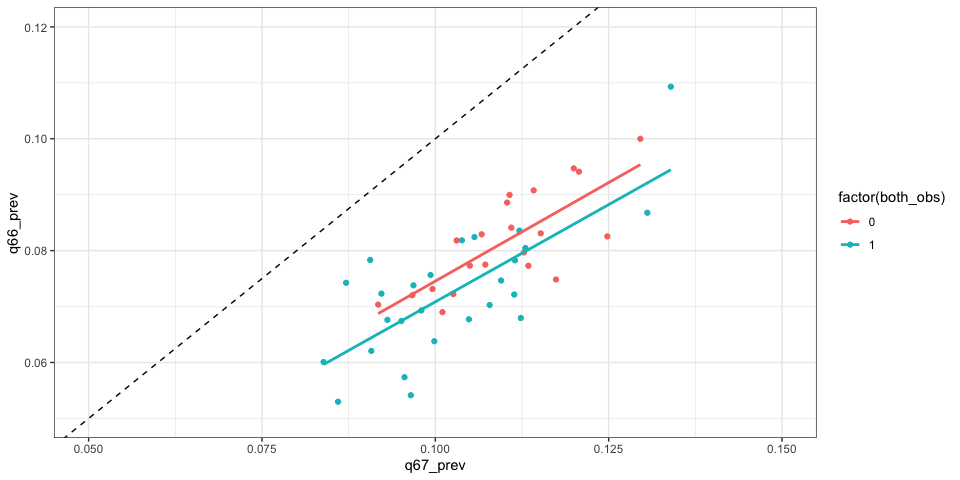

This notebook generates state-level predictions for all states with YRBS
data. It combined the previously generated hold-out predictions for
states with the focal questions with new predictions generated for
states without the focal questions.

    N_CORES = 6
    library(data.table)
    library(Matrix)
    library(parallel)
    library(ranger)

    states_combined_dt = fread('~/YRBS_predictions/data/combined_pred_data_all.csv', showProgress=TRUE)

    subset_dt = copy(states_combined_dt)[year >= 2013]

    id_vars = c('sitecode', 'census_region', 'census_division', 'year', 'weight')
    varimp_inds = fread('~/YRBS_predictions/data/varimp_v1.csv')
    modeling_vars = varimp_inds[, var]
    ss_vars = c(id_vars, modeling_vars)
    ss_vars = intersect(ss_vars, colnames(subset_dt))
    subset_dt = subset_dt[, ..ss_vars]

    # Add indicator for whether q66 and/or q67 answer are present
    subset_dt[, have_q67 := max(ifelse(!is.na(q67), 1, 0)), by = .(sitecode, year)]
    subset_dt[, have_q66 := max(ifelse(!is.na(q66), 1, 0)), by = .(sitecode, year)]

    # Add indicator for whether to predict each question (if they dont have the outcome in 2017)
    subset_dt[, predict_q67 := min(ifelse(!is.na(q67) & year==2017, 0, 1)), by = 'sitecode']
    subset_dt[, predict_q66 := min(ifelse(!is.na(q66) & year==2017, 0, 1)), by = 'sitecode']

    print(subset_dt[,table(have_q67)])

    ## have_q67
    ##      0      1 
    ## 121499 382251

    print(subset_dt[have_q67==1,uniqueN(sitecode)])

    ## [1] 32

    print(subset_dt[,table(have_q66)])

    ## have_q66
    ##      0      1 
    ## 183340 320410

    print(subset_dt[have_q66==1,uniqueN(sitecode)])

    ## [1] 30

    print(subset_dt[predict_q67 == 1, unique(sitecode)])

    ##  [1] "AK" "AL" "GA" "ID" "IN" "KS" "LA" "MO" "MS" "MT" "NJ" "OH" "SD" "TN" "UT"
    ## [16] "VA" "WY"

    print(subset_dt[predict_q67 == 0, unique(sitecode)])

    ##  [1] "AR" "AZ" "CA" "CO" "CT" "DE" "FL" "HI" "IA" "IL" "KY" "MA" "MD" "ME" "MI"
    ## [16] "NC" "ND" "NE" "NH" "NM" "NV" "NY" "OK" "PA" "RI" "SC" "TX" "VT" "WI" "WV"

    print(subset_dt[predict_q66 == 1, unique(sitecode)])

    ##  [1] "AK" "AL" "AZ" "CO" "GA" "ID" "IN" "KS" "LA" "MD" "MO" "MS" "MT" "ND" "NJ"
    ## [16] "OH" "SD" "TN" "UT" "VA" "WY"

    print(subset_dt[predict_q66 == 0, unique(sitecode)])

    ##  [1] "AR" "CA" "CT" "DE" "FL" "HI" "IA" "IL" "KY" "MA" "ME" "MI" "NC" "NE" "NH"
    ## [16] "NM" "NV" "NY" "OK" "PA" "RI" "SC" "TX" "VT" "WI" "WV"

    preds = intersect(varimp_inds[pred == "y", var], colnames(subset_dt))

    # Remove preds without variation
    preds = Filter(function(p) { length(unique(subset_dt[, get(p)])) > 1 }, preds)

    getmode <- function(v) {
       uniqv <- unique(v)
       uniqv[which.max(tabulate(match(v, uniqv)))]
    }

    # Fill nulls
    # Deal with missing values
    # Fill nulls with mode and add a separate is_missing indicator
    preds_to_fill = c(preds, 'q66', 'q67')

    for(p in preds_to_fill) {
      subset_dt[, (paste0(p,"_is_missing")) := ifelse(is.na(get(p)),1,0)]
      subset_dt[get(paste0(p,"_is_missing")) == 1, (p) := getmode(subset_dt[!is.na(get(p)),get(p)])]
      
      # make all predictors factors
      subset_dt[, (p) := as.factor(get(p))]
    }

    # make sure continuous predictors are numeric
    subset_dt[, bmipct := as.numeric(bmipct)]
    subset_dt[, bmi := as.numeric(bmi)]
    subset_dt[, stheight := as.numeric(stheight)]
    subset_dt[, stweight := as.numeric(stweight)]

    # Make year a factor for FEs
    subset_dt[, year := as.factor(year)]

    # Code outcomes

    # Same sex contacts 
    subset_dt[have_q66 == 1, Y_q66 := 0]
    subset_dt[q66 == 4, Y_q66 := 1]
    subset_dt[sex == 1 & q66 == 2, Y_q66 := 1]
    subset_dt[sex == 2 & q66 == 3, Y_q66 := 1]

    print(subset_dt[, table(Y_q66, useNA="always")])

    ## Y_q66
    ##      0      1   <NA> 
    ## 296931  23479 183340

    print(subset_dt[!is.na(Y_q66), unique(sitecode)])

    ##  [1] "AR" "CA" "CT" "DE" "FL" "HI" "IA" "IL" "IN" "KY" "MA" "MD" "ME" "MI" "NC"
    ## [16] "NE" "NH" "NJ" "NM" "NV" "NY" "OK" "PA" "RI" "SC" "TX" "VT" "WI" "WV" "WY"

    # Encode outcome
    subset_dt[have_q67==1, Y_q67 := 0]
    subset_dt[q67 == 2, Y_q67 := 1]
    subset_dt[q67 == 3, Y_q67 := 1]

    print(subset_dt[, table(Y_q67, useNA="always")])

    ## Y_q67
    ##      0      1   <NA> 
    ## 345159  37092 121499

    print(subset_dt[!is.na(Y_q67), unique(sitecode)])

    ##  [1] "AR" "AZ" "CA" "CO" "CT" "DE" "FL" "HI" "IA" "IL" "IN" "KY" "MA" "MD" "ME"
    ## [16] "MI" "NC" "ND" "NE" "NH" "NM" "NV" "NY" "OK" "PA" "RI" "SC" "TX" "VT" "WI"
    ## [31] "WV" "WY"

    # Q66 Training Data
    q66_dt = copy(subset_dt)[!is.na(Y_q66)]

    q66_wo_q67 = q66_dt[have_q67 == 0]
    q66_wo_q67[, predset := "Not Using Identity Responses"]

    # Duplicate states that have q67 answer as well
    q66_w_q67 = q66_dt[have_q67 == 1]
    q66_w_q67_null_q67 = copy(q66_w_q67)
    q66_w_q67_null_q67[, q67 := getmode(q66_w_q67_null_q67[!is.na(q67), q67])]
    q66_w_q67_null_q67[, q67_is_missing := 1]

    q66_w_q67[, predset := "Using Identity Responses"]
    q66_w_q67_null_q67[, predset := "Not Using Identity Responses"]

    q66_dup_dt = rbind(q66_wo_q67, q66_w_q67, q66_w_q67_null_q67)

    # prepare model matrix
    q66_preds = setdiff(
      unique(unlist(sapply(c(preds,'q67'), function(x) grep(x, colnames(subset_dt), value=T), simplify=T))),
      c('have_q67', 'Y_q67'))
                    
    q66_simp_formula_str = paste(" ~ -1 + census_region + census_division + year +",
                             paste(q66_preds, collapse = " + "))

    X_q66 = sparse.model.matrix(as.formula(q66_simp_formula_str), data=q66_dup_dt)
    Y_q66 = q66_dup_dt[, Y_q66]
    w_q66 = q66_dup_dt[, weight]
                    
    print(nrow(X_q66))

    ## [1] 637493

    print(nrow(q66_dup_dt))

    ## [1] 637493

    # Q66 Prediction Data 

    q66_dt_pred = copy(subset_dt)

    q66_dt_pred = q66_dt_pred[predict_q66==1] 
    X_q66_pred = sparse.model.matrix(as.formula(q66_simp_formula_str), data=q66_dt_pred)

    print(nrow(X_q66_pred))

    ## [1] 206009

    print(nrow(q66_dt_pred))

    ## [1] 206009

    print(q66_dt_pred[,unique(sitecode)])

    ##  [1] "AK" "AL" "AZ" "CO" "GA" "ID" "IN" "KS" "LA" "MD" "MO" "MS" "MT" "ND" "NJ"
    ## [16] "OH" "SD" "TN" "UT" "VA" "WY"

    # Q66 Male Training Data
    q66_male_dt = copy(subset_dt)[!is.na(Y_q66) & sex==2]

    q66_male_wo_q67 = q66_male_dt[have_q67 == 0]
    q66_male_wo_q67[, predset := "Not Using Identity Responses"]

    # Duplicate states that have q67 answer as well
    q66_male_w_q67 = q66_male_dt[have_q67 == 1]
    q66_male_w_q67_null_q67 = copy(q66_male_w_q67)
    q66_male_w_q67_null_q67[, q67 := getmode(q66_male_w_q67_null_q67[!is.na(q67), q67])]
    q66_male_w_q67_null_q67[, q67_is_missing := 1]

    q66_male_w_q67[, predset := "Using Identity Responses"]
    q66_male_w_q67_null_q67[, predset := "Not Using Identity Responses"]

    q66_male_dup_dt = rbind(q66_male_wo_q67, q66_male_w_q67, q66_male_w_q67_null_q67)

    # prepare model matrix
    q66_male_preds = setdiff(
      unique(unlist(sapply(c(preds,'q67'), function(x) grep(x, colnames(subset_dt), value=T), simplify=T))),
      c('have_q67', 'Y_q67'))
                    
    q66_male_simp_formula_str = paste(" ~ -1 + census_region + census_division + year +",
                             paste(q66_male_preds, collapse = " + "))

    X_male_q66 = sparse.model.matrix(as.formula(q66_male_simp_formula_str), data=q66_male_dup_dt)
    Y_male_q66 = q66_male_dup_dt[, Y_q66]
    w_male_q66 = q66_male_dup_dt[, weight]
                    
    print(nrow(X_male_q66))

    ## [1] 311208

    print(nrow(q66_male_dup_dt))

    ## [1] 311208

    # Q66 Male Prediction Data 

    q66_male_dt_pred = copy(subset_dt)

    q66_male_dt_pred = q66_male_dt_pred[predict_q66==1 & sex==2] 
    X_male_q66_pred = sparse.model.matrix(as.formula(q66_male_simp_formula_str), data=q66_male_dt_pred)

    print(nrow(X_male_q66_pred))

    ## [1] 100742

    print(nrow(q66_male_dt_pred))

    ## [1] 100742

    print(q66_male_dt_pred[,unique(sitecode)])

    ##  [1] "AK" "AL" "AZ" "CO" "GA" "ID" "IN" "KS" "LA" "MD" "MO" "MS" "MT" "ND" "NJ"
    ## [16] "OH" "SD" "TN" "UT" "VA" "WY"

    # Q67 Training Data
    q67_dt = copy(subset_dt)[!is.na(Y_q67)]

    q67_wo_q66 = q67_dt[have_q66 == 0]
    q67_wo_q66[, predset := "Not Using Contact Responses"]

    # Duplicate states that have q66 answer as well
    q67_w_q66 = q67_dt[have_q66 == 1]
    q67_w_q66_null_q67 = copy(q67_w_q66)
    q67_w_q66_null_q67[, q66 := getmode(q66_w_q67_null_q67[!is.na(q67), q67])]
    q67_w_q66_null_q67[, q66_is_missing := 1]

    q67_w_q66[, predset := "Using Contact Responses"]
    q67_w_q66_null_q67[, predset := "Not Using Contact Responses"]

    q67_dup_dt = rbind(q67_wo_q66, q67_w_q66, q67_w_q66_null_q67)

    # prepare model matrix
    q67_preds = setdiff(
      unique(unlist(sapply(c(preds,'q66'), function(x) grep(x, colnames(subset_dt), value=T), simplify=T))),
      c('have_q66', 'Y_q66'))

    # Remove preds without variation
    q67_preds = Filter(function(p) { length(unique(subset_dt[, get(p)])) > 1 }, q67_preds)
                    
    q67_simp_formula_str = paste(" ~ -1 + census_region + census_division + year +",
                             paste(q67_preds, collapse = " + "))

    X_q67 = sparse.model.matrix(as.formula(q67_simp_formula_str), data=q67_dup_dt)
    Y_q67 = q67_dup_dt[, Y_q67]
    w_q67 = q67_dup_dt[, weight]
                    
    print(nrow(X_q67))

    ## [1] 699334

    print(nrow(q67_dup_dt))

    ## [1] 699334

    # Q67 Prediction Data 

    q67_dt_pred = copy(subset_dt)

    q67_dt_pred = q67_dt_pred[predict_q67==1] 
    X_q67_pred = sparse.model.matrix(as.formula(q67_simp_formula_str), data=q67_dt_pred)

    print(nrow(X_q67_pred))

    ## [1] 85245

    print(nrow(q67_dt_pred))

    ## [1] 85245

    print(q67_dt_pred[, unique(sitecode)])

    ##  [1] "AK" "AL" "GA" "ID" "IN" "KS" "LA" "MO" "MS" "MT" "NJ" "OH" "SD" "TN" "UT"
    ## [16] "VA" "WY"

    # Save stuff to save time later
    save(
      list = c(
         "X_q66", "Y_q66", "w_q66", "X_q66_pred", "q66_dt_pred",
         "X_male_q66", "Y_male_q66", "w_male_q66", "X_male_q66_pred", "q66_male_dt_pred",
         "X_q67", "Y_q67", "w_q67", "X_q67_pred", "q67_dt_pred"
      ),
      file = "~/YRBS_predictions/data/yrbs_pred_image_20210918.RData", compress=F)

## Train models

    N_CORES = 6

    library(data.table)
    library(Matrix)
    library(parallel)
    library(ranger)

    load("~/YRBS_predictions/data/yrbs_pred_image_20210918.RData")

    region_feat_names = grep("census_region", colnames(X_q66), value = T)
    year_feat_names = grep("year", colnames(X_q66), value = T)
    m_q66 = ranger(
      num.trees = 90,
      mtry = round(ncol(X_q66)/3),
      min.node.size = 10,
      max.depth = 14,
      oob.error = TRUE,
      num.threads = N_CORES,
      verbose = F,
      seed = 13,
      classification = F,
      x = X_q66,
      y = Y_q66,
      always.split.variables = c(region_feat_names, year_feat_names)
    )

    region_feat_names = grep("census_region", colnames(X_male_q66), value = T)
    year_feat_names = grep("year", colnames(X_male_q66), value = T)
    m_q66_male = ranger(
      num.trees = 90,
      mtry = round(ncol(X_male_q66)/3),
      min.node.size = 10,
      max.depth = 14,
      oob.error = TRUE,
      num.threads = N_CORES,
      verbose = F,
      seed = 13,
      classification = F,
      x = X_male_q66,
      y = Y_male_q66,
      always.split.variables = c(region_feat_names, year_feat_names)
    )

    region_feat_names = grep("census_region", colnames(X_q67), value = T)
    year_feat_names = grep("year", colnames(X_q67), value = T)
    m_q67 = ranger(
      num.trees = 90,
      mtry = round(ncol(X_q67)/3),
      min.node.size = 10,
      max.depth = 14,
      oob.error = TRUE,
      num.threads = N_CORES,
      verbose = F,
      seed = 13,
      classification = F,
      x = X_q67,
      y = Y_q67,
      always.split.variables = c(region_feat_names, year_feat_names)
    )

    # Save stuff to save time later
    save(
      list = c(
         "X_q66", "Y_q66", "w_q66", "X_q66_pred", "q66_dt_pred", "m_q66",
         "X_male_q66", "Y_male_q66", "w_male_q66", "X_male_q66_pred", "q66_male_dt_pred", "m_q66_male",
         "X_q67", "Y_q67", "w_q67", "X_q67_pred", "q67_dt_pred", "m_q67"
      ),
      file = "~/YRBS_predictions/data/yrbs_pred_image_20210918.RData", compress=F)

## Make predictions

    N_CORES = 16

    library(data.table)
    library(Matrix)
    library(parallel)
    library(ranger)

    load("~/YRBS_predictions/data/yrbs_pred_image_20210918.RData")

    # Q66 predictions

    # Change year FE to 2017
    X_q66_pred = as.matrix(X_q66_pred)
    X_q66_pred[, "year2017"] = 1

    # Add missing col
    X_q66_pred_t = cbind(X_q66_pred, `census_divisionNew England` = 0)

    # Make predictions
    q66_preds = predict(m_q66, data = X_q66_pred_t, num.threads = N_CORES)$predictions

    # Weighted prevalence predictions by state year
    q66_dt_pred[, pred := q66_preds]
    q66_state_year_preds = q66_dt_pred[, .(
      real_prev = weighted.mean(Y_q66, weight),
      pred_prev_2017 = weighted.mean(pred, weight),
      any_q67_data = max(have_q67)),
      by = .(sitecode, year)]

    setorder(q66_state_year_preds, -year)
    q66_state_year_preds[year!=2017, year_rank := seq_len(.N), by='sitecode']
    q66_state_year_preds = q66_state_year_preds[year==2017 | year_rank==1]

    q66_state_year_preds

    ##     sitecode year  real_prev pred_prev_2017 any_q67_data year_rank
    ##  1:       AK 2017         NA     0.07939996            0        NA
    ##  2:       AZ 2017         NA     0.08495012            1        NA
    ##  3:       CO 2017         NA     0.07988245            1        NA
    ##  4:       ID 2017         NA     0.07598703            0        NA
    ##  5:       KS 2017         NA     0.06530551            0        NA
    ##  6:       LA 2017         NA     0.09629985            0        NA
    ##  7:       MD 2017         NA     0.08248521            1        NA
    ##  8:       MO 2017         NA     0.07812194            0        NA
    ##  9:       MT 2017         NA     0.08041718            0        NA
    ## 10:       ND 2017         NA     0.07799424            1        NA
    ## 11:       TN 2017         NA     0.07921740            0        NA
    ## 12:       UT 2017         NA     0.08490079            0        NA
    ## 13:       VA 2017         NA     0.07363469            0        NA
    ## 14:       AK 2015         NA     0.06894151            0         1
    ## 15:       AL 2015         NA     0.08197688            0         1
    ## 16:       AZ 2015         NA     0.09551190            1         1
    ## 17:       ID 2015         NA     0.07130387            0         1
    ## 18:       IN 2015 0.07705917     0.08531458            1         1
    ## 19:       MD 2015 0.07836775     0.07875529            1         1
    ## 20:       MO 2015         NA     0.06603061            0         1
    ## 21:       MS 2015         NA     0.08591041            0         1
    ## 22:       MT 2015         NA     0.07248995            0         1
    ## 23:       ND 2015         NA     0.06795007            1         1
    ## 24:       SD 2015         NA     0.06322460            0         1
    ## 25:       TN 2015         NA     0.08513279            0         1
    ## 26:       VA 2015         NA     0.07513400            0         1
    ## 27:       WY 2015 0.07156492     0.08116920            1         1
    ## 28:       GA 2013         NA     0.07374357            0         1
    ## 29:       KS 2013         NA     0.06252503            0         1
    ## 30:       LA 2013         NA     0.06634434            0         1
    ## 31:       NJ 2013 0.07545623     0.06870612            0         1
    ## 32:       OH 2013         NA     0.06433464            0         1
    ## 33:       UT 2013         NA     0.07854058            0         1
    ##     sitecode year  real_prev pred_prev_2017 any_q67_data year_rank

    # Q66 male predictions
    # Change year FE to 2017
    X_male_q66_pred = as.matrix(X_male_q66_pred)
    X_male_q66_pred[, "year2017"] = 1

    # Add missing col
    X_male_q66_pred_t = cbind(X_male_q66_pred, `census_divisionNew England` = 0)

    # Make predictions
    q66_male_preds = predict(m_q66_male, data = X_male_q66_pred_t, num.threads = N_CORES)$predictions

    # Weighted prevalence predictions by state year
    q66_male_dt_pred[, pred := q66_male_preds]
    q66_male_state_year_preds = q66_male_dt_pred[, .(
      real_prev = weighted.mean(Y_q66, weight),
      pred_prev_2017 = weighted.mean(pred, weight),
      any_q67_data = max(have_q67)),
      by = .(sitecode, year)]

    setorder(q66_male_state_year_preds, -year)
    q66_male_state_year_preds[year!=2017, year_rank := seq_len(.N), by='sitecode']
    q66_male_state_year_preds = q66_male_state_year_preds[year==2017 | year_rank==1]

    q66_male_state_year_preds

    ##     sitecode year  real_prev pred_prev_2017 any_q67_data year_rank
    ##  1:       AK 2017         NA     0.04822719            0        NA
    ##  2:       AZ 2017         NA     0.05158860            1        NA
    ##  3:       CO 2017         NA     0.04591958            1        NA
    ##  4:       ID 2017         NA     0.03805371            0        NA
    ##  5:       KS 2017         NA     0.03770450            0        NA
    ##  6:       LA 2017         NA     0.07503222            0        NA
    ##  7:       MD 2017         NA     0.05035987            1        NA
    ##  8:       MO 2017         NA     0.04581379            0        NA
    ##  9:       MT 2017         NA     0.04330496            0        NA
    ## 10:       ND 2017         NA     0.05056550            1        NA
    ## 11:       TN 2017         NA     0.05010098            0        NA
    ## 12:       UT 2017         NA     0.05209220            0        NA
    ## 13:       VA 2017         NA     0.04460925            0        NA
    ## 14:       AK 2015         NA     0.04534700            0         1
    ## 15:       AL 2015         NA     0.05071361            0         1
    ## 16:       AZ 2015         NA     0.07454334            1         1
    ## 17:       ID 2015         NA     0.03608198            0         1
    ## 18:       IN 2015 0.04905743     0.06014643            1         1
    ## 19:       MD 2015 0.04354267     0.04807763            1         1
    ## 20:       MO 2015         NA     0.03917770            0         1
    ## 21:       MS 2015         NA     0.06206783            0         1
    ## 22:       MT 2015         NA     0.04053818            0         1
    ## 23:       ND 2015         NA     0.04803055            1         1
    ## 24:       SD 2015         NA     0.03856421            0         1
    ## 25:       TN 2015         NA     0.04681816            0         1
    ## 26:       VA 2015         NA     0.04847108            0         1
    ## 27:       WY 2015 0.04839387     0.05453803            1         1
    ## 28:       GA 2013         NA     0.04479355            0         1
    ## 29:       KS 2013         NA     0.03697183            0         1
    ## 30:       LA 2013         NA     0.04547825            0         1
    ## 31:       NJ 2013 0.05056283     0.04061338            0         1
    ## 32:       OH 2013         NA     0.03283039            0         1
    ## 33:       UT 2013         NA     0.04961118            0         1
    ##     sitecode year  real_prev pred_prev_2017 any_q67_data year_rank

    # Q67 predictions
    # Change year FE to 2017
    X_q67_pred = as.matrix(X_q67_pred)
    X_q67_pred[, "year2017"] = 1

    # Add missing col
    X_q67_pred_t = cbind(X_q67_pred, `census_divisionNew England` = 0)

    q67_preds = predict(m_q67, data = X_q67_pred_t, num.threads = N_CORES)$predictions

    # Weighted prevalence predictions by state year
    q67_dt_pred[, pred := q67_preds]
    q67_state_year_preds = q67_dt_pred[, .(
      real_prev = weighted.mean(Y_q67, weight),
      pred_prev_2017 = weighted.mean(pred, weight),
      any_q66_data = max(have_q66)),
      by = .(sitecode, year)]

    setorder(q67_state_year_preds, -year)
    q67_state_year_preds[year!=2017, year_rank := seq_len(.N), by='sitecode']
    q67_state_year_preds = q67_state_year_preds[year==2017 | year_rank==1]

    q67_state_year_preds

    ##     sitecode year  real_prev pred_prev_2017 any_q66_data year_rank
    ##  1:       AK 2017         NA     0.11195722            0        NA
    ##  2:       ID 2017         NA     0.10953499            0        NA
    ##  3:       KS 2017         NA     0.09778339            0        NA
    ##  4:       LA 2017         NA     0.12632989            0        NA
    ##  5:       MO 2017         NA     0.09983057            0        NA
    ##  6:       MT 2017         NA     0.10771566            0        NA
    ##  7:       TN 2017         NA     0.10344060            0        NA
    ##  8:       UT 2017         NA     0.10711111            0        NA
    ##  9:       VA 2017         NA     0.10172684            0        NA
    ## 10:       AK 2015         NA     0.09881149            0         1
    ## 11:       AL 2015         NA     0.10296393            0         1
    ## 12:       ID 2015         NA     0.10055494            0         1
    ## 13:       IN 2015 0.09967427     0.10949831            1         1
    ## 14:       MO 2015         NA     0.08636306            0         1
    ## 15:       MS 2015         NA     0.10875329            0         1
    ## 16:       MT 2015         NA     0.08987369            0         1
    ## 17:       SD 2015         NA     0.08545709            0         1
    ## 18:       TN 2015         NA     0.10275349            0         1
    ## 19:       VA 2015         NA     0.09407541            0         1
    ## 20:       WY 2015 0.07522940     0.09948612            1         1
    ## 21:       GA 2013         NA     0.11359199            0         1
    ## 22:       KS 2013         NA     0.08339201            0         1
    ## 23:       LA 2013         NA     0.09680078            0         1
    ## 24:       NJ 2013         NA     0.09599471            1         1
    ## 25:       OH 2013         NA     0.08836880            0         1
    ## 26:       UT 2013         NA     0.09341238            0         1
    ##     sitecode year  real_prev pred_prev_2017 any_q66_data year_rank

Load errors and create prediction intervals

    error_dt = fread('~/YRBS_predictions/data/error_dt.csv')

    q66_state_year_preds[, pred_method := "Error"]
    q66_state_year_preds[year!=2017, pred_method := "Previous year without other focal Q"]
    q66_state_year_preds[any_q67_data==1 & year==2017, pred_method := "Same year with other focal Q"]
    q66_state_year_preds[any_q67_data==0 & year==2017, pred_method := "Same year without other focal Q"]
    print(q66_state_year_preds[, table(pred_method)])

    ## pred_method
    ## Previous year without other focal Q        Same year with other focal Q 
    ##                                  20                                   4 
    ##     Same year without other focal Q 
    ##                                   9

    q66_male_state_year_preds[, pred_method := "Error"]
    q66_male_state_year_preds[year!=2017, pred_method := "Previous year without other focal Q"]
    q66_male_state_year_preds[any_q67_data==1 & year==2017, pred_method := "Same year with other focal Q"]
    q66_male_state_year_preds[any_q67_data==0 & year==2017, pred_method := "Same year without other focal Q"]
    print(q66_male_state_year_preds[, table(pred_method)])

    ## pred_method
    ## Previous year without other focal Q        Same year with other focal Q 
    ##                                  20                                   4 
    ##     Same year without other focal Q 
    ##                                   9

    q67_state_year_preds[, pred_method := "Error"]
    q67_state_year_preds[year!=2017, pred_method := "Previous year without other focal Q"]
    q67_state_year_preds[any_q66_data==1 & year==2017, pred_method := "Same year with other focal Q"]
    q67_state_year_preds[any_q66_data==0 & year==2017, pred_method := "Same year without other focal Q"]
    print(q67_state_year_preds[, table(pred_method)])

    ## pred_method
    ## Previous year without other focal Q     Same year without other focal Q 
    ##                                  17                                   9

    q66_preds = merge(q66_state_year_preds, error_dt[q=='q66'], by=c('pred_method'))[,.(
        sitecode,
        pred_method,
        real_prev,
        pred_prev_2017 = pred_prev_2017 + oob_mean_bias,
        pred_prev_2017_lb = pred_prev_2017 + oob_mean_bias - qt(0.975, t_dist_df)*oob_sd,
        pred_prev_2017_ub = pred_prev_2017 + oob_mean_bias + qt(0.975, t_dist_df)*oob_sd
      )]

    q66_preds[pred_method == "Previous year without other focal Q", real_prev := NA]

    q66_preds

    ##     sitecode                         pred_method real_prev pred_prev_2017
    ##  1:       AK Previous year without other focal Q        NA     0.07773943
    ##  2:       AL Previous year without other focal Q        NA     0.09077480
    ##  3:       AZ Previous year without other focal Q        NA     0.10430981
    ##  4:       ID Previous year without other focal Q        NA     0.08010178
    ##  5:       IN Previous year without other focal Q        NA     0.09411249
    ##  6:       MD Previous year without other focal Q        NA     0.08755320
    ##  7:       MO Previous year without other focal Q        NA     0.07482853
    ##  8:       MS Previous year without other focal Q        NA     0.09470832
    ##  9:       MT Previous year without other focal Q        NA     0.08128786
    ## 10:       ND Previous year without other focal Q        NA     0.07674799
    ## 11:       SD Previous year without other focal Q        NA     0.07202252
    ## 12:       TN Previous year without other focal Q        NA     0.09393070
    ## 13:       VA Previous year without other focal Q        NA     0.08393192
    ## 14:       WY Previous year without other focal Q        NA     0.08996712
    ## 15:       GA Previous year without other focal Q        NA     0.08254148
    ## 16:       KS Previous year without other focal Q        NA     0.07132294
    ## 17:       LA Previous year without other focal Q        NA     0.07514225
    ## 18:       NJ Previous year without other focal Q        NA     0.07750403
    ## 19:       OH Previous year without other focal Q        NA     0.07313256
    ## 20:       UT Previous year without other focal Q        NA     0.08733850
    ## 21:       AZ        Same year with other focal Q        NA     0.07730219
    ## 22:       CO        Same year with other focal Q        NA     0.07223452
    ## 23:       MD        Same year with other focal Q        NA     0.07483728
    ## 24:       ND        Same year with other focal Q        NA     0.07034631
    ## 25:       AK     Same year without other focal Q        NA     0.08309364
    ## 26:       ID     Same year without other focal Q        NA     0.07968072
    ## 27:       KS     Same year without other focal Q        NA     0.06899919
    ## 28:       LA     Same year without other focal Q        NA     0.09999353
    ## 29:       MO     Same year without other focal Q        NA     0.08181563
    ## 30:       MT     Same year without other focal Q        NA     0.08411087
    ## 31:       TN     Same year without other focal Q        NA     0.08291108
    ## 32:       UT     Same year without other focal Q        NA     0.08859448
    ## 33:       VA     Same year without other focal Q        NA     0.07732837
    ##     sitecode                         pred_method real_prev pred_prev_2017
    ##     pred_prev_2017_lb pred_prev_2017_ub
    ##  1:        0.05834336        0.09713549
    ##  2:        0.07137873        0.11017086
    ##  3:        0.08491374        0.12370588
    ##  4:        0.06070572        0.09949785
    ##  5:        0.07471643        0.11350856
    ##  6:        0.06815714        0.10694927
    ##  7:        0.05543246        0.09422459
    ##  8:        0.07531226        0.11410439
    ##  9:        0.06189180        0.10068393
    ## 10:        0.05735192        0.09614405
    ## 11:        0.05262645        0.09141858
    ## 12:        0.07453464        0.11332677
    ## 13:        0.06453585        0.10332798
    ## 14:        0.07057105        0.10936318
    ## 15:        0.06314542        0.10193755
    ## 16:        0.05192687        0.09071901
    ## 17:        0.05574619        0.09453832
    ## 18:        0.05810797        0.09690010
    ## 19:        0.05373649        0.09252862
    ## 20:        0.06794243        0.10673456
    ## 21:        0.06130526        0.09329912
    ## 22:        0.05623760        0.08823145
    ## 23:        0.05884035        0.09083421
    ## 24:        0.05434938        0.08634324
    ## 25:        0.06136816        0.10481912
    ## 26:        0.05795524        0.10140620
    ## 27:        0.04727371        0.09072467
    ## 28:        0.07826806        0.12171901
    ## 29:        0.06009015        0.10354111
    ## 30:        0.06238539        0.10583634
    ## 31:        0.06118560        0.10463656
    ## 32:        0.06686900        0.11031995
    ## 33:        0.05560290        0.09905385
    ##     pred_prev_2017_lb pred_prev_2017_ub

    q66_male_preds = merge(q66_male_state_year_preds, error_dt[q=='q66_male'], by=c('pred_method'))[,.(
        sitecode,
        pred_method,
        real_prev,
        pred_prev_2017 = pred_prev_2017 + oob_mean_bias,
        pred_prev_2017_lb = pred_prev_2017 + oob_mean_bias - qt(0.975, t_dist_df)*oob_sd,
        pred_prev_2017_ub = pred_prev_2017 + oob_mean_bias + qt(0.975, t_dist_df)*oob_sd
      )]

    q66_male_preds[pred_method == "Previous year without other focal Q", real_prev := NA]

    q66_male_preds

    ##     sitecode                         pred_method real_prev pred_prev_2017
    ##  1:       AK Previous year without other focal Q        NA     0.05084886
    ##  2:       AL Previous year without other focal Q        NA     0.05621547
    ##  3:       AZ Previous year without other focal Q        NA     0.08004520
    ##  4:       ID Previous year without other focal Q        NA     0.04158384
    ##  5:       IN Previous year without other focal Q        NA     0.06564829
    ##  6:       MD Previous year without other focal Q        NA     0.05357949
    ##  7:       MO Previous year without other focal Q        NA     0.04467957
    ##  8:       MS Previous year without other focal Q        NA     0.06756969
    ##  9:       MT Previous year without other focal Q        NA     0.04604004
    ## 10:       ND Previous year without other focal Q        NA     0.05353241
    ## 11:       SD Previous year without other focal Q        NA     0.04406608
    ## 12:       TN Previous year without other focal Q        NA     0.05232003
    ## 13:       VA Previous year without other focal Q        NA     0.05397295
    ## 14:       WY Previous year without other focal Q        NA     0.06003989
    ## 15:       GA Previous year without other focal Q        NA     0.05029541
    ## 16:       KS Previous year without other focal Q        NA     0.04247369
    ## 17:       LA Previous year without other focal Q        NA     0.05098011
    ## 18:       NJ Previous year without other focal Q        NA     0.04611524
    ## 19:       OH Previous year without other focal Q        NA     0.03833225
    ## 20:       UT Previous year without other focal Q        NA     0.05511305
    ## 21:       AZ        Same year with other focal Q        NA     0.04448811
    ## 22:       CO        Same year with other focal Q        NA     0.03881909
    ## 23:       MD        Same year with other focal Q        NA     0.04325938
    ## 24:       ND        Same year with other focal Q        NA     0.04346501
    ## 25:       AK     Same year without other focal Q        NA     0.05122576
    ## 26:       ID     Same year without other focal Q        NA     0.04105228
    ## 27:       KS     Same year without other focal Q        NA     0.04070307
    ## 28:       LA     Same year without other focal Q        NA     0.07803079
    ## 29:       MO     Same year without other focal Q        NA     0.04881236
    ## 30:       MT     Same year without other focal Q        NA     0.04630353
    ## 31:       TN     Same year without other focal Q        NA     0.05309955
    ## 32:       UT     Same year without other focal Q        NA     0.05509077
    ## 33:       VA     Same year without other focal Q        NA     0.04760782
    ##     sitecode                         pred_method real_prev pred_prev_2017
    ##     pred_prev_2017_lb pred_prev_2017_ub
    ##  1:        0.03024707        0.07145065
    ##  2:        0.03561368        0.07681726
    ##  3:        0.05944342        0.10064699
    ##  4:        0.02098206        0.06218563
    ##  5:        0.04504650        0.08625008
    ##  6:        0.03297770        0.07418128
    ##  7:        0.02407778        0.06528135
    ##  8:        0.04696790        0.08817148
    ##  9:        0.02543825        0.06664183
    ## 10:        0.03293062        0.07413420
    ## 11:        0.02346429        0.06466786
    ## 12:        0.03171824        0.07292181
    ## 13:        0.03337116        0.07457473
    ## 14:        0.03943810        0.08064168
    ## 15:        0.02969363        0.07089720
    ## 16:        0.02187190        0.06307548
    ## 17:        0.03037832        0.07158190
    ## 18:        0.02551345        0.06671703
    ## 19:        0.01773046        0.05893404
    ## 20:        0.03451126        0.07571483
    ## 21:        0.02557639        0.06339983
    ## 22:        0.01990737        0.05773081
    ## 23:        0.02434766        0.06217110
    ## 24:        0.02455329        0.06237672
    ## 25:        0.02990061        0.07255091
    ## 26:        0.01972712        0.06237743
    ## 27:        0.01937791        0.06202822
    ## 28:        0.05670564        0.09935594
    ## 29:        0.02748721        0.07013751
    ## 30:        0.02497837        0.06762868
    ## 31:        0.03177440        0.07442470
    ## 32:        0.03376562        0.07641592
    ## 33:        0.02628267        0.06893297
    ##     pred_prev_2017_lb pred_prev_2017_ub

    q67_preds = merge(q67_state_year_preds, error_dt[q=='q67'], by=c('pred_method'))[,.(
        sitecode,
        pred_method,
        real_prev,
        pred_prev_2017 = pred_prev_2017 + oob_mean_bias,
        pred_prev_2017_lb = pred_prev_2017 + oob_mean_bias - qt(0.975, t_dist_df)*oob_sd,
        pred_prev_2017_ub = pred_prev_2017 + oob_mean_bias + qt(0.975, t_dist_df)*oob_sd
      )]

    q67_preds[pred_method == "Previous year without other focal Q", real_prev := NA]

    q67_preds

    ##     sitecode                         pred_method real_prev pred_prev_2017
    ##  1:       AK Previous year without other focal Q        NA     0.11003188
    ##  2:       AL Previous year without other focal Q        NA     0.11418432
    ##  3:       ID Previous year without other focal Q        NA     0.11177533
    ##  4:       IN Previous year without other focal Q        NA     0.12071870
    ##  5:       MO Previous year without other focal Q        NA     0.09758345
    ##  6:       MS Previous year without other focal Q        NA     0.11997368
    ##  7:       MT Previous year without other focal Q        NA     0.10109408
    ##  8:       SD Previous year without other focal Q        NA     0.09667748
    ##  9:       TN Previous year without other focal Q        NA     0.11397388
    ## 10:       VA Previous year without other focal Q        NA     0.10529581
    ## 11:       WY Previous year without other focal Q        NA     0.11070651
    ## 12:       GA Previous year without other focal Q        NA     0.12481238
    ## 13:       KS Previous year without other focal Q        NA     0.09461240
    ## 14:       LA Previous year without other focal Q        NA     0.10802118
    ## 15:       NJ Previous year without other focal Q        NA     0.10721510
    ## 16:       OH Previous year without other focal Q        NA     0.09958919
    ## 17:       UT Previous year without other focal Q        NA     0.10463277
    ## 18:       AK     Same year without other focal Q        NA     0.11520255
    ## 19:       ID     Same year without other focal Q        NA     0.11278032
    ## 20:       KS     Same year without other focal Q        NA     0.10102872
    ## 21:       LA     Same year without other focal Q        NA     0.12957523
    ## 22:       MO     Same year without other focal Q        NA     0.10307591
    ## 23:       MT     Same year without other focal Q        NA     0.11096099
    ## 24:       TN     Same year without other focal Q        NA     0.10668593
    ## 25:       UT     Same year without other focal Q        NA     0.11035644
    ## 26:       VA     Same year without other focal Q        NA     0.10497218
    ##     sitecode                         pred_method real_prev pred_prev_2017
    ##     pred_prev_2017_lb pred_prev_2017_ub
    ##  1:        0.08651089         0.1335529
    ##  2:        0.09066332         0.1377053
    ##  3:        0.08825433         0.1352963
    ##  4:        0.09719770         0.1442397
    ##  5:        0.07406246         0.1211044
    ##  6:        0.09645268         0.1434947
    ##  7:        0.07757308         0.1246151
    ##  8:        0.07315649         0.1201985
    ##  9:        0.09045289         0.1374949
    ## 10:        0.08177481         0.1288168
    ## 11:        0.08718551         0.1342275
    ## 12:        0.10129139         0.1483334
    ## 13:        0.07109140         0.1181334
    ## 14:        0.08450018         0.1315422
    ## 15:        0.08369411         0.1307361
    ## 16:        0.07606820         0.1231102
    ## 17:        0.08111177         0.1281538
    ## 18:        0.08919704         0.1412081
    ## 19:        0.08677482         0.1387858
    ## 20:        0.07502321         0.1270342
    ## 21:        0.10356972         0.1555807
    ## 22:        0.07707040         0.1290814
    ## 23:        0.08495548         0.1369665
    ## 24:        0.08068042         0.1326914
    ## 25:        0.08435093         0.1363619
    ## 26:        0.07896667         0.1309777
    ##     pred_prev_2017_lb pred_prev_2017_ub

    # dcast
    q67_preds[,pred_txt := paste0(
      format(pred_prev_2017*100,digits=0,nsmall=1,trim=T), " (", 
      format(pred_prev_2017_lb*100,digits=0,nsmall=1,trim=T), ", ", 
      format(pred_prev_2017_ub*100,digits=0,nsmall=1,trim=T), ")")]
    q67_preds_wide = dcast(q67_preds, sitecode ~ pred_method, value.var = c('pred_txt'))
    q67_preds_wide[is.na(q67_preds_wide)] = ''
    setnames(q67_preds_wide, 'sitecode', 'pred_state')
    q67_preds_wide

    ##     pred_state Previous year without other focal Q
    ##  1:         AK                    11.0 (8.7, 13.4)
    ##  2:         AL                    11.4 (9.1, 13.8)
    ##  3:         GA                   12.5 (10.1, 14.8)
    ##  4:         ID                    11.2 (8.8, 13.5)
    ##  5:         IN                    12.1 (9.7, 14.4)
    ##  6:         KS                     9.5 (7.1, 11.8)
    ##  7:         LA                    10.8 (8.5, 13.2)
    ##  8:         MO                     9.8 (7.4, 12.1)
    ##  9:         MS                    12.0 (9.6, 14.3)
    ## 10:         MT                    10.1 (7.8, 12.5)
    ## 11:         NJ                    10.7 (8.4, 13.1)
    ## 12:         OH                    10.0 (7.6, 12.3)
    ## 13:         SD                     9.7 (7.3, 12.0)
    ## 14:         TN                    11.4 (9.0, 13.7)
    ## 15:         UT                    10.5 (8.1, 12.8)
    ## 16:         VA                    10.5 (8.2, 12.9)
    ## 17:         WY                    11.1 (8.7, 13.4)
    ##     Same year without other focal Q
    ##  1:                11.5 (8.9, 14.1)
    ##  2:                                
    ##  3:                                
    ##  4:                11.3 (8.7, 13.9)
    ##  5:                                
    ##  6:                10.1 (7.5, 12.7)
    ##  7:               13.0 (10.4, 15.6)
    ##  8:                10.3 (7.7, 12.9)
    ##  9:                                
    ## 10:                11.1 (8.5, 13.7)
    ## 11:                                
    ## 12:                                
    ## 13:                                
    ## 14:                10.7 (8.1, 13.3)
    ## 15:                11.0 (8.4, 13.6)
    ## 16:                10.5 (7.9, 13.1)
    ## 17:

    # dcast
    q66_preds[,pred_txt := paste0(
      format(pred_prev_2017*100,digits=0,nsmall=1,trim=T), " (", 
      format(pred_prev_2017_lb*100,digits=0,nsmall=1,trim=T), ", ", 
      format(pred_prev_2017_ub*100,digits=0,nsmall=1,trim=T), ")")]
    q66_preds_wide = dcast(q66_preds, sitecode ~ pred_method, value.var = c('pred_txt'))
    q66_preds_wide[is.na(q66_preds_wide)] = ''
    setnames(q66_preds_wide, 'sitecode', 'pred_state')
    q66_preds_wide

    ##     pred_state Previous year without other focal Q Same year with other focal Q
    ##  1:         AK                      7.8 (5.8, 9.7)                             
    ##  2:         AL                     9.1 (7.1, 11.0)                             
    ##  3:         AZ                    10.4 (8.5, 12.4)               7.7 (6.1, 9.3)
    ##  4:         CO                                                   7.2 (5.6, 8.8)
    ##  5:         GA                     8.3 (6.3, 10.2)                             
    ##  6:         ID                      8.0 (6.1, 9.9)                             
    ##  7:         IN                     9.4 (7.5, 11.4)                             
    ##  8:         KS                      7.1 (5.2, 9.1)                             
    ##  9:         LA                      7.5 (5.6, 9.5)                             
    ## 10:         MD                     8.8 (6.8, 10.7)               7.5 (5.9, 9.1)
    ## 11:         MO                      7.5 (5.5, 9.4)                             
    ## 12:         MS                     9.5 (7.5, 11.4)                             
    ## 13:         MT                     8.1 (6.2, 10.1)                             
    ## 14:         ND                      7.7 (5.7, 9.6)               7.0 (5.4, 8.6)
    ## 15:         NJ                      7.8 (5.8, 9.7)                             
    ## 16:         OH                      7.3 (5.4, 9.3)                             
    ## 17:         SD                      7.2 (5.3, 9.1)                             
    ## 18:         TN                     9.4 (7.5, 11.3)                             
    ## 19:         UT                     8.7 (6.8, 10.7)                             
    ## 20:         VA                     8.4 (6.5, 10.3)                             
    ## 21:         WY                     9.0 (7.1, 10.9)                             
    ##     pred_state Previous year without other focal Q Same year with other focal Q
    ##     Same year without other focal Q
    ##  1:                 8.3 (6.1, 10.5)
    ##  2:                                
    ##  3:                                
    ##  4:                                
    ##  5:                                
    ##  6:                 8.0 (5.8, 10.1)
    ##  7:                                
    ##  8:                  6.9 (4.7, 9.1)
    ##  9:                10.0 (7.8, 12.2)
    ## 10:                                
    ## 11:                 8.2 (6.0, 10.4)
    ## 12:                                
    ## 13:                 8.4 (6.2, 10.6)
    ## 14:                                
    ## 15:                                
    ## 16:                                
    ## 17:                                
    ## 18:                 8.3 (6.1, 10.5)
    ## 19:                 8.9 (6.7, 11.0)
    ## 20:                  7.7 (5.6, 9.9)
    ## 21:                                
    ##     Same year without other focal Q

    # dcast
    q66_male_preds[,pred_txt := paste0(
      format(pred_prev_2017*100,digits=0,nsmall=1,trim=T), " (", 
      format(pred_prev_2017_lb*100,digits=0,nsmall=1,trim=T), ", ", 
      format(pred_prev_2017_ub*100,digits=0,nsmall=1,trim=T), ")")]
    q66_male_preds_wide = dcast(q66_male_preds, sitecode ~ pred_method, value.var = c('pred_txt'))
    q66_male_preds_wide[is.na(q66_male_preds_wide)] = ''
    setnames(q66_male_preds_wide, 'sitecode', 'pred_state')
    q66_male_preds_wide

    ##     pred_state Previous year without other focal Q Same year with other focal Q
    ##  1:         AK                      5.1 (3.0, 7.1)                             
    ##  2:         AL                      5.6 (3.6, 7.7)                             
    ##  3:         AZ                     8.0 (5.9, 10.1)               4.4 (2.6, 6.3)
    ##  4:         CO                                                   3.9 (2.0, 5.8)
    ##  5:         GA                      5.0 (3.0, 7.1)                             
    ##  6:         ID                      4.2 (2.1, 6.2)                             
    ##  7:         IN                      6.6 (4.5, 8.6)                             
    ##  8:         KS                      4.2 (2.2, 6.3)                             
    ##  9:         LA                      5.1 (3.0, 7.2)                             
    ## 10:         MD                      5.4 (3.3, 7.4)               4.3 (2.4, 6.2)
    ## 11:         MO                      4.5 (2.4, 6.5)                             
    ## 12:         MS                      6.8 (4.7, 8.8)                             
    ## 13:         MT                      4.6 (2.5, 6.7)                             
    ## 14:         ND                      5.4 (3.3, 7.4)               4.3 (2.5, 6.2)
    ## 15:         NJ                      4.6 (2.6, 6.7)                             
    ## 16:         OH                      3.8 (1.8, 5.9)                             
    ## 17:         SD                      4.4 (2.3, 6.5)                             
    ## 18:         TN                      5.2 (3.2, 7.3)                             
    ## 19:         UT                      5.5 (3.5, 7.6)                             
    ## 20:         VA                      5.4 (3.3, 7.5)                             
    ## 21:         WY                      6.0 (3.9, 8.1)                             
    ##     pred_state Previous year without other focal Q Same year with other focal Q
    ##     Same year without other focal Q
    ##  1:                  5.1 (3.0, 7.3)
    ##  2:                                
    ##  3:                                
    ##  4:                                
    ##  5:                                
    ##  6:                  4.1 (2.0, 6.2)
    ##  7:                                
    ##  8:                  4.1 (1.9, 6.2)
    ##  9:                  7.8 (5.7, 9.9)
    ## 10:                                
    ## 11:                  4.9 (2.7, 7.0)
    ## 12:                                
    ## 13:                  4.6 (2.5, 6.8)
    ## 14:                                
    ## 15:                                
    ## 16:                                
    ## 17:                                
    ## 18:                  5.3 (3.2, 7.4)
    ## 19:                  5.5 (3.4, 7.6)
    ## 20:                  4.8 (2.6, 6.9)
    ## 21:                                
    ##     Same year without other focal Q

Combine OOB training predictions with these predictions

    q67_oob_preds = fread('~/YRBS_predictions/data/q67_merged_preds.csv')
    q67_combo_preds = rbind(q67_oob_preds, q67_preds_wide[!(pred_state %in% q67_oob_preds$pred_state)], fill=T)
    q67_combo_preds[is.na(q67_combo_preds)] = ''
    q67_combo_preds

    ##     pred_state          real_txt Same year with other focal Q
    ##  1:         AR 13.4 (11.9, 15.1)            14.7 (12.8, 16.7)
    ##  2:         AZ 11.3 (10.1, 12.8)                             
    ##  3:         CA   9.3 (8.0, 10.7)             10.4 (8.4, 12.3)
    ##  4:         CO  10.3 (8.8, 11.9)                             
    ##  5:         CT  10.6 (9.4, 11.9)             10.3 (8.3, 12.4)
    ##  6:         DE   9.8 (8.8, 10.9)              9.7 (7.7, 11.7)
    ##  7:         FL   9.9 (9.2, 10.7)              9.8 (7.8, 11.8)
    ##  8:         HI 10.8 (10.0, 11.6)             11.1 (9.1, 13.2)
    ##  9:         IA    8.4 (7.2, 9.8)              9.1 (7.2, 11.1)
    ## 10:         IL   9.7 (8.9, 10.5)             11.0 (9.1, 13.0)
    ## 11:         KY  11.1 (9.8, 12.6)              9.9 (7.9, 11.8)
    ## 12:         MA   9.1 (8.1, 10.1)              9.9 (7.9, 11.9)
    ## 13:         MD 11.7 (11.5, 12.0)                             
    ## 14:         ME 11.3 (10.7, 12.0)              9.2 (7.4, 11.1)
    ## 15:         MI   8.7 (7.4, 10.2)             10.3 (8.4, 12.2)
    ## 16:         NC  10.4 (9.4, 11.5)             11.2 (9.2, 13.1)
    ## 17:         ND   9.2 (8.0, 10.5)                             
    ## 18:         NE   8.6 (7.3, 10.2)              8.7 (6.7, 10.7)
    ## 19:         NH   9.6 (9.1, 10.2)              8.3 (6.4, 10.3)
    ## 20:         NM 11.1 (10.4, 12.0)             10.7 (8.6, 12.7)
    ## 21:         NV 13.1 (11.5, 14.8)             11.2 (9.3, 13.0)
    ## 22:         NY 11.2 (10.7, 11.8)             10.0 (8.0, 11.9)
    ## 23:         OK   9.5 (8.2, 11.0)              9.1 (7.1, 11.1)
    ## 24:         PA   9.1 (8.2, 10.0)              9.9 (7.9, 11.9)
    ## 25:         RI  10.9 (9.7, 12.3)             10.4 (8.4, 12.4)
    ## 26:         SC  11.2 (9.7, 12.9)             11.4 (9.4, 13.5)
    ## 27:         TX  10.5 (9.2, 11.9)             10.8 (8.8, 12.9)
    ## 28:         VT  10.0 (9.6, 10.4)              9.3 (7.3, 11.3)
    ## 29:         WI   9.6 (8.4, 10.9)              9.6 (7.6, 11.6)
    ## 30:         WV   9.2 (7.9, 10.8)             10.0 (8.0, 12.0)
    ## 31:         AK                                               
    ## 32:         AL                                               
    ## 33:         GA                                               
    ## 34:         ID                                               
    ## 35:         IN                                               
    ## 36:         KS                                               
    ## 37:         LA                                               
    ## 38:         MO                                               
    ## 39:         MS                                               
    ## 40:         MT                                               
    ## 41:         NJ                                               
    ## 42:         OH                                               
    ## 43:         SD                                               
    ## 44:         TN                                               
    ## 45:         UT                                               
    ## 46:         VA                                               
    ## 47:         WY                                               
    ##     pred_state          real_txt Same year with other focal Q
    ##     Same year without other focal Q Previous year without other focal Q
    ##  1:               14.8 (12.2, 17.4)                   13.1 (10.7, 15.5)
    ##  2:                10.0 (7.4, 12.6)                    12.1 (9.7, 14.5)
    ##  3:                10.5 (7.9, 13.1)                     9.9 (7.5, 12.3)
    ##  4:                 9.2 (6.6, 11.8)                                    
    ##  5:                 9.7 (7.0, 12.3)                    10.4 (8.0, 12.8)
    ##  6:                10.0 (7.4, 12.7)                     9.7 (7.3, 12.2)
    ##  7:                 9.6 (6.9, 12.2)                    10.2 (7.8, 12.6)
    ##  8:                10.9 (8.3, 13.6)                    11.6 (9.2, 14.0)
    ##  9:                 9.8 (7.2, 12.4)                                    
    ## 10:                11.0 (8.4, 13.6)                    10.2 (7.7, 12.6)
    ## 11:                 9.9 (7.3, 12.5)                    10.7 (8.3, 13.1)
    ## 12:                 9.3 (6.7, 12.0)                     9.7 (7.3, 12.1)
    ## 13:                 9.6 (7.0, 12.1)                     9.9 (7.6, 12.1)
    ## 14:                 8.6 (6.1, 11.0)                     9.1 (6.9, 11.4)
    ## 15:                10.8 (8.3, 13.4)                    10.5 (8.2, 12.8)
    ## 16:                11.3 (8.6, 13.9)                    11.3 (9.0, 13.7)
    ## 17:                11.0 (8.4, 13.6)                    10.2 (7.8, 12.5)
    ## 18:                 9.2 (6.5, 11.8)                                    
    ## 19:                 8.5 (5.9, 11.1)                                    
    ## 20:                11.4 (8.7, 14.0)                    11.4 (9.0, 13.8)
    ## 21:                10.4 (8.0, 12.9)                    10.2 (8.1, 12.2)
    ## 22:                 9.8 (7.2, 12.4)                     9.9 (7.6, 12.3)
    ## 23:                10.0 (7.4, 12.7)                     9.7 (7.3, 12.1)
    ## 24:                10.3 (7.7, 12.9)                    10.0 (7.7, 12.4)
    ## 25:                10.5 (7.8, 13.1)                    11.0 (8.6, 13.4)
    ## 26:                11.1 (8.4, 13.7)                                    
    ## 27:                11.8 (9.2, 14.4)                                    
    ## 28:                 9.3 (6.6, 11.9)                     8.8 (6.4, 11.1)
    ## 29:                10.4 (7.8, 13.1)                                    
    ## 30:                10.1 (7.4, 12.7)                    10.9 (8.6, 13.2)
    ## 31:                11.5 (8.9, 14.1)                    11.0 (8.7, 13.4)
    ## 32:                                                    11.4 (9.1, 13.8)
    ## 33:                                                   12.5 (10.1, 14.8)
    ## 34:                11.3 (8.7, 13.9)                    11.2 (8.8, 13.5)
    ## 35:                                                    12.1 (9.7, 14.4)
    ## 36:                10.1 (7.5, 12.7)                     9.5 (7.1, 11.8)
    ## 37:               13.0 (10.4, 15.6)                    10.8 (8.5, 13.2)
    ## 38:                10.3 (7.7, 12.9)                     9.8 (7.4, 12.1)
    ## 39:                                                    12.0 (9.6, 14.3)
    ## 40:                11.1 (8.5, 13.7)                    10.1 (7.8, 12.5)
    ## 41:                                                    10.7 (8.4, 13.1)
    ## 42:                                                    10.0 (7.6, 12.3)
    ## 43:                                                     9.7 (7.3, 12.0)
    ## 44:                10.7 (8.1, 13.3)                    11.4 (9.0, 13.7)
    ## 45:                11.0 (8.4, 13.6)                    10.5 (8.1, 12.8)
    ## 46:                10.5 (7.9, 13.1)                    10.5 (8.2, 12.9)
    ## 47:                                                    11.1 (8.7, 13.4)
    ##     Same year without other focal Q Previous year without other focal Q

    q66_oob_preds = fread('~/YRBS_predictions/data/q66_merged_preds.csv')
    q66_combo_preds = rbind(q66_oob_preds, q66_preds_wide[!(pred_state %in% q66_oob_preds$pred_state)], fill=T)
    q66_combo_preds[is.na(q66_combo_preds)] = ''
    q66_combo_preds

    ##     pred_state         real_txt Same year with other focal Q
    ##  1:         AR 10.9 (9.5, 12.5)             10.3 (8.6, 11.9)
    ##  2:         CA  6.8 (5.7,  8.0)              6.6 (5.0,  8.2)
    ##  3:         CT  8.2 (7.2,  9.4)              6.0 (4.6,  7.3)
    ##  4:         DE  6.9 (6.1,  7.9)              7.5 (5.9,  9.2)
    ##  5:         FL  7.6 (6.9,  8.3)              7.1 (5.4,  8.7)
    ##  6:         HI  7.0 (6.4,  7.7)              7.3 (5.6,  8.9)
    ##  7:         IA  6.0 (5.0,  7.2)              7.5 (6.0,  9.0)
    ##  8:         IL  7.4 (6.7,  8.1)              7.8 (6.1,  9.4)
    ##  9:         KY  7.2 (6.2,  8.4)              7.6 (5.9,  9.2)
    ## 10:         MA  7.8 (7.0,  8.8)              6.2 (4.7,  7.6)
    ## 11:         ME  8.0 (7.5,  8.6)              7.1 (5.5,  8.7)
    ## 12:         MI  7.4 (6.2,  8.8)              7.5 (5.8,  9.1)
    ## 13:         NC  8.2 (7.3,  9.2)              7.5 (5.9,  9.1)
    ## 14:         NE  5.3 (4.3,  6.6)              6.1 (4.5,  7.7)
    ## 15:         NH  5.4 (5.0,  5.8)              6.2 (4.6,  7.8)
    ## 16:         NM  7.8 (7.2,  8.5)              7.7 (6.1,  9.4)
    ## 17:         NV  8.7 (7.4, 10.1)              8.2 (6.6,  9.8)
    ## 18:         NY  6.8 (6.3,  7.3)              6.4 (4.8,  8.1)
    ## 19:         OK  6.7 (5.6,  8.1)              7.4 (5.8,  9.0)
    ## 20:         PA  6.2 (5.5,  7.0)              6.6 (5.0,  8.2)
    ## 21:         RI  7.5 (6.4,  8.6)              7.5 (5.8,  9.1)
    ## 22:         SC  8.4 (7.1,  9.9)              8.8 (7.2, 10.5)
    ## 23:         TX  6.8 (5.8,  7.9)              7.4 (5.8,  9.0)
    ## 24:         VT  6.4 (6.1,  6.7)              6.6 (5.0,  8.2)
    ## 25:         WI  5.7 (4.8,  6.8)              6.3 (4.7,  8.0)
    ## 26:         WV  7.2 (6.0,  8.6)              7.4 (5.8,  9.1)
    ## 27:         AK                                              
    ## 28:         AL                                              
    ## 29:         AZ                                7.7 (6.1, 9.3)
    ## 30:         CO                                7.2 (5.6, 8.8)
    ## 31:         GA                                              
    ## 32:         ID                                              
    ## 33:         IN                                              
    ## 34:         KS                                              
    ## 35:         LA                                              
    ## 36:         MD                                7.5 (5.9, 9.1)
    ## 37:         MO                                              
    ## 38:         MS                                              
    ## 39:         MT                                              
    ## 40:         ND                                7.0 (5.4, 8.6)
    ## 41:         NJ                                              
    ## 42:         OH                                              
    ## 43:         SD                                              
    ## 44:         TN                                              
    ## 45:         UT                                              
    ## 46:         VA                                              
    ## 47:         WY                                              
    ##     pred_state         real_txt Same year with other focal Q
    ##     Same year without other focal Q Previous year without other focal Q
    ##  1:                10.9 (8.6, 13.1)                     9.9 (8.0, 11.9)
    ##  2:                 6.7 (4.5,  9.0)                     6.9 (4.9,  8.9)
    ##  3:                 5.5 (3.6,  7.4)                     6.1 (4.4,  7.8)
    ##  4:                 7.4 (5.2,  9.6)                     7.8 (5.9,  9.8)
    ##  5:                 6.7 (4.5,  8.9)                     7.4 (5.4,  9.4)
    ##  6:                 7.3 (5.1,  9.5)                     8.0 (6.0,  9.9)
    ##  7:                 7.7 (5.6,  9.8)                                    
    ##  8:                 7.8 (5.6, 10.0)                     7.8 (5.8,  9.8)
    ##  9:                 7.4 (5.2,  9.6)                     8.5 (6.6, 10.4)
    ## 10:                 6.1 (4.0,  8.3)                     6.8 (4.8,  8.7)
    ## 11:                 6.2 (4.2,  8.3)                     6.7 (4.9,  8.6)
    ## 12:                 8.2 (6.1, 10.4)                     7.4 (5.4,  9.4)
    ## 13:                 7.6 (5.4,  9.8)                     8.1 (6.1, 10.1)
    ## 14:                 6.6 (4.4,  8.7)                                    
    ## 15:                 6.1 (3.9,  8.3)                                    
    ## 16:                 7.6 (5.4,  9.8)                     7.7 (5.7,  9.7)
    ## 17:                 7.2 (5.1,  9.3)                     8.0 (6.0,  9.9)
    ## 18:                 5.7 (3.5,  7.9)                     6.2 (4.2,  8.1)
    ## 19:                 7.7 (5.5,  9.9)                     7.4 (5.4,  9.4)
    ## 20:                 7.3 (5.1,  9.4)                     7.1 (5.1,  9.0)
    ## 21:                 7.5 (5.3,  9.7)                     8.4 (6.4, 10.3)
    ## 22:                 8.5 (6.3, 10.7)                                    
    ## 23:                 7.9 (5.8, 10.1)                                    
    ## 24:                 5.7 (3.5,  7.9)                     5.8 (3.8,  7.8)
    ## 25:                 7.0 (4.8,  9.1)                                    
    ## 26:                 7.9 (5.7, 10.1)                     8.9 (7.0, 10.7)
    ## 27:                 8.3 (6.1, 10.5)                      7.8 (5.8, 9.7)
    ## 28:                                                     9.1 (7.1, 11.0)
    ## 29:                                                    10.4 (8.5, 12.4)
    ## 30:                                                                    
    ## 31:                                                     8.3 (6.3, 10.2)
    ## 32:                 8.0 (5.8, 10.1)                      8.0 (6.1, 9.9)
    ## 33:                                                     9.4 (7.5, 11.4)
    ## 34:                  6.9 (4.7, 9.1)                      7.1 (5.2, 9.1)
    ## 35:                10.0 (7.8, 12.2)                      7.5 (5.6, 9.5)
    ## 36:                                                     8.8 (6.8, 10.7)
    ## 37:                 8.2 (6.0, 10.4)                      7.5 (5.5, 9.4)
    ## 38:                                                     9.5 (7.5, 11.4)
    ## 39:                 8.4 (6.2, 10.6)                     8.1 (6.2, 10.1)
    ## 40:                                                      7.7 (5.7, 9.6)
    ## 41:                                                      7.8 (5.8, 9.7)
    ## 42:                                                      7.3 (5.4, 9.3)
    ## 43:                                                      7.2 (5.3, 9.1)
    ## 44:                 8.3 (6.1, 10.5)                     9.4 (7.5, 11.3)
    ## 45:                 8.9 (6.7, 11.0)                     8.7 (6.8, 10.7)
    ## 46:                  7.7 (5.6, 9.9)                     8.4 (6.5, 10.3)
    ## 47:                                                     9.0 (7.1, 10.9)
    ##     Same year without other focal Q Previous year without other focal Q

    q66_male_oob_preds = fread('~/YRBS_predictions/data/q66_male_merged_preds.csv')
    q66_male_combo_preds = rbind(q66_male_oob_preds, q66_male_preds_wide[!(pred_state %in% q66_male_oob_preds$pred_state)], fill=T)
    q66_male_combo_preds[is.na(q66_male_combo_preds)] = ''
    q66_male_combo_preds

    ##     pred_state       real_txt Same year with other focal Q
    ##  1:         AR 5.7 (4.3, 7.5)               7.7 (5.9, 9.4)
    ##  2:         CA 4.5 (3.3, 6.1)               4.2 (2.3, 6.1)
    ##  3:         CT 5.7 (4.6, 7.2)               3.9 (2.1, 5.7)
    ##  4:         DE 4.2 (3.3, 5.4)               4.0 (2.1, 5.9)
    ##  5:         FL 4.0 (3.3, 4.7)               4.2 (2.3, 6.2)
    ##  6:         HI 5.2 (4.4, 6.0)               5.9 (3.9, 7.8)
    ##  7:         IA 3.3 (2.3, 4.7)               4.4 (2.5, 6.3)
    ##  8:         IL 4.7 (4.0, 5.7)               5.0 (3.1, 6.9)
    ##  9:         KY 3.1 (2.2, 4.4)               4.4 (2.6, 6.3)
    ## 10:         MA 5.0 (4.0, 6.2)               3.7 (1.9, 5.6)
    ## 11:         ME 5.6 (5.0, 6.3)               4.2 (2.4, 6.1)
    ## 12:         MI 5.4 (4.0, 7.1)               5.1 (3.2, 7.0)
    ## 13:         NC 5.1 (4.1, 6.3)               4.4 (2.5, 6.3)
    ## 14:         NE 2.8 (1.9, 4.3)               3.7 (1.8, 5.6)
    ## 15:         NH 3.3 (2.8, 3.7)               3.6 (1.6, 5.5)
    ## 16:         NM 5.5 (4.7, 6.4)               4.0 (2.2, 5.8)
    ## 17:         NV 4.1 (2.9, 5.6)               3.9 (2.0, 5.9)
    ## 18:         NY 3.9 (3.4, 4.5)               4.3 (2.4, 6.2)
    ## 19:         OK 2.9 (1.9, 4.3)               3.5 (1.6, 5.4)
    ## 20:         PA 3.2 (2.5, 4.1)               4.2 (2.4, 6.1)
    ## 21:         RI 4.8 (3.7, 6.3)               4.6 (2.6, 6.5)
    ## 22:         SC 7.2 (5.5, 9.4)               5.6 (3.8, 7.4)
    ## 23:         TX 4.5 (3.4, 6.0)               4.6 (2.7, 6.5)
    ## 24:         VT 3.7 (3.4, 4.1)               3.9 (1.9, 5.8)
    ## 25:         WI 3.6 (2.6, 4.9)               4.1 (2.2, 6.0)
    ## 26:         WV 5.1 (3.7, 6.8)               4.9 (2.9, 6.8)
    ## 27:         AK                                            
    ## 28:         AL                                            
    ## 29:         AZ                              4.4 (2.6, 6.3)
    ## 30:         CO                              3.9 (2.0, 5.8)
    ## 31:         GA                                            
    ## 32:         ID                                            
    ## 33:         IN                                            
    ## 34:         KS                                            
    ## 35:         LA                                            
    ## 36:         MD                              4.3 (2.4, 6.2)
    ## 37:         MO                                            
    ## 38:         MS                                            
    ## 39:         MT                                            
    ## 40:         ND                              4.3 (2.5, 6.2)
    ## 41:         NJ                                            
    ## 42:         OH                                            
    ## 43:         SD                                            
    ## 44:         TN                                            
    ## 45:         UT                                            
    ## 46:         VA                                            
    ## 47:         WY                                            
    ##     pred_state       real_txt Same year with other focal Q
    ##     Same year without other focal Q Previous year without other focal Q
    ##  1:                  7.7 (5.6, 9.7)                      6.4 (4.3, 8.5)
    ##  2:                  4.3 (2.1, 6.5)                      3.7 (1.7, 5.8)
    ##  3:                  3.7 (1.7, 5.7)                      3.8 (1.9, 5.7)
    ##  4:                  4.0 (1.8, 6.2)                      4.6 (2.5, 6.7)
    ##  5:                  4.1 (1.9, 6.3)                      4.5 (2.4, 6.7)
    ##  6:                  5.5 (3.3, 7.6)                      5.5 (3.3, 7.6)
    ##  7:                  4.6 (2.5, 6.7)                                    
    ##  8:                  4.8 (2.7, 7.0)                      5.3 (3.2, 7.4)
    ##  9:                  4.5 (2.4, 6.6)                      5.0 (3.1, 6.9)
    ## 10:                  3.9 (1.7, 6.0)                      3.9 (1.9, 6.0)
    ## 11:                  3.6 (1.6, 5.6)                      3.6 (1.7, 5.5)
    ## 12:                  4.9 (2.7, 7.1)                      4.6 (2.5, 6.7)
    ## 13:                  4.4 (2.2, 6.5)                      4.7 (2.6, 6.8)
    ## 14:                  4.0 (1.9, 6.1)                                    
    ## 15:                  3.5 (1.3, 5.7)                                    
    ## 16:                  4.1 (2.0, 6.2)                      4.1 (2.0, 6.1)
    ## 17:                  4.0 (1.8, 6.2)                      4.7 (2.6, 6.8)
    ## 18:                  4.3 (2.1, 6.5)                      4.8 (2.7, 6.8)
    ## 19:                  3.7 (1.5, 5.9)                      4.0 (1.9, 6.0)
    ## 20:                  4.6 (2.5, 6.7)                      4.1 (2.1, 6.2)
    ## 21:                  5.1 (2.9, 7.2)                      5.0 (2.8, 7.1)
    ## 22:                  5.1 (3.1, 7.1)                                    
    ## 23:                  4.6 (2.4, 6.8)                                    
    ## 24:                  3.7 (1.5, 5.9)                      3.9 (1.8, 6.1)
    ## 25:                  4.2 (2.0, 6.4)                                    
    ## 26:                  5.1 (3.0, 7.3)                      5.2 (3.1, 7.3)
    ## 27:                  5.1 (3.0, 7.3)                      5.1 (3.0, 7.1)
    ## 28:                                                      5.6 (3.6, 7.7)
    ## 29:                                                     8.0 (5.9, 10.1)
    ## 30:                                                                    
    ## 31:                                                      5.0 (3.0, 7.1)
    ## 32:                  4.1 (2.0, 6.2)                      4.2 (2.1, 6.2)
    ## 33:                                                      6.6 (4.5, 8.6)
    ## 34:                  4.1 (1.9, 6.2)                      4.2 (2.2, 6.3)
    ## 35:                  7.8 (5.7, 9.9)                      5.1 (3.0, 7.2)
    ## 36:                                                      5.4 (3.3, 7.4)
    ## 37:                  4.9 (2.7, 7.0)                      4.5 (2.4, 6.5)
    ## 38:                                                      6.8 (4.7, 8.8)
    ## 39:                  4.6 (2.5, 6.8)                      4.6 (2.5, 6.7)
    ## 40:                                                      5.4 (3.3, 7.4)
    ## 41:                                                      4.6 (2.6, 6.7)
    ## 42:                                                      3.8 (1.8, 5.9)
    ## 43:                                                      4.4 (2.3, 6.5)
    ## 44:                  5.3 (3.2, 7.4)                      5.2 (3.2, 7.3)
    ## 45:                  5.5 (3.4, 7.6)                      5.5 (3.5, 7.6)
    ## 46:                  4.8 (2.6, 6.9)                      5.4 (3.3, 7.5)
    ## 47:                                                      6.0 (3.9, 8.1)
    ##     Same year without other focal Q Previous year without other focal Q

Evaluate predictions (MAE, Coverage, Rsq)

    q67_raw_preds = fread('~/YRBS_predictions/data/q67_raw_preds.csv')
    q66_raw_preds = fread('~/YRBS_predictions/data/q66_raw_preds.csv')
    q66_male_raw_preds = fread('~/YRBS_predictions/data/q66_male_raw_preds.csv')

    gen_pred_eval_metrics = function(pred_dt) {
      eval_dt = copy(pred_dt)

      eval_agg_dt = eval_dt[,.(
        real_sd = sd(real_prev, na.rm=T),
        real_avg_mae = mean(abs(real_prev-mean(real_prev)), na.rm=T),
        mae = mean(abs(real_prev-norm_oob_pe), na.rm=T),
        rmse = sqrt(mean((real_prev-norm_oob_pe)^2, na.rm=T)),
        coverage = mean(real_prev >= norm_oob_lb & real_prev <= norm_oob_ub, na.rm=T),
        .N
        ), by = 'pred_method']
      
      return(eval_agg_dt)
    }

    gen_pred_eval_metrics(q67_raw_preds)

    ##                            pred_method    real_sd real_avg_mae         mae
    ## 1:        Same year with other focal Q 0.01244057  0.009861838 0.008003628
    ## 2:     Same year without other focal Q 0.01220837  0.009797942 0.010957635
    ## 3: Previous year without other focal Q 0.01247813  0.010111466 0.009010750
    ##           rmse  coverage  N
    ## 1: 0.009755404 0.9230769 26
    ## 2: 0.012932571 0.9333333 30
    ## 3: 0.011596478 0.9565217 23

    gen_pred_eval_metrics(q66_raw_preds)

    ##                            pred_method    real_sd real_avg_mae         mae
    ## 1:        Same year with other focal Q 0.01168021  0.008425954 0.006071149
    ## 2:     Same year without other focal Q 0.01168021  0.008425954 0.008598552
    ## 3: Previous year without other focal Q 0.01023909  0.006958076 0.007774882
    ##           rmse  coverage  N
    ## 1: 0.007921061 0.9230769 26
    ## 2: 0.010757617 0.9615385 26
    ## 3: 0.009507748 0.9500000 20

    gen_pred_eval_metrics(q66_male_raw_preds)

    ##                            pred_method     real_sd real_avg_mae         mae
    ## 1:        Same year with other focal Q 0.010715890  0.008806933 0.007399213
    ## 2:     Same year without other focal Q 0.010715890  0.008806933 0.007878636
    ## 3: Previous year without other focal Q 0.008867868  0.007496521 0.008315583
    ##           rmse  coverage  N
    ## 1: 0.009364351 0.9230769 26
    ## 2: 0.010559391 0.9230769 26
    ## 3: 0.010098779 0.9000000 20

Exports for maps

    q66_real_prevs = fread('~/YRBS_predictions/data/q66_real_prevs.csv')
    q66_pred_pes = dcast(q66_preds, sitecode ~ pred_method, value.var = c('pred_prev_2017'))
    q66_pred_pes[, final_pred := fcoalesce(`Same year with other focal Q`,`Same year without other focal Q`,`Previous year without other focal Q`)]
    q66_map_t = rbind(q66_real_prevs[,.(State = pred_state, map_value = real_prev, obs_prev = 1)], q66_pred_pes[!(sitecode %in% q66_real_prevs$pred_state),.(State=sitecode, map_value = final_pred, obs_prev=0)])
    q66_map_t

    ##     State  map_value obs_prev
    ##  1:    AR 0.10930561        1
    ##  2:    CA 0.06762911        1
    ##  3:    CT 0.08242939        1
    ##  4:    DE 0.06930966        1
    ##  5:    FL 0.07563638        1
    ##  6:    HI 0.07026988        1
    ##  7:    IA 0.06009128        1
    ##  8:    IL 0.07379811        1
    ##  9:    KY 0.07215305        1
    ## 10:    MA 0.07833091        1
    ## 11:    ME 0.08047648        1
    ## 12:    MI 0.07425037        1
    ## 13:    NC 0.08184053        1
    ## 14:    NE 0.05298650        1
    ## 15:    NH 0.05413995        1
    ## 16:    NM 0.07826562        1
    ## 17:    NV 0.08677706        1
    ## 18:    NY 0.06795586        1
    ## 19:    OK 0.06742855        1
    ## 20:    PA 0.06206865        1
    ## 21:    RI 0.07465776        1
    ## 22:    SC 0.08357502        1
    ## 23:    TX 0.06771929        1
    ## 24:    VT 0.06380544        1
    ## 25:    WI 0.05736422        1
    ## 26:    WV 0.07231462        1
    ## 27:    AK 0.08309364        0
    ## 28:    AL 0.09077480        0
    ## 29:    AZ 0.07730219        0
    ## 30:    CO 0.07223452        0
    ## 31:    GA 0.08254148        0
    ## 32:    ID 0.07968072        0
    ## 33:    IN 0.09411249        0
    ## 34:    KS 0.06899919        0
    ## 35:    LA 0.09999353        0
    ## 36:    MD 0.07483728        0
    ## 37:    MO 0.08181563        0
    ## 38:    MS 0.09470832        0
    ## 39:    MT 0.08411087        0
    ## 40:    ND 0.07034631        0
    ## 41:    NJ 0.07750403        0
    ## 42:    OH 0.07313256        0
    ## 43:    SD 0.07202252        0
    ## 44:    TN 0.08291108        0
    ## 45:    UT 0.08859448        0
    ## 46:    VA 0.07732837        0
    ## 47:    WY 0.08996712        0
    ##     State  map_value obs_prev

    q66_male_real_prevs = fread('~/YRBS_predictions/data/q66_male_real_prevs.csv')
    q66_male_pred_pes = dcast(q66_male_preds, sitecode ~ pred_method, value.var = c('pred_prev_2017'))
    q66_male_pred_pes[, final_pred := fcoalesce(`Same year with other focal Q`,`Same year without other focal Q`,`Previous year without other focal Q`)]
    q66_male_map_t = rbind(q66_male_real_prevs[,.(State = pred_state, map_value = real_prev, obs_prev = 1)], q66_male_pred_pes[!(sitecode %in% q66_male_real_prevs$pred_state),.(State=sitecode, map_value = final_pred, obs_prev=0)])
    q66_male_map_t

    ##     State  map_value obs_prev
    ##  1:    AR 0.05680985        1
    ##  2:    CA 0.04507599        1
    ##  3:    CT 0.05743277        1
    ##  4:    DE 0.04189738        1
    ##  5:    FL 0.03977411        1
    ##  6:    HI 0.05159365        1
    ##  7:    IA 0.03287408        1
    ##  8:    IL 0.04749182        1
    ##  9:    KY 0.03077377        1
    ## 10:    MA 0.04989317        1
    ## 11:    ME 0.05582751        1
    ## 12:    MI 0.05359171        1
    ## 13:    NC 0.05062416        1
    ## 14:    NE 0.02844720        1
    ## 15:    NH 0.03266816        1
    ## 16:    NM 0.05474931        1
    ## 17:    NV 0.04074951        1
    ## 18:    NY 0.03932449        1
    ## 19:    OK 0.02874105        1
    ## 20:    PA 0.03245050        1
    ## 21:    RI 0.04846792        1
    ## 22:    SC 0.07182103        1
    ## 23:    TX 0.04510256        1
    ## 24:    VT 0.03719733        1
    ## 25:    WI 0.03610893        1
    ## 26:    WV 0.05075474        1
    ## 27:    AK 0.05122576        0
    ## 28:    AL 0.05621547        0
    ## 29:    AZ 0.04448811        0
    ## 30:    CO 0.03881909        0
    ## 31:    GA 0.05029541        0
    ## 32:    ID 0.04105228        0
    ## 33:    IN 0.06564829        0
    ## 34:    KS 0.04070307        0
    ## 35:    LA 0.07803079        0
    ## 36:    MD 0.04325938        0
    ## 37:    MO 0.04881236        0
    ## 38:    MS 0.06756969        0
    ## 39:    MT 0.04630353        0
    ## 40:    ND 0.04346501        0
    ## 41:    NJ 0.04611524        0
    ## 42:    OH 0.03833225        0
    ## 43:    SD 0.04406608        0
    ## 44:    TN 0.05309955        0
    ## 45:    UT 0.05509077        0
    ## 46:    VA 0.04760782        0
    ## 47:    WY 0.06003989        0
    ##     State  map_value obs_prev

    q67_real_prevs = fread('~/YRBS_predictions/data/q67_real_prevs.csv')
    q67_pred_pes = dcast(q67_preds, sitecode ~ pred_method, value.var = c('pred_prev_2017'))
    q67_pred_pes[, final_pred := fcoalesce(`Same year without other focal Q`,`Previous year without other focal Q`)]
    q67_map_t = rbind(q67_real_prevs[,.(State = pred_state, map_value = real_prev, obs_prev = 1)], q67_pred_pes[!(sitecode %in% q67_real_prevs$pred_state),.(State=sitecode, map_value = final_pred, obs_prev=0)])
    q67_map_t

    ##     State  map_value obs_prev
    ##  1:    AR 0.13396483        1
    ##  2:    CA 0.09309203        1
    ##  3:    CT 0.10564306        1
    ##  4:    DE 0.09798639        1
    ##  5:    FL 0.09931341        1
    ##  6:    HI 0.10783468        1
    ##  7:    IA 0.08387861        1
    ##  8:    IL 0.09684820        1
    ##  9:    KY 0.11138598        1
    ## 10:    MA 0.09060659        1
    ## 11:    ME 0.11299033        1
    ## 12:    MI 0.08713100        1
    ## 13:    NC 0.10383340        1
    ## 14:    NE 0.08597256        1
    ## 15:    NH 0.09646650        1
    ## 16:    NM 0.11148227        1
    ## 17:    NV 0.13057205        1
    ## 18:    NY 0.11233457        1
    ## 19:    OK 0.09510595        1
    ## 20:    PA 0.09076751        1
    ## 21:    RI 0.10948712        1
    ## 22:    SC 0.11213546        1
    ## 23:    TX 0.10483918        1
    ## 24:    VT 0.09985919        1
    ## 25:    WI 0.09555519        1
    ## 26:    WV 0.09222851        1
    ## 27:    AZ 0.11342342        1
    ## 28:    CO 0.10259286        1
    ## 29:    MD 0.11740870        1
    ## 30:    ND 0.09175883        1
    ## 31:    AK 0.11520255        0
    ## 32:    AL 0.11418432        0
    ## 33:    GA 0.12481238        0
    ## 34:    ID 0.11278032        0
    ## 35:    IN 0.12071870        0
    ## 36:    KS 0.10102872        0
    ## 37:    LA 0.12957523        0
    ## 38:    MO 0.10307591        0
    ## 39:    MS 0.11997368        0
    ## 40:    MT 0.11096099        0
    ## 41:    NJ 0.10721510        0
    ## 42:    OH 0.09958919        0
    ## 43:    SD 0.09667748        0
    ## 44:    TN 0.10668593        0
    ## 45:    UT 0.11035644        0
    ## 46:    VA 0.10497218        0
    ## 47:    WY 0.11070651        0
    ##     State  map_value obs_prev

Scatter of LGB and Same Sex Contacts for sanity check

    library(ggplot2)
    scatter_t = merge(
      q66_map_t[,.(State,q66_prev=map_value,q66_obs=obs_prev)],
      q67_map_t[,.(State,q67_prev=map_value,q67_obs=obs_prev)],
      by='State')
    scatter_t[,both_obs:=q66_obs*q67_obs]
    ggplot(scatter_t, aes(x=q67_prev,y=q66_prev,color=factor(both_obs))) + geom_point() + theme_bw() + geom_smooth(method="lm", se=F) + geom_abline(intercept=0,slope=1,linetype="dashed") +
    coord_cartesian(xlim=c(0.05,0.15),ylim=c(0.05,0.12))

    ## `geom_smooth()` using formula 'y ~ x'

